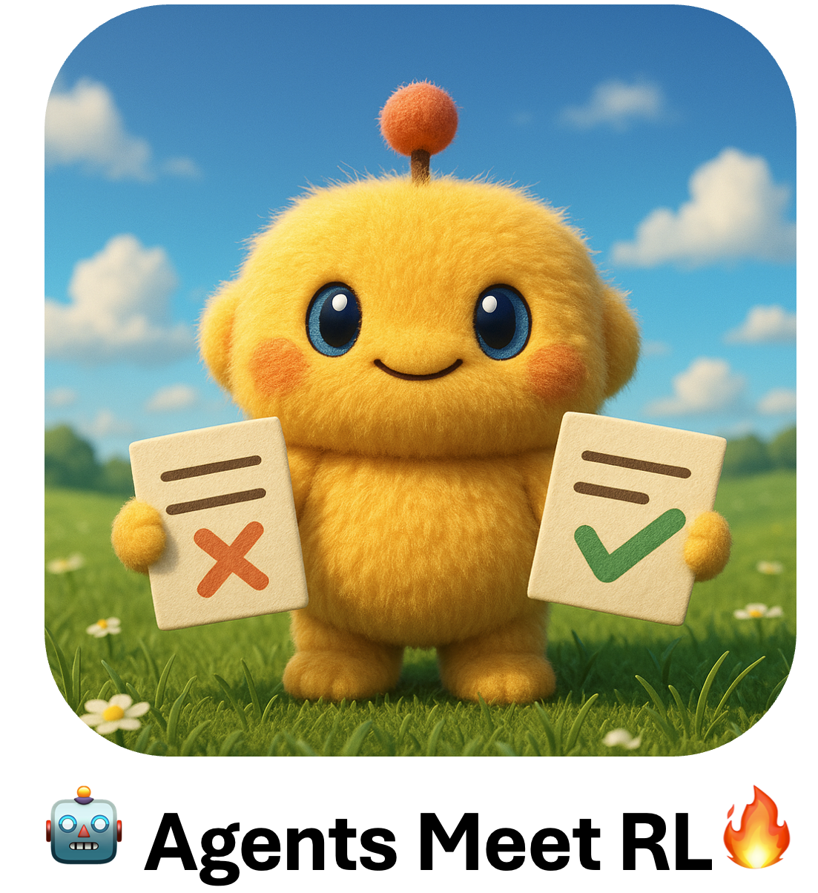

<div align="center">
  
</div>

<div align="center">
  


<br>


</div>

# When LLM Agents Meet Reinforcement Learning

**AgentsMeetRL** is an awesome list that summarizes **open-source repositories** for training LLM Agents using reinforcement learning:
 - 🤖 The criteria for identifying an agent project are that it must have at least one of the following: multi-turn interactions or tool use (so TIR projects, Tool-Integrated Reasoning, are considered in this repo).
 - ⚠️ This project is based on code analysis from open-source repositories using GitHub Copilot Agent, which may contain unfaithful cases. Although manually reviewed, there may still be omissions. If you find any errors, please don't hesitate to let us know immediately through issues or PRs - we warmly welcome them!
 - 🚀 We particularly focus on the reinforcement learning frameworks, RL algorithms, rewards, and environments that projects depend on, for everyone's reference on how these excellent open-source projects make their technical choices. See [Click to view technical details] under each table.
 - 🤗 Feel free to submit your own projects anytime - we welcome contributions!

Some Enumeration:
 - Enumeration for Reward Type:
   - External Verifier: e.g., a compiler or math solver
   - Rule-Based: e.g., a LaTeX parser with exact match scoring
   - Model-Based: e.g., a trained verifier LLM or reward LLM
   - Custom

---

## 🔧 Base Framework


| Github Repo | 🌟 Stars | Date | Org | Paper Link |
| :----: | :----: | :----: |  :----: | :----: |
| [siiRL](https://github.com/sii-research/siiRL) |  | 2025.7 | Shanghai Innovation Institute | [Paper](https://arxiv.org/abs/2507.13833) |
| [slime](https://github.com/THUDM/slime) |  | 2025.6 | Tsinghua University (THUDM) | [blog](https://lmsys.org/blog/2025-07-09-slime/) | 
| [agent-lightning](https://github.com/microsoft/agent-lightning) |  | 2025.6 | Microsoft Research | [Paper](https://arxiv.org/abs/2508.03680) |
| [AReaL](https://github.com/inclusionAI/AReaL) |  | 2025.6 | AntGroup/Tsinghua | [Paper](https://arxiv.org/pdf/2505.24298) | 
| [ROLL](https://github.com/alibaba/ROLL) |  | 2025.6 | Alibaba | [Paper](https://arxiv.org/pdf/2506.06122) | 
| [MARTI](https://github.com/TsinghuaC3I/MARTI) |  | 2025.5 | Tsinghua | -- |
| [RL2](https://github.com/ChenmienTan/RL2) |  | 2025.4 | Accio | – | 
| [verifiers](https://github.com/willccbb/verifiers) |  | 2025.3 | Individual | -- |
| [oat](https://github.com/sail-sg/oat) |  | 2024.11 | NUS/Sea AI | [Paper](https://arxiv.org/pdf/2411.01493) | 
| [veRL](https://github.com/volcengine/verl) |  | 2024.10 | ByteDance | [Paper](https://arxiv.org/pdf/2409.19256) |
| [OpenRLHF](https://github.com/OpenRLHF/OpenRLHF) |  | 2023.7 | OpenRLHF | [Paper](https://arxiv.org/abs/2405.11143) | 
| [trl](https://github.com/huggingface/trl) |  | 2019.11 | HuggingFace | -- | 

<details>
<summary>📋 Click to view technical details</summary>

| Github Repo | RL Algorithm | Single/Multi Agent | Outcome/Process Reward | Single/Multi Turn | Task | Reward Type | Tool usage |
| :----: | :----: | :----: | :----: | :----: | :----: | :----: | :----: |
| [siiRL](https://github.com/sii-research/siiRL) | PPO/GRPO/CPGD/MARFT | Multi | Both | Multi | LLM/VLM/LLM-MAS PostTraining | Model/Rule | Planned |
| [slime](https://github.com/THUDM/slime) | GRPO/GSPO/REINFORCE++ | Single | Both | Both | Math/Code | External Verifier | Yes |
| [agent-lightning](https://github.com/microsoft/agent-lightning) | PPO/Custom/Automatic Prompt Optimization | Multi | Outcome | Multi | Calculator/SQL | Model/External/Rule | Yes |
| [AReaL](https://github.com/inclusionAI/AReaL) | PPO | Both | Outcome | Both | Math/Code | External | Yes |
| [ROLL](https://github.com/alibaba/ROLL) | PPO/GRPO/Reinforce++/TOPR/RAFT++ | Multi | Both | Multi | Math/QA/Code/Alignment | All | Yes |
| [MARTI](https://github.com/TsinghuaC3I/MARTI) | PPO/GRPO/REINFORCE++/TTRL | Multi | Both | Multi | Math | All | Yes |
| [RL2](https://github.com/ChenmienTan/RL2) | Dr. GRPO/PPO/DPO | Single | Both | Both | QA/Dialogue | Rule/Model/External | Yes |
| [verifiers](https://github.com/willccbb/verifiers) | GRPO | Multi | Outcome | Both | Reasoning/Math/Code | All | Code |
| [oat](https://github.com/sail-sg/oat) | PPO/GRPO | Single | Outcome | Multi | Math/Alignment | External | No |
| [veRL](https://github.com/volcengine/verl) | PPO/GRPO | Single | Outcome | Both | Math/QA/Reasoning/Search | All | Yes |
| [OpenRLHF](https://github.com/OpenRLHF/OpenRLHF) | PPO/REINFORCE++/GRPO/DPO/IPO/KTO/RLOO | Multi | Both | Both | Dialogue/Chat/Completion | Rule/Model/External | Yes |
| [trl](https://github.com/huggingface/trl) | PPO/GRPO/DPO | Single | Both | Single | QA | Custom | No |

</details>

## 💪 General/MultiTask

| Github Repo | 🌟 Stars | Date | Org | Paper Link | RL Framework |
| :----: | :----: | :----: |  :----: | :----: | :----: |
| [AgentGym-RL](https://github.com/WooooDyy/AgentGym-RL) |  | 2025.9 | Fudan University | [Paper](https://arxiv.org/abs/2509.08755) | veRL |
| [Agent_Foundation_Models](https://github.com/OPPO-PersonalAI/Agent_Foundation_Models) |  | 2025.8 | OPPO Personal AI Lab | [Paper](https://arxiv.org/abs/2508.13167) | veRL |
| [SPA-RL-Agent](https://github.com/WangHanLinHenry/SPA-RL-Agent) |  | 2025.5 | PolyU | [Paper](https://arxiv.org/pdf/2505.20732) | TRL |
| [verl-agent](https://github.com/langfengQ/verl-agent) |  | 2025.5 | NTU/Skywork | [Paper](https://arxiv.org/pdf/2505.10978) | veRL |

<details>
<summary>📋 Click to view technical details</summary>
  
| Github Repo | RL Algorithm | Single/Multi Agent | Outcome/Process Reward | Single/Multi Turn | Task | Reward Type | Tool usage |
| :----: | :----: | :----: | :----: | :----: | :----: | :----: | :----: |
| [AgentGym-RL](https://github.com/WooooDyy/AgentGym-RL) | PPO/GRPO/RLOO/REINFORCE++ | Single | Outcome | Multi | Web/Search/Game/Embodied/Science | Rule/Model/External | Yes (Web, Search, Env APIs) |
| [Agent_Foundation_Models](https://github.com/OPPO-PersonalAI/Agent_Foundation_Models) | DAPO/PPO | Single | Outcome | Single | QA/Code/Math | Rule/External | Yes |
| [SPA-RL-Agent](https://github.com/WangHanLinHenry/SPA-RL-Agent) | PPO | Single | Process | Multi | Navigation/Web/TextGame | Model | No |
| [verl-agent](https://github.com/langfengQ/verl-agent) | PPO/GRPO/GiGPO/DAPO/RLOO/REINFORCE++ | Multi | Both | Multi | Phone Use/Math/Code/Web/TextGame | All | Yes |

</details>

## 🔍 Search/Research/Web


| Github Repo | 🌟 Stars | Date | Org | Paper Link | RL Framework |
| :----: | :----: | :----: |  :----: | :----: | :----: |
| [ASearcher](https://github.com/inclusionAI/ASearcher) |  | 2025.8 | Ant Research RL Lab <br> Tsinghua University & UW | [Paper](https://arxiv.org/abs/2508.07976) | RealHF/AReaL |
| [Kimi-Researcher](https://github.com/moonshotai/Kimi-Researcher) |  | 2025.6 | Moonshot AI | [blog](https://moonshotai.github.io/Kimi-Researcher/) | Custom |
| [TTI](https://github.com/test-time-interaction/TTI) |  | 2025.6 | CMU | [Paper](https://arxiv.org/abs/2506.07976) | Custom |
| [R-Search](https://github.com/QingFei1/R-Search) |  | 2025.6 | Individual | -- | veRL |
| [R1-Searcher-plus](https://github.com/RUCAIBox/R1-Searcher-plus) |  | 2025.5 | RUC | [Paper](https://arxiv.org/pdf/2505.17005) | Custom |
| [StepSearch](https://github.com/Zillwang/StepSearch) |  | 2025.5 | SenseTime | [Paper](https://arxiv.org/pdf/2505.15107) | veRL |
| [AutoRefine](https://github.com/syr-cn/AutoRefine) |  | 2025.5 | USTC | [Paper](https://www.arxiv.org/pdf/2505.11277) | veRL |
| [ZeroSearch](https://github.com/Alibaba-NLP/ZeroSearch) |  | 2025.5 | Alibaba |[Paper](https://arxiv.org/pdf/2505.04588) | veRL |
| [WebThinker](https://github.com/RUC-NLPIR/WebThinker) |  | 2025.4 | RUC | [Paper](https://arxiv.org/pdf/2504.21776) | Custom |
| [DeepResearcher](https://github.com/GAIR-NLP/DeepResearcher) |  | 2025.4 | SJTU | [Paper](https://arxiv.org/pdf/2504.03160) | veRL |
| [Search-R1](https://github.com/PeterGriffinJin/Search-R1) |  | 2025.3 | UIUC/Google | [paper1](https://arxiv.org/pdf/2503.09516), [paper2](https://arxiv.org/pdf/2505.15117) | veRL |
| [R1-Searcher](https://github.com/RUCAIBox/R1-Searcher) |  | 2025.3 | RUC | [Paper](https://arxiv.org/pdf/2503.05592) | OpenRLHF |
| [C-3PO](https://github.com/Chen-GX/C-3PO) |  | 2025.2 | Alibaba | [Paper](https://arxiv.org/pdf/2502.06205) | OpenRLHF |
| [WebAgent](https://github.com/Alibaba-NLP/WebAgent) |  | 2025.1 | Alibaba | [paper1](https://arxiv.org/pdf/2501.07572), [paper2](https://arxiv.org/pdf/2505.22648) | LLaMA-Factory |

<details>
<summary>📋 Click to view technical details</summary>

| Github Repo | RL Algorithm | Single/Multi Agent | Outcome/Process Reward | Single/Multi Turn | Task | Reward Type | Tool usage |
| :----: | :----: | :----: | :----: | :----: | :----: | :----: | :----: |
| [ASearcher](https://github.com/inclusionAI/ASearcher) | PPO/GRPO + Decoupled PPO | Single | Outcome | Multi | Math/Code/SearchQA | External/Rule | Yes |
| [Kimi-Researcher](https://github.com/moonshotai/Kimi-Researcher) | REINFORCE | Single | Outcome | Multi | Research | Outcome | Search, Browse, Coding |
| [TTI](https://github.com/test-time-interaction/TTI) | REINFORCE/BC | Single | Outcome | Multi | Web | External | Web Browsing |
| [R-Search](https://github.com/QingFei1/R-Search) | PPO/GRPO | Single | Both | Multi | QA/Search | All | Yes |
| [R1-Searcher-plus](https://github.com/RUCAIBox/R1-Searcher-plus) | Custom | Single | Outcome | Multi | Search | Model | Search |
| [StepSearch](https://github.com/Zillwang/StepSearch) | PPO | Single | Process | Multi | QA | Model | Search |
| [AutoRefine](https://github.com/syr-cn/AutoRefine) | PPO/GRPO | Multi | Both | Multi | RAG QA | Rule | Search |
| [ZeroSearch](https://github.com/Alibaba-NLP/ZeroSearch) | PPO/GRPO/REINFORCE | Single | Outcome | Multi | QA/Search | Rule | Yes |
| [WebThinker](https://github.com/RUC-NLPIR/WebThinker) | DPO | Single | Outcome | Multi | Reasoning/QA/Research | Model/External | Web Browsing |
| [DeepResearcher](https://github.com/GAIR-NLP/DeepResearcher) | PPO/GRPO | Multi | Outcome | Multi | Research | All | Yes |
| [Search-R1](https://github.com/PeterGriffinJin/Search-R1) | PPO/GRPO | Single | Outcome | Multi | Search | All | Search |
| [R1-Searcher](https://github.com/RUCAIBox/R1-Searcher) | PPO/DPO | Single | Both | Multi | Search | All | Yes |
| [C-3PO](https://github.com/Chen-GX/C-3PO) | PPO | Multi | Outcome | Multi | Search | Model | Yes |
| [WebAgent](https://github.com/Alibaba-NLP/WebAgent) | DAPO | Multi | Process | Multi | Web | Model | Yes |

</details>

## 📱 GUI


| Github Repo | 🌟 Stars | Date | Org | Paper Link | RL Framework |
| :----: | :----: | :----: |  :----: | :----: | :----: |
| [MobileAgent](https://github.com/X-PLUG/MobileAgent) |  | 2025.9 | X-PLUG (TongyiQwen) | [paper](https://arxiv.org/abs/2509.11543) | veRL |
| [InfiGUI-G1](https://github.com/InfiXAI/InfiGUI-G1) |  | 2025.8 | InfiX AI | [Paper](https://arxiv.org/abs/2508.05731) | veRL |
| [Grounding-R1](https://github.com/Yan98/Grounding-R1) |  | 2025.6 | Salesforce | [blog](https://huggingface.co/blog/HelloKKMe/grounding-r1) | trl |
| [AgentCPM-GUI](https://github.com/OpenBMB/AgentCPM-GUI) |  | 2025.6 | OpenBMB/Tsinghua/RUC | [Paper](https://arxiv.org/pdf/2506.01391) | Huggingface |
| [ARPO](https://github.com/dvlab-research/ARPO) |  | 2025.5 | CUHK/HKUST | [Paper](https://arxiv.org/pdf/2505.16282) | veRL |
| [GUI-G1](https://github.com/Yuqi-Zhou/GUI-G1) |  | 2025.5 | RUC | [Paper](https://arxiv.org/pdf/2505.15810) | TRL |
| [GUI-R1](https://github.com/ritzz-ai/GUI-R1) |  | 2025.4 | CAS/NUS | [Paper](https://arxiv.org/pdf/2504.10458) | veRL |
| [UI-R1](https://github.com/lll6gg/UI-R1) |  | 2025.3 | vivo/CUHK | [Paper](https://arxiv.org/pdf/2503.21620) | TRL |

<details>
<summary>📋 Click to view technical details</summary>

| Github Repo | RL Algorithm | Single/Multi Agent | Outcome/Process Reward | Single/Multi Turn | Task | Reward Type | Tool usage |
| :----: | :----: | :----: | :----: | :----: | :----: | :----: | :----: |
| [MobileAgent](https://github.com/X-PLUG/MobileAgent) | semi-online RL | Single | Both | Multi | MobileGUI/Automation | Rule | Yes |
| [InfiGUI-G1](https://github.com/InfiXAI/InfiGUI-G1) | AEPO | Single | Outcome | Single | GUI/Grounding | Rule | No |
| [Grounding-R1](https://github.com/Yan98/Grounding-R1) | GRPO | Single | Outcome | Multi | GUI Grounding | Model | Yes |
| [AgentCPM-GUI](https://github.com/OpenBMB/AgentCPM-GUI) | GRPO | Single | Outcome | Multi | Mobile GUI | Model | Yes |
| [ARPO](https://github.com/dvlab-research/ARPO) | GRPO | Single | Outcome | Multi | GUI | External | Computer Use |
| [GUI-G1](https://github.com/Yuqi-Zhou/GUI-G1) | GRPO | Single | Outcome | Single | GUI | Rule/External | No |
| [GUI-R1](https://github.com/ritzz-ai/GUI-R1) | GRPO | Single | Outcome | Multi | GUI | Rule | No |
| [UI-R1](https://github.com/lll6gg/UI-R1) | GRPO | Single | Process | Both | GUI | Rule | Computer/Phone Use |

</details>

## 🔨 Tool


| Github Repo | 🌟 Stars | Date | Org | Paper Link | RL Framework |
| :----: | :----: | :----: |  :----: | :----: | :----: |
| [MiroRL](https://github.com/MiroMindAI/MiroRL) |  | 2025.8 | MiroMindAI | [HF Repo](https://huggingface.co/miromind-ai) | veRL |
| [verl-tool](https://github.com/TIGER-AI-Lab/verl-tool) |  | 2025.6 | TIGER-Lab | [X](https://x.com/DongfuJiang/status/1929198238017720379) | veRL |
| [Multi-Turn-RL-Agent](https://github.com/SiliangZeng/Multi-Turn-RL-Agent) |  | 2025.5 | University of Minnesota | [Paper](https://arxiv.org/pdf/2505.11821) | Custom |
| [Tool-N1](https://github.com/NVlabs/Tool-N1) |  | 2025.5 | NVIDIA | [Paper](https://arxiv.org/pdf/2505.00024) | veRL |
| [Tool-Star](https://github.com/dongguanting/Tool-Star) |  | 2025.5 | RUC | [Paper](https://arxiv.org/pdf/2505.16410) | LLaMA-Factory |
| [RL-Factory](https://github.com/Simple-Efficient/RL-Factory) |  | 2025.5 | Simple-Efficient | [model](https://huggingface.co/Simple-Efficient/RLFactory-Qwen3-8B-GRPO) | veRL |
| [ReTool](https://github.com/ReTool-RL/ReTool) |  | 2025.4 | ByteDance | [Paper](https://arxiv.org/pdf/2504.11536) | veRL |
| [AWorld](https://github.com/inclusionAI/AWorld) |  | 2025.3 | Ant Group (inclusionAI) | [Paper](https://arxiv.org/abs/2508.20404) | veRL |
| [Agent-R1](https://github.com/0russwest0/Agent-R1) |  | 2025.3 | USTC | -- | veRL |
| [ReCall](https://github.com/Agent-RL/ReCall) |  | 2025.3 | BaiChuan | [Paper](https://arxiv.org/pdf/2503.19470) | veRL |

<details>
<summary>📋 Click to view technical details</summary>

| Github Repo | RL Algorithm | Single/Multi Agent | Outcome/Process Reward | Single/Multi Turn | Task | Reward Type | Tool usage |
| :----: | :----: | :----: | :----: | :----: | :----: | :----: | :----: |
| [MiroRL](https://github.com/MiroMindAI/MiroRL) | GRPO | Single | Both | Multi | Reasoning/Planning/ToolUse | Rule-based | MCP |
| [verl-tool](https://github.com/TIGER-AI-Lab/verl-tool) | PPO/GRPO | Single | Both | Both | Math/Code | Rule/External | Yes |
| [Multi-Turn-RL-Agent](https://github.com/SiliangZeng/Multi-Turn-RL-Agent) | GRPO | Single | Both | Multi | Tool-use/Math | Rule/External | Yes |
| [Tool-N1](https://github.com/NVlabs/Tool-N1) | PPO | Single | Outcome | Multi | Math/Dialogue | All | Yes |
| [Tool-Star](https://github.com/dongguanting/Tool-Star) | PPO/DPO/ORPO/SimPO/KTO | Single | Outcome | Multi | Multi-modal/Tool Use/Dialogue | Model/External | Yes |
| [RL-Factory](https://github.com/Simple-Efficient/RL-Factory) | GRPO | Multi | Both | Multi | Tool-use/NL2SQL | All | MCP |
| [ReTool](https://github.com/ReTool-RL/ReTool) | PPO | Single | Outcome | Multi | Math | External | Code |
| [AWorld](https://github.com/inclusionAI/AWorld) | GRPO | Both | Outcome | Multi | Search/Web/Code | External/Rule | Yes |
| [Agent-R1](https://github.com/0russwest0/Agent-R1) | PPO/GRPO | Single | Both | Multi | Tool-use/QA | Model | Yes |
| [ReCall](https://github.com/Agent-RL/ReCall) | PPO/GRPO/RLOO/REINFORCE++/ReMax | Single | Outcome | Multi | Tool-use/Math/QA | All | Yes |

</details>

## 🎮 TextGame


| Github Repo | 🌟 Stars | Date | Org | Paper Link | RL Framework |
| :----: | :----: | :----: |  :----: | :----: | :----: |
| [ARIA](https://github.com/rhyang2021/ARIA) |  | 2025.6 | Fudan University | [Paper](https://arxiv.org/abs/2506.00539) | Custom |
| [AMPO](https://github.com/MozerWang/AMPO) |  | 2025.5 | Tongyi Lab, Alibaba | [Paper](https://arxiv.org/abs/2505.02156) | veRL |
| [Trinity-RFT](https://github.com/modelscope/Trinity-RFT) |  | 2025.5 | Alibaba | [Paper](https://arxiv.org/pdf/2505.17826) | veRL |
| [VAGEN](https://github.com/RAGEN-AI/VAGEN) |  | 2025.3 | RAGEN-AI | [Paper](https://www.notion.so/VAGEN-Training-VLM-Agents-with-Multi-Turn-Reinforcement-Learning-1bfde13afb6e80b792f6d80c7c2fcad0) | veRL |
| [ART](https://github.com/OpenPipe/ART) |  | 2025.3 | OpenPipe | [Paper](https://github.com/OpenPipe/ART#-citation) | TRL |
| [OpenManus-RL](https://github.com/OpenManus/OpenManus-RL) |  | 2025.3 | UIUC/MetaGPT | -- | Custom |
| [RAGEN](https://github.com/RAGEN-AI/RAGEN) |  | 2025.1 | RAGEN-AI | [Paper](https://arxiv.org/pdf/2504.20073) | veRL |

<details>
<summary>📋 Click to view technical details</summary>

| Github Repo | RL Algorithm | Single/Multi Agent | Outcome/Process Reward | Single/Multi Turn | Task | Reward Type | Tool usage |
| :----: | :----: | :----: | :----: | :----: | :----: | :----: | :----: |
| [ARIA](https://github.com/rhyang2021/ARIA) | REINFORCE | Both | Process | Multi | Negotiation/Bargaining | Other | No |
| [AMPO](https://github.com/MozerWang/AMPO) | BC/AMPO(GRPO improvement) | Multi | Outcome | Multi | Social Interaction | Model-based | No |
| [Trinity-RFT](https://github.com/modelscope/Trinity-RFT) | PPO/GRPO | Single | Outcome | Both | Math/TextGame/Web | All | Yes |
| [VAGEN](https://github.com/RAGEN-AI/VAGEN) | PPO/GRPO | Single | Both | Multi | TextGame/Navigation | All | Yes |
| [ART](https://github.com/OpenPipe/ART) | GRPO | Multi | Both | Multi | TextGame | All | Yes |
| [OpenManus-RL](https://github.com/OpenManus/OpenManus-RL) | PPO/DPO/GRPO | Multi | Outcome | Multi | TextGame | All | Yes |
| [RAGEN](https://github.com/RAGEN-AI/RAGEN) | PPO/GRPO | Single | Both | Multi | TextGame | All | Yes |

</details>

## 💻 Code


| Github Repo | 🌟 Stars | Date | Org | Paper Link | RL Framework |
| :----: | :----: | :----: |  :----: | :----: | :----: |
| [RepoDeepSearch](https://github.com/Mizersy/RepoDeepSearch) |  | 2025.8 | PKU, Bytedance, BIT | [Paper](https://arxiv.org/abs/2508.03012) | veRL |
| [MedAgentGym](https://github.com/wshi83/MedAgentGym) |  | 2025.6 | Emory/Georgia Tech | [Paper](https://arxiv.org/pdf/2506.04405) | Hugginface |
| [CURE](https://github.com/Gen-Verse/CURE) |  | 2025.6 | University of Chicago <br> Princeton/ByteDance | [Paper](https://arxiv.org/pdf/2506.03136) | Huggingface |
| [MASLab](https://github.com/MASWorks/MASLab) |  | 2025.5 | MASWorks | [Paper](https://arxiv.org/pdf/2505.16988) | Custom |
| [Time-R1](https://github.com/ulab-uiuc/Time-R1) |  | 2025.5 | UIUC | [Paper](https://arxiv.org/pdf/2505.13508) | veRL |
| [ML-Agent](https://github.com/MASWorks/ML-Agent) |  | 2025.5 | MASWorks | [Paper](https://arxiv.org/pdf/2505.23723) | Custom |
| [SkyRL](https://github.com/NovaSky-AI/SkyRL) |  | 2025.4 | NovaSky | -- | veRL |
| [digitalhuman](https://github.com/Tencent/digitalhuman) |  | 2025.4 | Tencent | [Paper](https://arxiv.org/abs/2507.03112) | veRL |
| [sweet_rl](https://github.com/facebookresearch/sweet_rl) |  | 2025.3 | Meta/UCB | [Paper](https://arxiv.org/pdf/2503.15478) | OpenRLHF |
| [rllm](https://github.com/agentica-project/rllm) |  | 2025.1 | Berkeley Sky Computing Lab <br> BAIR / Together AI | [Notion Blog](https://pretty-radio-b75.notion.site/rLLM-A-Framework-for-Post-Training-Language-Agents-21b81902c146819db63cd98a54ba5f31) | veRL |
| [open-r1](https://github.com/huggingface/open-r1) |  | 2025.1 | HuggingFace | -- | TRL |

<details>
<summary>📋 Click to view technical details</summary>

| Github Repo | RL Algorithm | Single/Multi Agent | Outcome/Process Reward | Single/Multi Turn | Task | Reward Type | Tool usage |
| :----: | :----: | :----: | :----: | :----: | :----: | :----: | :----: |
| [RepoDeepSearch](https://github.com/Mizersy/RepoDeepSearch) | GRPO | Single | Both | Multi | Search/Repair | Rule/External | Yes |
| [MedAgentGym](https://github.com/wshi83/MedAgentGym) | SFT/DPO/PPO/GRPO | Single | Outcome | Multi | Medical/Code | External | Yes |
| [CURE](https://github.com/Gen-Verse/CURE) | PPO | Single | Outcome | Single | Code | External | No |
| [MASLab](https://github.com/MASWorks/MASLab) | NO RL | Multi | Outcome | Multi | Code/Math/Reasoning | External | Yes |
| [Time-R1](https://github.com/ulab-uiuc/Time-R1) | PPO/GRPO/DPO | Multi | Outcome | Multi | Temporal | All | Code |
| [ML-Agent](https://github.com/MASWorks/ML-Agent) | Custom | Single | Process | Multi | Code | All | Yes |
| [SkyRL](https://github.com/NovaSky-AI/SkyRL) | PPO/GRPO | Single | Outcome | Multi | Math/Code | All | Code |
| [digitalhuman](https://github.com/Tencent/digitalhuman) | PPO/GRPO/ReMax/RLOO | Multi | Outcome | Multi | Empathy/Math/Code/MultimodalQA | Rule/Model/External | Yes |
| [sweet_rl](https://github.com/facebookresearch/sweet_rl) | DPO | Multi | Process | Multi | Design/Code | Model | Web Browsing |
| [rllm](https://github.com/agentica-project/rllm) | PPO/GRPO | Single | Outcome | Multi | Code Edit | External | Yes |
| [open-r1](https://github.com/huggingface/open-r1) | GRPO | Single | Outcome | Single | Math/Code | All | Yes |

</details>

## 🤔 QA(Reasoning/Math)


| Github Repo | 🌟 Stars | Date | Org | Paper Link | RL Framework |
| :----: | :----: | :----: |  :----: | :----: | :----: |
| [ARPO](https://github.com/dongguanting/ARPO) |  | 2025.7 | RUC, Kuaishou | [Paper](https://arxiv.org/abs/2507.19849) | veRL |
| [terminal-bench-rl](https://github.com/Danau5tin/terminal-bench-rl) |  | 2025.7 | Individual (Danau5tin) | N/A | rLLM |
| [MOTIF](https://github.com/purbeshmitra/MOTIF) |  | 2025.6 | University of Maryland | [Paper](https://arxiv.org/abs/2507.02851) | trl |
| [cmriat/l0](https://github.com/cmriat/l0) |  | 2025.6 | CMRIAT | [Paper](https://arxiv.org/abs/2506.23667) | veRL |
| [agent-distillation](https://github.com/Nardien/agent-distillation) |  | 2025.5 | KAIST | [Paper](https://arxiv.org/pdf/2505.17612) | Custom |
| [VDeepEyes](https://github.com/Visual-Agent/DeepEyes) |  | 2025.5 | Xiaohongshu/XJTU | [Paper](https://arxiv.org/pdf/2505.14362) | veRL |
| [EasyR1](https://github.com/hiyouga/EasyR1) |  | 2025.4 | Individual | [repo1](https://github.com/hiyouga/EasyR1)/[paper2](https://arxiv.org/pdf/2409.19256) | veRL |
| [AutoCoA](https://github.com/ADaM-BJTU/AutoCoA) |  | 2025.3 | BJTU | [Paper](https://arxiv.org/pdf/2503.06580) | veRL |
| [ToRL](https://github.com/GAIR-NLP/ToRL) |  | 2025.3 | SJTU | [Paper](https://arxiv.org/pdf/2503.23383) | veRL |
| [ReMA](https://github.com/ziyuwan/ReMA-public) |  | 2025.3 | SJTU, UCL | [Paper](https://arxiv.org/pdf/2503.09501) | veRL |
| [Agentic-Reasoning](https://github.com/theworldofagents/Agentic-Reasoning) |  | 2025.2 | Oxford | [Paper](https://arxiv.org/pdf/2502.04644) | Custom |
| [SimpleTIR](https://github.com/ltzheng/SimpleTIR) |  | 2025.2 | NTU, Bytedance | [Notion Blog](https://simpletir.notion.site/report) | veRL |
| [openrlhf_async_pipline](https://github.com/yyht/openrlhf_async_pipline) |  | 2024.5 | OpenRLHF | [Paper](https://arxiv.org/pdf/2405.11143) | OpenRLHF |

<details>
<summary>📋 Click to view technical details</summary>

| Github Repo | RL Algorithm | Single/Multi Agent | Outcome/Process Reward | Single/Multi Turn | Task | Reward Type | Tool usage |
| :----: | :----: | :----: | :----: | :----: | :----: | :----: | :----: |
| [ARPO](https://github.com/dongguanting/ARPO) | GRPO | Single | Outcome | Multi | Math/Coding | Model/Rule | Yes |
| [terminal-bench-rl](https://github.com/Danau5tin/terminal-bench-rl) | GRPO | Single | Outcome | Multi | Coding/Terminal | Model+External Verifier | Yes |
| [MOTIF](https://github.com/purbeshmitra/MOTIF) | GRPO | Single | Outcome | Multi | QA | Rule | No |
| [cmriat/l0](https://github.com/cmriat/l0) | PPO | Multi | Process | Multi | QA | All | Yes |
| [agent-distillation](https://github.com/Nardien/agent-distillation) | PPO | Single | Process | Multi | QA/Math | External | Yes |
| [VDeepEyes](https://github.com/Visual-Agent/DeepEyes) | PPO/GRPO | Multi | Process | Multi | VQA | All | Yes |
| [EasyR1](https://github.com/hiyouga/EasyR1) | GRPO | Single | Process | Multi | Vision-Language | Model | Yes |
| [AutoCoA](https://github.com/ADaM-BJTU/AutoCoA) | GRPO | Multi | Outcome | Multi | Reasoning/Math/QA | All | Yes |
| [ToRL](https://github.com/GAIR-NLP/ToRL) | GRPO | Single | Outcome | Single | Math | Rule/External | Yes |
| [ReMA](https://github.com/ziyuwan/ReMA-public) | PPO | Multi | Outcome | Multi | Math | Rule | No |
| [Agentic-Reasoning](https://github.com/theworldofagents/Agentic-Reasoning) | Custom | Single | Process | Multi | QA/Math | External | Web Browsing |
| [SimpleTIR](https://github.com/ltzheng/SimpleTIR) | PPO/GRPO (with extensions) | Single | Outcome | Multi | Math, Coding | All | Yes |
| [openrlhf_async_pipline](https://github.com/yyht/openrlhf_async_pipline) | PPO/REINFORCE++/DPO/RLOO | Single | Outcome | Multi | Dialogue/Reasoning/QA | All | No |

</details>

## 🧠 Memory


| Github Repo | 🌟 Stars | Date | Org | Paper Link | RL Framework |
| :----: | :----: | :----: |  :----: | :----: | :----: |
| [MEM1](https://github.com/MIT-MI/MEM1) |  | 2025.7 | MIT | [Paper](https://arxiv.org/abs/2506.15841) | veRL (based on Search-R1) |
| [Memento](https://github.com/Agent-on-the-Fly/Memento) |  | 2025.6 | UCL, Huawei | [Paper](https://arxiv.org/abs/2508.16153) | Custom |
| [MemAgent](https://github.com/BytedTsinghua-SIA/MemAgent) |  | 2025.6 | Bytedance, Tsinghua-SIA | [Paper](https://arxiv.org/abs/2507.02259) | veRL |

<details>
<summary>📋 Click to view technical details</summary>

| Github Repo | RL Algorithm | Single/Multi Agent | Outcome/Process Reward | Single/Multi Turn | Task | Reward Type | Tool usage |
| :----: | :----: | :----: | :----: | :----: | :----: | :----: | :----: |
| [MEM1](https://github.com/MIT-MI/MEM1) | PPO/GRPO | Single | Outcome | Multi | WebShop/GSM8K/QA | Rule/Model | Yes |
| [Memento](https://github.com/Agent-on-the-Fly/Memento) | soft Q-Learning | Single | Outcome | Multi | Research/QA/Code/Web | External/Rule | Yes |
| [MemAgent](https://github.com/BytedTsinghua-SIA/MemAgent) | PPO, GRPO, DPO | Multi | Outcome | Multi | Long-context QA | Rule/Model/External | Yes |

</details>

## 🦾 Embodied


| Github Repo | 🌟 Stars | Date | Org | Paper Link | RL Framework |
| :----: | :----: | :----: |  :----: | :----: | :----: |
| [Embodied-R1](https://github.com/pickxiguapi/Embodied-R1) |  | 2025.6 | Tianjing University | [Paper](http://arxiv.org/abs/2508.13998) | veRL |


<details>
<summary>📋 Click to view technical details</summary>

| Github Repo | RL Algorithm | Single/Multi Agent | Outcome/Process Reward | Single/Multi Turn | Task | Reward Type | Tool usage |
| :----: | :----: | :----: | :----: | :----: | :----: | :----: | :----: |
| [Embodied-R1](https://github.com/pickxiguapi/Embodied-R1) | GRPO | Single | Outcome | Single | Grounding/Waypoint | Rule | No |


</details>

## 🏥 Biomedical


| Github Repo | 🌟 Stars | Date | Org | Paper Link | RL Framework |
| :----: | :----: | :----: |  :----: | :----: | :----: |
| [MMedAgent-RL](https://github.com/JanerhYang/MMedAgent-RL) |  | 2025.8 | Unknown | [paper](https://arxiv.org/abs/2506.00555) | Unknown |
| [DoctorAgent-RL](https://github.com/JarvisUSTC/DoctorAgent-RL) |  | 2025.5 | UCAS/CAS/USTC | [Paper](https://arxiv.org/pdf/2505.19630) | RAGEN |
| [Biomni](https://github.com/snap-stanford/Biomni) |  | 2025.3 | Stanford University (SNAP) | [Paper](https://www.biorxiv.org/content/10.1101/2025.05.30.656746v1) | Custom |


<details>
<summary>📋 Click to view technical details</summary>

| Github Repo | RL Algorithm | Single/Multi Agent | Outcome/Process Reward | Single/Multi Turn | Task | Reward Type | Tool usage |
| :----: | :----: | :----: | :----: | :----: | :----: | :----: | :----: |
| [MMedAgent-RL](https://github.com/JanerhYang/MMedAgent-RL) | Unknown | Multi | Unknown | Unknown | Unknown | Unknown | Unknown |
| [DoctorAgent-RL](https://github.com/JarvisUSTC/DoctorAgent-RL) | GRPO | Multi | Both | Multi | Consultation/Diagnosis | Model/Rule | No |
| [Biomni](https://github.com/snap-stanford/Biomni) | TBD | Single | TBD | Single | scRNAseq/CRISPR/ADMET/Knowledge | TBD | Yes |


</details>

## ⛰️ Environment

| Github Repo | 🌟 Stars | Date | Org | Task | 
| :----: | :----: | :----: |  :----: | :----: |
| [CompassVerifier](https://github.com/open-compass/CompassVerifier) |  | 2025.7 | Shanghai AI Lab | Knowledge/Math/Science/GeneralReasoning |
| [Mind2Web-2](https://github.com/OSU-NLP-Group/Mind2Web-2) |  | 2025.6 | Ohio State University | Web |
| [gem](https://github.com/axon-rl/gem) |  | 2025.5 | Sea AI Lab | Math/Code/Game/QA |
| [MLE-Dojo](https://github.com/MLE-Dojo/MLE-Dojo) |  | 2025.5 | GIT, Stanford | MLE |
| [atropos](https://github.com/NousResearch/atropos) |  | 2025.4 | Nous Research | Game/Code/Tool |
| [InternBootcamp](https://github.com/InternLM/InternBootcamp) |  | 2025.4 | InternBootcamp | Coding/QA/Game |
| [loong](https://github.com/camel-ai/loong) |  | 2025.3 | CAMEL-AI.org | RLVR |
| [reasoning-gym](https://github.com/open-thought/reasoning-gym) |  | 2025.1 | open-thought | Math/Game |
| [llmgym](https://github.com/tensorzero/llmgym) |  | 2025.1 | tensorzero | TextGame/Tool |
| [debug-gym](https://github.com/microsoft/debug-gym) |  | 2024.11 | Microsoft Research | Debugging/Game/Code |
| [gym-llm](https://github.com/rsanchezmo/gym-llm) |  | 2024.8 | Rodrigo Sánchez Molina | Control/Game |
| [AgentGym](https://github.com/WooooDyy/AgentGym) |  | 2024.6 | Fudan | Web/Game |
| [tau-bench](https://github.com/sierra-research/tau-bench) |  | 2024.6 | Sierra | Tool |
| [appworld](https://github.com/StonyBrookNLP/appworld) |  | 2024.6 | Stony Brook University | Phone Use |
| [android_world](https://github.com/google-research/android_world) |  | 2024.5 | Google Research | Phone Use |
| [TheAgentCompany](https://github.com/TheAgentCompany/TheAgentCompany) |  | 2024.3 | CMU, Duke | Coding |
| [LlamaGym](https://github.com/KhoomeiK/LlamaGym) |  | 2024.3 | Rohan Pandey | Game|
| [visualwebarena](https://github.com/web-arena-x/visualwebarena)   |  | 2024.1 | CMU | Web |
| [LMRL-Gym](https://github.com/abdulhaim/LMRL-Gym) |  | 2023.12 | UC Berkeley | Game |
| [OSWorld](https://github.com/xlang-ai/OSWorld) |  | 2023.10 | HKU, CMU, Salesforce, Waterloo | Computer Use |
| [webarena](https://github.com/web-arena-x/webarena) |  | 2023.7 | CMU | Web |
| [AgentBench](https://github.com/THUDM/AgentBench) |  | 2023.7 | Tsinghua University | Game/Web/QA/Tool |
| [WebShop](https://github.com/princeton-nlp/WebShop) |  | 2022.7 | Princeton-NLP | Web |
| [ScienceWorld](https://github.com/allenai/ScienceWorld) |  | 2022.3 | AllenAI | TextGame/ScienceQA |
| [alfworld](https://github.com/alfworld/alfworld) |  | 2020.10 | Microsoft, CMU, UW | Embodied |
| [factorio-learning-environment](https://github.com/JackHopkins/factorio-learning-environment) |  | 2021.6 | JackHopkins | Game |
| [jericho](https://github.com/microsoft/jericho) |  | 2018.10 | Microsoft, GIT | TextGame |
| [TextWorld](https://github.com/microsoft/TextWorld) |  | 2018.6 | Microsoft Research | TextGame |

## Under Review/Waiting for Open Source
- [JoyAgents-R1: Joint Evolution Dynamics for Versatile Multi-LLM Agents with Reinforcement Learning](https://arxiv.org/abs/2506.19846)
- [Shop-R1: Rewarding LLMs to Simulate Human Behavior in Online Shopping via Reinforcement Learning](https://arxiv.org/abs/2507.17842)
- [Training Long-Context, Multi-Turn Software Engineering Agents with Reinforcement Learning](https://arxiv.org/abs/2508.03501)
- [Acting Less is Reasoning More! Teaching Model to Act Efficiently](https://arxiv.org/abs/2504.14870)
- [Agentic Reasoning and Tool Integration for LLMs via Reinforcement Learning](https://arxiv.org/abs/2505.01441)
- [ComputerRL: Scaling End-to-End Online Reinforcement Learning for Computer Use Agents](https://arxiv.org/abs/2508.14040)
- [Atom-Searcher: Enhancing Agentic Deep Research via Fine-Grained Atomic Thought Reward](https://github.com/antgroup/Research-Venus)
- [MUA-RL: MULTI-TURN USER-INTERACTING AGENTREINFORCEMENT LEARNING FOR AGENTIC TOOL USE](https://github.com/zzwkk/MUA-RL)
- [Understanding Tool-Integrated Reasoning](https://zhongwenxu.notion.site/Understanding-Tool-Integrated-Reasoning-2551c4e140e3805489fadcc802a1ea83)
- [Memory-R1: Enhancing Large Language Model Agents to Manage and Utilize Memories via Reinforcement Learning](https://arxiv.org/abs/2508.19828)
- [Encouraging Good Processes Without the Need for Good Answers: Reinforcement Learning for LLM Agent Planning](https://arxiv.org/abs/2508.19598)
- [SFR-DeepResearch: Towards Effective Reinforcement Learning for Autonomously Reasoning Single Agents](https://arxiv.org/abs/2509.06283)
- [WebExplorer: Explore and Evolve for Training Long-Horizon Web Agents](https://arxiv.org/abs/2509.06501)
- [EnvX: Agentize Everything with Agentic AI](https://arxiv.org/abs/2509.08088)
- [UI-TARS-2 Technical Report: Advancing GUI Agent with Multi-Turn Reinforcement Learning](https://arxiv.org/abs/2509.02544)
- [UI-Venus Technical Report: Building High-performance UI Agents with RFT](https://arxiv.org/abs/2508.10833)
- [Agent2 : An Agent-Generates-Agent Framework for Reinforcement Learning Automation](https://arxiv.org/abs/2509.13368)

## Star History

[](https://www.star-history.com/#thinkwee/agentsMeetRL&Date)


## Citation

If you find this repository useful, please consider citing it:

```bibtex
@misc{agentsMeetRL,
  title={When LLM Agents Meet Reinforcement Learning: A Comprehensive Survey},
  author={AgentsMeetRL Contributors},
  year={2025},
  url={https://github.com/thinkwee/agentsMeetRL}
}
```

---

<div align="center">
  <p>Made with ❤️ by the AgentsMeetRL community</p>
</div>
