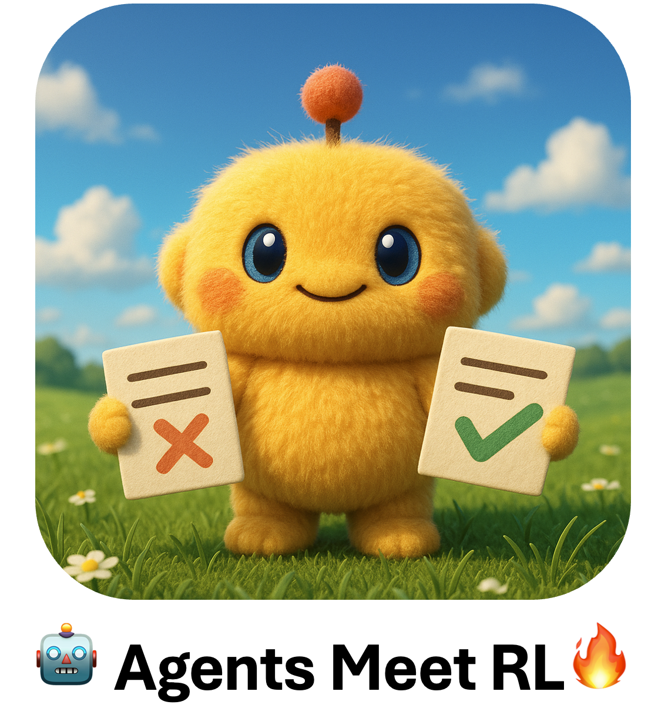

<div align="center">
  
</div>

<div align="center">


<br>


<br>


<br>


</div>

<div align="center">

[](https://thinkwee.top/amr/)

</div>

# When LLM Agents Meet Reinforcement Learning

**AgentsMeetRL** is an awesome list that summarizes **open-source repositories** for training LLM Agents using reinforcement learning:
 - 🤖 The criteria for identifying an agent project are that it must have at least one of the following: multi-turn interactions or tool use (so TIR projects, Tool-Integrated Reasoning, are considered in this repo).
 - ⚠️ This project is based on code analysis from open-source repositories using LLM coding agents, which may contain unfaithful cases. Although manually reviewed, there may still be omissions. If you find any errors, please don't hesitate to let us know immediately through issues or PRs - we warmly welcome them!
 - 🚀 We particularly focus on the reinforcement learning frameworks, RL algorithms, rewards, and environments that projects depend on, for everyone's reference on how these excellent open-source projects make their technical choices. See [Click to view technical details] under each table.
 - 📅 Last updated: 2026-03-24
 - 📢 **2026-03 Update**: Restructured taxonomy from 12 to 16 categories. Added ~70 new repositories covering Sep 2025 – Mar 2026. New categories include Multi-Agent RL, Reward & Training, Safety, VLM Agent, Self-Evolution, and Domain-Specific. Merged the old GUI and Web into Web & GUI, retired TextGame and Biomedical as standalone categories. Total repos grew from ~134 to 205.
 - 🤗 Feel free to submit your own projects anytime - we welcome contributions!

Taxonomy:
 - **Base Framework**: General-purpose RL training frameworks for LLM agents (e.g., veRL, OpenRLHF, trl)
 - **General/MultiTask**: Agent systems trained/evaluated across multiple tasks or environments
 - **Search & RAG**: Search-augmented reasoning agents that use retrieval tools to enhance LLM reasoning
 - **Web & GUI**: Agents that interact with web browsers, mobile/desktop GUIs, or operating systems
 - **Tool-Use**: Agents trained to invoke external tools (APIs, code executors, MCP, etc.)
 - **Code & SWE**: Software engineering and code generation agents
 - **Reasoning**: Reasoning agents with tool-integrated or multi-turn reasoning (math, QA, visual)
 - **Multi-Agent RL**: Multi-agent collaboration, negotiation, or credit assignment via RL
 - **Memory**: Agents that learn to manage, retrieve, or evolve memory
 - **Embodied**: Agents operating in embodied/physical simulation environments
 - **Domain-Specific**: RL agents for specialized domains (medical, OS tuning, etc.)
 - **Reward & Training**: Process/outcome reward models and training methodologies for agents
 - **Safety**: RL for agent safety alignment, adversarial red-teaming, and jailbreak defense/attack
 - **VLM Agent**: Vision-language model agents trained with RL for multimodal interaction
 - **Self-Evolution**: Agents that self-evolve via RL feedback loops (⚠️ definition still evolving in the community)
 - **Environment**: Benchmarks, gyms, and sandbox environments for agent training/evaluation

Some Enumeration:
 - Enumeration for Reward Type:
   - External Verifier: e.g., a compiler or math solver
   - Rule-Based: e.g., a LaTeX parser with exact match scoring
   - Model-Based: e.g., a trained verifier LLM or reward LLM
   - Custom

---

## 🔧 Base Framework


| Github Repo | 🌟 Stars | Date | Org | Paper Link |
| :----: | :----: | :----: |  :----: | :----: |
| [Open-AgentRL](https://github.com/Gen-Verse/Open-AgentRL) |  | 2026.2 | Gen-Verse | [Paper](https://arxiv.org/abs/2602.02488) |
| [OpenClaw-RL](https://github.com/Gen-Verse/OpenClaw-RL) |  | 2026.3 | Gen-Verse | [Paper](https://arxiv.org/abs/2603.10165) |
| [Claw-R1](https://github.com/AgentR1/Claw-R1) |  | 2026.3 | USTC | -- |
| [prime-rl](https://github.com/PrimeIntellect-ai/prime-rl) |  | 2025.2 | Prime Intellect | -- |
| [NeMo-RL](https://github.com/NVIDIA-NeMo/RL) |  | 2026.1 | NVIDIA | -- |
| [RLinf](https://github.com/RLinf/RLinf) |  | 2025.8 | Tsinghua/Infinigence AI/PKU | [Paper](https://arxiv.org/abs/2509.15965) |
| [siiRL](https://github.com/sii-research/siiRL) |  | 2025.7 | Shanghai Innovation Institute | [Paper](https://arxiv.org/abs/2507.13833) |
| [slime](https://github.com/THUDM/slime) |  | 2025.6 | Tsinghua University (THUDM) | [blog](https://lmsys.org/blog/2025-07-09-slime/) |
| [agent-lightning](https://github.com/microsoft/agent-lightning) |  | 2025.6 | Microsoft Research | [Paper](https://arxiv.org/abs/2508.03680) |
| [AReaL](https://github.com/inclusionAI/AReaL) |  | 2025.6 | AntGroup/Tsinghua | [Paper](https://arxiv.org/pdf/2505.24298) |
| [ROLL](https://github.com/alibaba/ROLL) |  | 2025.6 | Alibaba | [Paper](https://arxiv.org/pdf/2506.06122) |
| [MARTI](https://github.com/TsinghuaC3I/MARTI) |  | 2025.5 | Tsinghua | -- |
| [RL2](https://github.com/ChenmienTan/RL2) |  | 2025.4 | Accio | – |
| [verifiers](https://github.com/willccbb/verifiers) |  | 2025.3 | Individual | -- |
| [oat](https://github.com/sail-sg/oat) |  | 2024.11 | NUS/Sea AI | [Paper](https://arxiv.org/pdf/2411.01493) |
| [veRL](https://github.com/volcengine/verl) |  | 2024.10 | ByteDance | [Paper](https://arxiv.org/pdf/2409.19256) |
| [OpenRLHF](https://github.com/OpenRLHF/OpenRLHF) |  | 2023.7 | OpenRLHF | [Paper](https://arxiv.org/abs/2405.11143) |
| [trl](https://github.com/huggingface/trl) |  | 2019.11 | HuggingFace | -- |

<details>
<summary>📋 Click to view technical details</summary>

| Github Repo | RL Algorithm | Single/Multi Agent | Outcome/Process Reward | Single/Multi Turn | Task | Reward Type | Tool usage |
| :----: | :----: | :----: | :----: | :----: | :----: | :----: | :----: |
| [Open-AgentRL](https://github.com/Gen-Verse/Open-AgentRL) | GRPO-TCR | Single | Both | Multi | Reasoning/GUI/Coding | Model (PRM) | Yes (SandboxFusion) |
| [OpenClaw-RL](https://github.com/Gen-Verse/OpenClaw-RL) | GRPO/OPD | Both | Both | Multi | Terminal/GUI/SWE/Tool-call | Model/External | Yes |
| [Claw-R1](https://github.com/AgentR1/Claw-R1) | Generic RL Framework | Multi | Both | Multi | General Agent | All | Yes (Framework-agnostic) |
| [prime-rl](https://github.com/PrimeIntellect-ai/prime-rl) | GRPO/PPO | Multi | Outcome | Multi | Math/Code/Search | Model/External | Yes |
| [NeMo-RL](https://github.com/NVIDIA-NeMo/RL) | GRPO/DAPO/GDPO/DPO | Single | Outcome | Multi | Math/Reasoning/Code | Rule/External | No |
| [RLinf](https://github.com/RLinf/RLinf) | PPO/GRPO/DAPO/SAC/REINFORCE++/CrossQ/RLPD | Both | Both | Multi | Robotics/Math/Code/QA/VQA | All (Rule/Model/External) | Yes |
| [siiRL](https://github.com/sii-research/siiRL) | PPO/GRPO/CPGD/MARFT | Multi | Both | Multi | LLM/VLM/LLM-MAS PostTraining | Model/Rule | Planned |
| [slime](https://github.com/THUDM/slime) | GRPO/GSPO/REINFORCE++ | Single | Both | Both | Math/Code | External Verifier | Yes |
| [agent-lightning](https://github.com/microsoft/agent-lightning) | PPO/Custom/Automatic Prompt Optimization | Multi | Outcome | Multi | Calculator/SQL | Model/External/Rule | Yes |
| [AReaL](https://github.com/inclusionAI/AReaL) | PPO | Both | Outcome | Both | Math/Code | External | Yes |
| [ROLL](https://github.com/alibaba/ROLL) | PPO/GRPO/Reinforce++/TOPR/RAFT++ | Multi | Both | Multi | Math/QA/Code/Alignment | All | Yes |
| [MARTI](https://github.com/TsinghuaC3I/MARTI) | PPO/GRPO/REINFORCE++/TTRL | Multi | Both | Multi | Math | All | Yes |
| [RL2](https://github.com/ChenmienTan/RL2) | Dr. GRPO/PPO/DPO | Single | Both | Both | QA/Dialogue | Rule/Model/External | Yes |
| [verifiers](https://github.com/willccbb/verifiers) | GRPO | Multi | Outcome | Both | Reasoning/Math/Code | All | Code |
| [oat](https://github.com/sail-sg/oat) | PPO/GRPO | Single | Outcome | Multi | Math/Alignment | External | No |
| [veRL](https://github.com/volcengine/verl) | PPO/GRPO | Single | Outcome | Both | Math/QA/Reasoning/Search | All | Yes |
| [OpenRLHF](https://github.com/OpenRLHF/OpenRLHF) | PPO/REINFORCE++/GRPO/DPO/IPO/KTO/RLOO | Multi | Both | Both | Dialogue/Chat/Completion | Rule/Model/External | Yes |
| [trl](https://github.com/huggingface/trl) | PPO/GRPO/DPO | Single | Both | Single | QA | Custom | No |

</details>

## 💪 General/MultiTask

| Github Repo | 🌟 Stars | Date | Org | Paper Link | RL Framework |
| :----: | :----: | :----: |  :----: | :----: | :----: |
| [MetaClaw](https://github.com/aiming-lab/MetaClaw) |  | 2026.3 | UNC-Chapel Hill (AIMING Lab) | [Paper](https://arxiv.org/abs/2603.17187) | Custom |
| [SkillRL](https://github.com/aiming-lab/SkillRL) |  | 2026.2 | UNC-Chapel Hill (AIMING Lab) | [Paper](https://arxiv.org/abs/2602.08234) | Custom |
| [LLM-in-Sandbox](https://github.com/llm-in-sandbox/llm-in-sandbox) |  | 2026.1 | RUC/MSRA/THU | [Paper](https://huggingface.co/papers/2601.16206) | rllm (w/ veRL) |
| [youtu-agent](https://github.com/TencentCloudADP/youtu-agent) |  | 2025.12 | Tencent Youtu Lab | [Paper](https://arxiv.org/abs/2512.24615) | Custom |
| [DEPO](https://github.com/OpenCausaLab/DEPO) |  | 2025.11 | HKUST/SJTU | [Paper](https://arxiv.org/abs/2511.15392) | LLaMA-Factory |
| [SPEAR](https://github.com/TencentYoutuResearch/SPEAR) |  | 2025.10 | Tencent Youtu Lab | [Paper](https://arxiv.org/abs/2509.22601) | veRL/verl-agent |
| [DeepAgent](https://github.com/RUC-NLPIR/DeepAgent) |  | 2025.10 | RUC/Xiaohongshu | [Paper](https://arxiv.org/abs/2510.21618) | Custom |
| [AgentRL](https://github.com/THUDM/AgentRL) |  | 2025.9 | Tsinghua | [Paper](https://arxiv.org/abs/2510.04206) | veRL |
| [AgentGym-RL](https://github.com/WooooDyy/AgentGym-RL) |  | 2025.9 | Fudan University | [Paper](https://arxiv.org/abs/2509.08755) | veRL |
| [Agent_Foundation_Models](https://github.com/OPPO-PersonalAI/Agent_Foundation_Models) |  | 2025.8 | OPPO Personal AI Lab | [Paper](https://arxiv.org/abs/2508.13167) | veRL |
| [Trinity-RFT](https://github.com/modelscope/Trinity-RFT) |  | 2025.5 | Alibaba | [Paper](https://arxiv.org/pdf/2505.17826) | veRL |
| [SPA-RL-Agent](https://github.com/WangHanLinHenry/SPA-RL-Agent) |  | 2025.5 | PolyU | [Paper](https://arxiv.org/pdf/2505.20732) | TRL |
| [verl-agent](https://github.com/langfengQ/verl-agent) |  | 2025.5 | NTU/Skywork | [Paper](https://arxiv.org/pdf/2505.10978) | veRL |
| [VAGEN](https://github.com/RAGEN-AI/VAGEN) |  | 2025.3 | RAGEN-AI | [Paper](https://www.notion.so/VAGEN-Training-VLM-Agents-with-Multi-Turn-Reinforcement-Learning-1bfde13afb6e80b792f6d80c7c2fcad0) | veRL |
| [ART](https://github.com/OpenPipe/ART) |  | 2025.3 | OpenPipe | [Paper](https://github.com/OpenPipe/ART#-citation) | TRL |
| [OpenManus-RL](https://github.com/OpenManus/OpenManus-RL) |  | 2025.3 | UIUC/MetaGPT | -- | Custom |

<details>
<summary>📋 Click to view technical details</summary>

| Github Repo | RL Algorithm | Single/Multi Agent | Outcome/Process Reward | Single/Multi Turn | Task | Reward Type | Tool usage |
| :----: | :----: | :----: | :----: | :----: | :----: | :----: | :----: |
| [MetaClaw](https://github.com/aiming-lab/MetaClaw) | GRPO (LoRA) | Single | Process | Multi | General Agentic | Model (PRM) | Yes (Skill-augmented) |
| [SkillRL](https://github.com/aiming-lab/SkillRL) | GRPO | Single | Outcome | Multi | ALFWorld/WebShop/Search | Rule | Yes (Web search, actions) |
| [LLM-in-Sandbox](https://github.com/llm-in-sandbox/llm-in-sandbox) | GRPO++ | Single | Outcome | Multi | Math/Physics/Chemistry/Biomedicine/Long-context/IF/SWE | Rule | Yes (Code Sandbox w/ Terminal, File, Internet) |
| [youtu-agent](https://github.com/TencentCloudADP/youtu-agent) | Training-Free GRPO | Single | Outcome | Multi | Deep Research/Data Analysis/Tool-use | Model/External | Yes (Web search, code, file) |
| [DEPO](https://github.com/OpenCausaLab/DEPO) | KTO + Efficiency Loss | Single | Both | Multi | Agent (BabyAI/WebShop) | Rule | Yes |
| [SPEAR](https://github.com/TencentYoutuResearch/SPEAR) | GRPO/GiGPO + SIL | Single | Both | Multi | Math/Agent | Rule/External | Yes (Search, Sandbox, Browser) |
| [DeepAgent](https://github.com/RUC-NLPIR/DeepAgent) | ToolPO | Single | Outcome | Multi | ToolBench/ALFWorld/WebShop/GAIA/HLE | Model | Yes (16,000+ RapidAPIs) |
| [AgentRL](https://github.com/THUDM/AgentRL) | GRPO/REINFORCE++/RLOO/ReMax/GAE | Single | Outcome | Multi | Agent Tasks | External | Yes |
| [AgentGym-RL](https://github.com/WooooDyy/AgentGym-RL) | PPO/GRPO/RLOO/REINFORCE++ | Single | Outcome | Multi | Web/Search/Game/Embodied/Science | Rule/Model/External | Yes (Web, Search, Env APIs) |
| [Agent_Foundation_Models](https://github.com/OPPO-PersonalAI/Agent_Foundation_Models) | DAPO/PPO | Single | Outcome | Single | QA/Code/Math | Rule/External | Yes |
| [Trinity-RFT](https://github.com/modelscope/Trinity-RFT) | PPO/GRPO | Single | Outcome | Both | Math/TextGame/Web | All | Yes |
| [SPA-RL-Agent](https://github.com/WangHanLinHenry/SPA-RL-Agent) | PPO | Single | Process | Multi | Navigation/Web/TextGame | Model | No |
| [verl-agent](https://github.com/langfengQ/verl-agent) | PPO/GRPO/GiGPO/DAPO/RLOO/REINFORCE++ | Multi | Both | Multi | Phone Use/Math/Code/Web/TextGame | All | Yes |
| [VAGEN](https://github.com/RAGEN-AI/VAGEN) | PPO/GRPO | Single | Both | Multi | TextGame/Navigation | All | Yes |
| [ART](https://github.com/OpenPipe/ART) | GRPO | Multi | Both | Multi | TextGame | All | Yes |
| [OpenManus-RL](https://github.com/OpenManus/OpenManus-RL) | PPO/DPO/GRPO | Multi | Outcome | Multi | TextGame | All | Yes |

</details>

## 🔍 Search & RAG Agent


| Github Repo | 🌟 Stars | Date | Org | Paper Link | RL Framework |
| :----: | :----: | :----: |  :----: | :----: | :----: |
| [ProRAG](https://github.com/lilinwz/ProRAG) |  | 2026.1 | RUC | [Paper](https://arxiv.org/abs/2601.21912) | Custom |
| [MemSearcher](https://github.com/icip-cas/MemSearcher) |  | 2025.11 | CAS | [Paper](https://arxiv.org/abs/2511.02805) | Custom |
| [ReSeek](https://github.com/TencentBAC/ReSeek) |  | 2025.10 | Tencent PCG BAC/Tsinghua University | [Paper](https://arxiv.org/abs/2510.00568) | veRL |
| [AutoGraph-R1](https://github.com/HKUST-KnowComp/AutoGraph-R1) |  | 2025.10 | HKUST KnowComp | [Paper](https://arxiv.org/abs/2510.15339) | Custom |
| [Tree-GRPO](https://github.com/AMAP-ML/Tree-GRPO) |  | 2025.9 | AMAP | [Paper](https://arxiv.org/abs/2509.21240) | veRL |
| [ASearcher](https://github.com/inclusionAI/ASearcher) |  | 2025.8 | Ant Research RL Lab <br> Tsinghua University & UW | [Paper](https://arxiv.org/abs/2508.07976) | RealHF/AReaL |
| [Graph-R1](https://github.com/LHRLAB/Graph-R1) |  | 2025.7 | BUPT/NTU/NUS | [Paper](https://arxiv.org/abs/2507.21892) | veRL |
| [Kimi-Researcher](https://github.com/moonshotai/Kimi-Researcher) |  | 2025.6 | Moonshot AI | [blog](https://moonshotai.github.io/Kimi-Researcher/) | Custom |
| [R-Search](https://github.com/QingFei1/R-Search) |  | 2025.6 | Individual | -- | veRL |
| [R1-Searcher-plus](https://github.com/RUCAIBox/R1-Searcher-plus) |  | 2025.5 | RUC | [Paper](https://arxiv.org/pdf/2505.17005) | Custom |
| [StepSearch](https://github.com/Zillwang/StepSearch) |  | 2025.5 | SenseTime | [Paper](https://arxiv.org/pdf/2505.15107) | veRL |
| [AutoRefine](https://github.com/syr-cn/AutoRefine) |  | 2025.5 | USTC | [Paper](https://www.arxiv.org/pdf/2505.11277) | veRL |
| [ZeroSearch](https://github.com/Alibaba-NLP/ZeroSearch) |  | 2025.5 | Alibaba |[Paper](https://arxiv.org/pdf/2505.04588) | veRL |
| [ReasonRAG](https://github.com/wlzhang2020/ReasonRAG) |  | 2025.5 | CityU HK / Huawei | [Paper](https://arxiv.org/abs/2505.14069) | Custom |
| [Agentic-RAG-R1](https://github.com/jiangxinke/Agentic-RAG-R1) |  | 2025.12 | PKU | -- | Custom |
| [WebThinker](https://github.com/RUC-NLPIR/WebThinker) |  | 2025.4 | RUC | [Paper](https://arxiv.org/pdf/2504.21776) | Custom |
| [DeepResearcher](https://github.com/GAIR-NLP/DeepResearcher) |  | 2025.4 | SJTU | [Paper](https://arxiv.org/pdf/2504.03160) | veRL |
| [Search-R1](https://github.com/PeterGriffinJin/Search-R1) |  | 2025.3 | UIUC/Google | [paper1](https://arxiv.org/pdf/2503.09516), [paper2](https://arxiv.org/pdf/2505.15117) | veRL |
| [R1-Searcher](https://github.com/RUCAIBox/R1-Searcher) |  | 2025.3 | RUC | [Paper](https://arxiv.org/pdf/2503.05592) | OpenRLHF |
| [C-3PO](https://github.com/Chen-GX/C-3PO) |  | 2025.2 | Alibaba | [Paper](https://arxiv.org/pdf/2502.06205) | OpenRLHF |
| [DeepRetrieval](https://github.com/pat-jj/DeepRetrieval) |  | 2025.2 | UIUC | [Paper](https://arxiv.org/abs/2503.00223) | veRL |
| [SSRL](https://github.com/TsinghuaC3I/SSRL) |  | 2025.8 | Tsinghua | [Paper](https://arxiv.org/abs/2508.10874) | Custom |
| [Research-Venus](https://github.com/antgroup/Research-Venus) |  | 2025.8 | Ant Group | [Paper](https://arxiv.org/abs/2508.12800) | Custom |
| [DeepResearch](https://github.com/Alibaba-NLP/DeepResearch) |  | 2025.9 | Alibaba/Tongyi Lab | [Paper](https://arxiv.org/abs/2510.24701) | Custom |
| [DeepDive](https://github.com/THUDM/DeepDive) |  | 2025.9 | Tsinghua/THUDM | [Paper](https://arxiv.org/abs/2509.10446) | Custom |

<details>
<summary>📋 Click to view technical details</summary>

| Github Repo | RL Algorithm | Single/Multi Agent | Outcome/Process Reward | Single/Multi Turn | Task | Reward Type | Tool usage |
| :----: | :----: | :----: | :----: | :----: | :----: | :----: | :----: |
| [ProRAG](https://github.com/lilinwz/ProRAG) | GRPO + DGA (dual-granularity advantage) | Single | Both | Multi | Multi-hop RAG | Model (PRM via MCTS) | Yes (Retrieval) |
| [MemSearcher](https://github.com/icip-cas/MemSearcher) | Multi-context GRPO | Single | Outcome | Multi | Search/QA + Memory | Rule/Model | Yes (Web search + Memory) |
| [ReSeek](https://github.com/TencentBAC/ReSeek) | GRPO/PPO | Single | Both | Multi | QA/Search | Rule | Search/JUDGE |
| [AutoGraph-R1](https://github.com/HKUST-KnowComp/AutoGraph-R1) | GRPO (via VeRL) | Single | Outcome | Multi | KG Construction for QA | Rule | Yes (Graph retrieval) |
| [Tree-GRPO](https://github.com/AMAP-ML/Tree-GRPO) | GRPO/Tree-GRPO | Single | Outcome | Multi | Search | Rule | Search |
| [ASearcher](https://github.com/inclusionAI/ASearcher) | PPO/GRPO + Decoupled PPO | Single | Outcome | Multi | Math/Code/SearchQA | External/Rule | Yes |
| [Graph-R1](https://github.com/LHRLAB/Graph-R1) | GRPO/REINFORCE++/PPO | Single | Outcome | Multi | KGQA | Rule (EM/F1) | Yes (Graph retrieval) |
| [Kimi-Researcher](https://github.com/moonshotai/Kimi-Researcher) | REINFORCE | Single | Outcome | Multi | Research | Outcome | Search, Browse, Coding |
| [R-Search](https://github.com/QingFei1/R-Search) | PPO/GRPO | Single | Both | Multi | QA/Search | All | Yes |
| [R1-Searcher-plus](https://github.com/RUCAIBox/R1-Searcher-plus) | Custom | Single | Outcome | Multi | Search | Model | Search |
| [StepSearch](https://github.com/Zillwang/StepSearch) | PPO | Single | Process | Multi | QA | Model | Search |
| [AutoRefine](https://github.com/syr-cn/AutoRefine) | PPO/GRPO | Multi | Both | Multi | RAG QA | Rule | Search |
| [ZeroSearch](https://github.com/Alibaba-NLP/ZeroSearch) | PPO/GRPO/REINFORCE | Single | Outcome | Multi | QA/Search | Rule | Yes |
| [ReasonRAG](https://github.com/wlzhang2020/ReasonRAG) | DPO + MCTS-based PRM | Single | Process | Multi | Multi-hop QA | Model (PRM) | Yes (Wikipedia search) |
| [Agentic-RAG-R1](https://github.com/jiangxinke/Agentic-RAG-R1) | GRPO | Single | Outcome | Multi | Knowledge-intensive QA | Rule/Model | Yes (Wiki/Doc search) |
| [WebThinker](https://github.com/RUC-NLPIR/WebThinker) | DPO | Single | Outcome | Multi | Reasoning/QA/Research | Model/External | Web Browsing |
| [DeepResearcher](https://github.com/GAIR-NLP/DeepResearcher) | PPO/GRPO | Multi | Outcome | Multi | Research | All | Yes |
| [Search-R1](https://github.com/PeterGriffinJin/Search-R1) | PPO/GRPO | Single | Outcome | Multi | Search | All | Search |
| [R1-Searcher](https://github.com/RUCAIBox/R1-Searcher) | PPO/DPO | Single | Both | Multi | Search | All | Yes |
| [C-3PO](https://github.com/Chen-GX/C-3PO) | PPO | Multi | Outcome | Multi | Search | Model | Yes |
| [DeepRetrieval](https://github.com/pat-jj/DeepRetrieval) | GRPO | Single | Outcome | Multi | Query Generation/IR | Rule | Yes (Search) |
| [SSRL](https://github.com/TsinghuaC3I/SSRL) | GRPO | Single | Outcome | Multi | Self-Search | Rule | Yes (Self-search) |
| [Research-Venus](https://github.com/antgroup/Research-Venus) | GRPO | Single | Both | Multi | Deep Research | Model (atomic thought) | Yes (Search) |
| [DeepResearch](https://github.com/Alibaba-NLP/DeepResearch) | RL-based | Single | Outcome | Multi | Deep Research | Model | Yes (Search, Browse) |
| [DeepDive](https://github.com/THUDM/DeepDive) | GRPO | Single | Outcome | Multi | KG-augmented Search | Rule | Yes (KG + Search) |

</details>

## 🌐 Web & GUI Agent


| Github Repo | 🌟 Stars | Date | Org | Paper Link | RL Framework |
| :----: | :----: | :----: |  :----: | :----: | :----: |
| [MobileAgent](https://github.com/X-PLUG/MobileAgent) |  | 2025.9 | X-PLUG (TongyiQwen) | [paper](https://arxiv.org/abs/2509.11543) | veRL |
| [InfiGUI-G1](https://github.com/InfiXAI/InfiGUI-G1) |  | 2025.8 | InfiX AI | [Paper](https://arxiv.org/abs/2508.05731) | veRL |
| [UI-AGILE](https://github.com/KDEGroup/UI-AGILE) |  | 2025.7 | Xiamen University | [Paper](https://arxiv.org/abs/2507.22025) | Custom |
| [gui-rcpo](https://github.com/zju-real/gui-rcpo) |  | 2025.8 | Zhejiang University | [Paper](https://arxiv.org/abs/2508.05615) | Custom |
| [Grounding-R1](https://github.com/Yan98/Grounding-R1) |  | 2025.6 | Salesforce | [blog](https://huggingface.co/blog/HelloKKMe/grounding-r1) | trl |
| [AgentCPM-GUI](https://github.com/OpenBMB/AgentCPM-GUI) |  | 2025.6 | OpenBMB/Tsinghua/RUC | [Paper](https://arxiv.org/pdf/2506.01391) | Huggingface |
| [TTI](https://github.com/test-time-interaction/TTI) |  | 2025.6 | CMU | [Paper](https://arxiv.org/abs/2506.07976) | Custom |
| [SE-GUI](https://github.com/YXB-NKU/SE-GUI) |  | 2025.5 | Nankai University/vivo | [Paper](https://arxiv.org/pdf/2505.12370) | trl |
| [ARPO](https://github.com/dvlab-research/ARPO) |  | 2025.5 | CUHK/HKUST | [Paper](https://arxiv.org/pdf/2505.16282) | veRL |
| [GUI-G1](https://github.com/Yuqi-Zhou/GUI-G1) |  | 2025.5 | RUC | [Paper](https://arxiv.org/pdf/2505.15810) | TRL |
| [WebAgent-R1](https://github.com/weizhepei/WebAgent-R1) |  | 2025.5 | Amazon/UVA | [Paper](https://arxiv.org/abs/2505.16421) | Custom |
| [GUI-R1](https://github.com/ritzz-ai/GUI-R1) |  | 2025.4 | CAS/NUS | [Paper](https://arxiv.org/pdf/2504.10458) | veRL |
| [UI-R1](https://github.com/lll6gg/UI-R1) |  | 2025.3 | vivo/CUHK | [Paper](https://arxiv.org/pdf/2503.21620) | TRL |
| [CollabUIAgents](https://github.com/THUNLP-MT/CollabUIAgents) |  | 2025.2 | Tsinghua/Alibaba/HKUST | [Paper](https://arxiv.org/abs/2502.14496) | Custom |
| [WebAgent](https://github.com/Alibaba-NLP/WebAgent) |  | 2025.1 | Alibaba | [paper1](https://arxiv.org/pdf/2501.07572), [paper2](https://arxiv.org/pdf/2505.22648) | LLaMA-Factory |
| [UI-TARS](https://github.com/bytedance/UI-TARS) |  | 2025.9 | ByteDance Seed | [Paper](https://arxiv.org/abs/2509.02544) | Custom |
| [DigiQ](https://github.com/DigiRL-agent/digiq) |  | 2025.2 | UC Berkeley/CMU/Amazon | [Paper](https://arxiv.org/abs/2502.15760) | Custom |
| [ZeroGUI](https://github.com/OpenGVLab/ZeroGUI) |  | 2025.5 | Shanghai AI Lab | [Paper](https://arxiv.org/abs/2505.23762) | Custom |
| [InfiGUI-R1](https://github.com/Reallm-Labs/InfiGUI-R1) |  | 2025.4 | Zhejiang University | [Paper](https://arxiv.org/abs/2504.14239) | Custom |
| [GUI-Agent-RL](https://github.com/microsoft/GUI-Agent-RL) |  | 2025.2 | Microsoft | [Paper](https://arxiv.org/abs/2502.18906) | Custom |

<details>
<summary>📋 Click to view technical details</summary>

| Github Repo | RL Algorithm | Single/Multi Agent | Outcome/Process Reward | Single/Multi Turn | Task | Reward Type | Tool usage |
| :----: | :----: | :----: | :----: | :----: | :----: | :----: | :----: |
| [MobileAgent](https://github.com/X-PLUG/MobileAgent) | semi-online RL | Single | Both | Multi | MobileGUI/Automation | Rule | Yes |
| [InfiGUI-G1](https://github.com/InfiXAI/InfiGUI-G1) | AEPO | Single | Outcome | Single | GUI/Grounding | Rule | No |
| [UI-AGILE](https://github.com/KDEGroup/UI-AGILE) | GRPO | Single | Outcome | Single | GUI Grounding | Rule (continuous) | No |
| [gui-rcpo](https://github.com/zju-real/gui-rcpo) | RCPO | Single | Outcome | Single | GUI Grounding | Rule (self-supervised) | No |
| [Grounding-R1](https://github.com/Yan98/Grounding-R1) | GRPO | Single | Outcome | Multi | GUI Grounding | Model | Yes |
| [AgentCPM-GUI](https://github.com/OpenBMB/AgentCPM-GUI) | GRPO | Single | Outcome | Multi | Mobile GUI | Model | Yes |
| [TTI](https://github.com/test-time-interaction/TTI) | REINFORCE/BC | Single | Outcome | Multi | Web | External | Web Browsing |
| [SE-GUI](https://github.com/YXB-NKU/SE-GUI) | GRPO | Single | Both | Single | GUI Grounding | Rule | Yes |
| [ARPO](https://github.com/dvlab-research/ARPO) | GRPO | Single | Outcome | Multi | GUI | External | Computer Use |
| [GUI-G1](https://github.com/Yuqi-Zhou/GUI-G1) | GRPO | Single | Outcome | Single | GUI | Rule/External | No |
| [WebAgent-R1](https://github.com/weizhepei/WebAgent-R1) | M-GRPO | Single | Outcome | Multi | Web Navigation (WebArena-Lite) | Rule (task success) | Yes (Web browsing) |
| [GUI-R1](https://github.com/ritzz-ai/GUI-R1) | GRPO | Single | Outcome | Multi | GUI | Rule | No |
| [UI-R1](https://github.com/lll6gg/UI-R1) | GRPO | Single | Process | Both | GUI | Rule | Computer/Phone Use |
| [CollabUIAgents](https://github.com/THUNLP-MT/CollabUIAgents) | DPO (credit re-assignment) | Multi | Process | Multi | GUI (Mobile + Web) | Model (LLM) | Yes (GUI interaction) |
| [WebAgent](https://github.com/Alibaba-NLP/WebAgent) | DAPO | Multi | Process | Multi | Web | Model | Yes |
| [UI-TARS](https://github.com/bytedance/UI-TARS) | Multi-turn RL | Single | Both | Multi | GUI (Cross-platform) | Model | Yes (GUI actions) |
| [DigiQ](https://github.com/DigiRL-agent/digiq) | Value-based offline RL | Single | Outcome | Multi | Android Device Control | Model (Q-function) | Yes |
| [ZeroGUI](https://github.com/OpenGVLab/ZeroGUI) | Online RL | Single | Outcome | Multi | GUI Agent | Rule | Yes (GUI actions) |
| [InfiGUI-R1](https://github.com/Reallm-Labs/InfiGUI-R1) | RL + sub-goal guidance | Single | Both | Multi | GUI Reasoning | Rule | Yes |
| [GUI-Agent-RL](https://github.com/microsoft/GUI-Agent-RL) | Value-based RL (VEM) | Single | Outcome | Multi | GUI (Web Shopping) | Model | Yes |

</details>

## 🔨 Tool-Use Agent


| Github Repo | 🌟 Stars | Date | Org | Paper Link | RL Framework |
| :----: | :----: | :----: |  :----: | :----: | :----: |
| [MATPO](https://github.com/mzf666/MATPO) |  | 2025.10 | MiroMind AI | [Paper](https://arxiv.org/abs/2510.04678) | Custom |
| [MiroRL](https://github.com/MiroMindAI/MiroRL) |  | 2025.8 | MiroMindAI | [HF Repo](https://huggingface.co/miromind-ai) | veRL |
| [verl-tool](https://github.com/TIGER-AI-Lab/verl-tool) |  | 2025.6 | TIGER-Lab | [X](https://x.com/DongfuJiang/status/1929198238017720379) | veRL |
| [Multi-Turn-RL-Agent](https://github.com/SiliangZeng/Multi-Turn-RL-Agent) |  | 2025.5 | University of Minnesota | [Paper](https://arxiv.org/pdf/2505.11821) | Custom |
| [Tool-N1](https://github.com/NVlabs/Tool-N1) |  | 2025.5 | NVIDIA | [Paper](https://arxiv.org/pdf/2505.00024) | veRL |
| [Tool-Star](https://github.com/dongguanting/Tool-Star) |  | 2025.5 | RUC | [Paper](https://arxiv.org/pdf/2505.16410) | LLaMA-Factory |
| [RL-Factory](https://github.com/Simple-Efficient/RL-Factory) |  | 2025.5 | Simple-Efficient | [model](https://huggingface.co/Simple-Efficient/RLFactory-Qwen3-8B-GRPO) | veRL |
| [ReTool](https://github.com/ReTool-RL/ReTool) |  | 2025.4 | ByteDance | [Paper](https://arxiv.org/pdf/2504.11536) | veRL |
| [AWorld](https://github.com/inclusionAI/AWorld) |  | 2025.3 | Ant Group (inclusionAI) | [Paper](https://arxiv.org/abs/2508.20404) | veRL |
| [Agent-R1](https://github.com/0russwest0/Agent-R1) |  | 2025.3 | USTC | [Paper](https://arxiv.org/abs/2511.14460) | veRL |
| [ReCall](https://github.com/Agent-RL/ReCall) |  | 2025.3 | BaiChuan | [Paper](https://arxiv.org/pdf/2503.19470) | veRL |
| [ToolRL](https://github.com/qiancheng0/ToolRL) |  | 2025.4 | UIUC | [Paper](https://arxiv.org/abs/2504.13958) | veRL |

<details>
<summary>📋 Click to view technical details</summary>

| Github Repo | RL Algorithm | Single/Multi Agent | Outcome/Process Reward | Single/Multi Turn | Task | Reward Type | Tool usage |
| :----: | :----: | :----: | :----: | :----: | :----: | :----: | :----: |
| [MATPO](https://github.com/mzf666/MATPO) | GRPO (multi-agent) | Multi | Outcome | Multi | Tool-use/Search | Rule | Yes (MCP: Serper, Web scraping) |
| [MiroRL](https://github.com/MiroMindAI/MiroRL) | GRPO | Single | Both | Multi | Reasoning/Planning/ToolUse | Rule-based | MCP |
| [verl-tool](https://github.com/TIGER-AI-Lab/verl-tool) | PPO/GRPO | Single | Both | Both | Math/Code | Rule/External | Yes |
| [Multi-Turn-RL-Agent](https://github.com/SiliangZeng/Multi-Turn-RL-Agent) | GRPO | Single | Both | Multi | Tool-use/Math | Rule/External | Yes |
| [Tool-N1](https://github.com/NVlabs/Tool-N1) | PPO | Single | Outcome | Multi | Math/Dialogue | All | Yes |
| [Tool-Star](https://github.com/dongguanting/Tool-Star) | PPO/DPO/ORPO/SimPO/KTO | Single | Outcome | Multi | Multi-modal/Tool Use/Dialogue | Model/External | Yes |
| [RL-Factory](https://github.com/Simple-Efficient/RL-Factory) | GRPO | Multi | Both | Multi | Tool-use/NL2SQL | All | MCP |
| [ReTool](https://github.com/ReTool-RL/ReTool) | PPO | Single | Outcome | Multi | Math | External | Code |
| [AWorld](https://github.com/inclusionAI/AWorld) | GRPO | Both | Outcome | Multi | Search/Web/Code | External/Rule | Yes |
| [Agent-R1](https://github.com/0russwest0/Agent-R1) | PPO/GRPO | Single | Both | Multi | Tool-use/QA | Model | Yes |
| [ReCall](https://github.com/Agent-RL/ReCall) | PPO/GRPO/RLOO/REINFORCE++/ReMax | Single | Outcome | Multi | Tool-use/Math/QA | All | Yes |
| [ToolRL](https://github.com/qiancheng0/ToolRL) | GRPO/PPO | Single | Outcome | Multi | Tool Learning | Rule/External | Yes |

</details>

## 💻 Code & SWE Agent


| Github Repo | 🌟 Stars | Date | Org | Paper Link | RL Framework |
| :----: | :----: | :----: |  :----: | :----: | :----: |
| [CUDA-Agent](https://github.com/BytedTsinghua-SIA/CUDA-Agent) |  | 2026.2 | ByteDance/Tsinghua | [Paper](https://arxiv.org/abs/2602.24286) | Custom |
| [LLM-in-Sandbox](https://github.com/llm-in-sandbox/llm-in-sandbox) |  | 2026.1 | RUC/MSRA/THU | [Paper](https://huggingface.co/papers/2601.16206) | rllm (w/ veRL) |
| [PPP-Agent](https://github.com/sunnweiwei/PPP-Agent) |  | 2025.11 | CMU/OpenHands | [Paper](https://arxiv.org/abs/2511.02208) | veRL |
| [RepoDeepSearch](https://github.com/Mizersy/RepoDeepSearch) |  | 2025.8 | PKU, Bytedance, BIT | [Paper](https://arxiv.org/abs/2508.03012) | veRL |
| [CUDA-L1](https://github.com/deepreinforce-ai/CUDA-L1) |  | 2025.7 | DeepReinforce AI | [Paper](https://arxiv.org/abs/2507.14111) | Custom |
| [MedAgentGym](https://github.com/wshi83/MedAgentGym) |  | 2025.6 | Emory/Georgia Tech | [Paper](https://arxiv.org/pdf/2506.04405) | Hugginface |
| [CURE](https://github.com/Gen-Verse/CURE) |  | 2025.6 | University of Chicago <br> Princeton/ByteDance | [Paper](https://arxiv.org/pdf/2506.03136) | Huggingface |
| [Time-R1](https://github.com/ulab-uiuc/Time-R1) |  | 2025.5 | UIUC | [Paper](https://arxiv.org/pdf/2505.13508) | veRL |
| [ML-Agent](https://github.com/MASWorks/ML-Agent) |  | 2025.5 | MASWorks | [Paper](https://arxiv.org/pdf/2505.23723) | Custom |
| [SkyRL](https://github.com/NovaSky-AI/SkyRL) |  | 2025.4 | NovaSky | [Paper](https://arxiv.org/abs/2511.16108) | veRL |
| [digitalhuman](https://github.com/Tencent/digitalhuman) |  | 2025.4 | Tencent | [Paper](https://arxiv.org/abs/2507.03112) | veRL |
| [sweet_rl](https://github.com/facebookresearch/sweet_rl) |  | 2025.3 | Meta/UCB | [Paper](https://arxiv.org/pdf/2503.15478) | OpenRLHF |
| [swe-rl](https://github.com/facebookresearch/swe-rl) |  | 2025.2 | Meta/UIUC/CMU | [Paper](https://arxiv.org/abs/2502.18449) | Custom |
| [rllm](https://github.com/agentica-project/rllm) |  | 2025.1 | Berkeley Sky Computing Lab <br> BAIR / Together AI | [Notion Blog](https://pretty-radio-b75.notion.site/rLLM-A-Framework-for-Post-Training-Language-Agents-21b81902c146819db63cd98a54ba5f31) | veRL |
| [open-r1](https://github.com/huggingface/open-r1) |  | 2025.1 | HuggingFace | -- | TRL |
| [R1-Code-Interpreter](https://github.com/yongchao98/R1-Code-Interpreter) |  | 2025.5 | MIT | [Paper](https://arxiv.org/abs/2505.21668) | Custom |
| [CTRL](https://github.com/HKUNLP/critic-rl) |  | 2025.2 | HKU/ByteDance | [Paper](https://arxiv.org/abs/2502.03492) | Custom |
| [DeepAnalyze](https://github.com/ruc-datalab/DeepAnalyze) |  | 2025.10 | RUC/Tsinghua | [Paper](https://arxiv.org/abs/2510.16872) | Custom |
| [AceCoder](https://github.com/TIGER-AI-Lab/AceCoder) |  | 2025.2 | Waterloo (TIGER-Lab) | [Paper](https://arxiv.org/abs/2502.01718) | Custom |

<details>
<summary>📋 Click to view technical details</summary>

| Github Repo | RL Algorithm | Single/Multi Agent | Outcome/Process Reward | Single/Multi Turn | Task | Reward Type | Tool usage |
| :----: | :----: | :----: | :----: | :----: | :----: | :----: | :----: |
| [CUDA-Agent](https://github.com/BytedTsinghua-SIA/CUDA-Agent) | Agentic RL (staged) | Single | Outcome | Multi | CUDA Kernel Generation | Rule (correctness + performance) | Yes (compile/verify/profile) |
| [LLM-in-Sandbox](https://github.com/llm-in-sandbox/llm-in-sandbox) | GRPO++ | Single | Outcome | Multi | Code/SWE + General (Math/Sci/Bio) | Rule | Yes (Code Sandbox w/ Terminal, File, Internet) |
| [PPP-Agent](https://github.com/sunnweiwei/PPP-Agent) | PPP-RL | Single | Both | Multi | SWE/Research | Rule+Model | Search, Ask, Browse |
| [RepoDeepSearch](https://github.com/Mizersy/RepoDeepSearch) | GRPO | Single | Both | Multi | Search/Repair | Rule/External | Yes |
| [CUDA-L1](https://github.com/deepreinforce-ai/CUDA-L1) | Contrastive RL | Single | Outcome | Single | CUDA Optimization | Rule (performance) | No |
| [MedAgentGym](https://github.com/wshi83/MedAgentGym) | SFT/DPO/PPO/GRPO | Single | Outcome | Multi | Medical/Code | External | Yes |
| [CURE](https://github.com/Gen-Verse/CURE) | PPO | Single | Outcome | Single | Code | External | No |
| [Time-R1](https://github.com/ulab-uiuc/Time-R1) | PPO/GRPO/DPO | Multi | Outcome | Multi | Temporal | All | Code |
| [ML-Agent](https://github.com/MASWorks/ML-Agent) | Custom | Single | Process | Multi | Code | All | Yes |
| [SkyRL](https://github.com/NovaSky-AI/SkyRL) | PPO/GRPO | Single | Outcome | Multi | Math/Code | All | Code |
| [digitalhuman](https://github.com/Tencent/digitalhuman) | PPO/GRPO/ReMax/RLOO | Multi | Outcome | Multi | Empathy/Math/Code/MultimodalQA | Rule/Model/External | Yes |
| [sweet_rl](https://github.com/facebookresearch/sweet_rl) | DPO | Multi | Process | Multi | Design/Code | Model | Web Browsing |
| [swe-rl](https://github.com/facebookresearch/swe-rl) | RL-based | Single | Outcome | Single | SWE (SWE-bench) | Rule (similarity) | No |
| [rllm](https://github.com/agentica-project/rllm) | PPO/GRPO | Single | Outcome | Multi | Code Edit | External | Yes |
| [open-r1](https://github.com/huggingface/open-r1) | GRPO | Single | Outcome | Single | Math/Code | All | Yes |
| [R1-Code-Interpreter](https://github.com/yongchao98/R1-Code-Interpreter) | GRPO | Single | Outcome | Multi | Code Interpretation | Rule/External | Yes (Code exec) |
| [CTRL](https://github.com/HKUNLP/critic-rl) | RL (critique-revision) | Single | Process | Multi | Code Refinement | Model | Yes (Code exec) |
| [DeepAnalyze](https://github.com/ruc-datalab/DeepAnalyze) | Curriculum RL | Single | Outcome | Multi | Data Science | Rule/External | Yes (Code exec) |
| [AceCoder](https://github.com/TIGER-AI-Lab/AceCoder) | GRPO | Single | Outcome | Single | Code Generation | External (test cases) | Yes |

</details>

## 🤔 Reasoning Agent


| Github Repo | 🌟 Stars | Date | Org | Paper Link | RL Framework |
| :----: | :----: | :----: |  :----: | :----: | :----: |
| [Agent0](https://github.com/aiming-lab/Agent0) |  | 2025.10 | UNC‑Chapel Hill / Salesforce Research / Stanford University | [Paper](https://arxiv.org/abs/2511.16043) | veRL |
| [KG-R1](https://github.com/Jinyeop3110/KG-R1) |  | 2025.9 | UIUC/Google | [Paper1](https://arxiv.org/pdf/2503.09516), [Paper2](https://arxiv.org/abs/2505.15117) | veRL |
| [AgentFlow](https://github.com/lupantech/AgentFlow) |  | 2025.09 | Stanford University | [arXiv](https://arxiv.org/abs/2510.05592) | veRL |
| [ARPO](https://github.com/dongguanting/ARPO) |  | 2025.7 | RUC, Kuaishou | [Paper](https://arxiv.org/abs/2507.19849) | veRL |
| [terminal-bench-rl](https://github.com/Danau5tin/terminal-bench-rl) |  | 2025.7 | Individual (Danau5tin) | N/A | rLLM |
| [MOTIF](https://github.com/purbeshmitra/MOTIF) |  | 2025.6 | University of Maryland | [Paper](https://arxiv.org/abs/2507.02851) | trl |
| [cmriat/l0](https://github.com/cmriat/l0) |  | 2025.6 | CMRIAT | [Paper](https://arxiv.org/abs/2506.23667) | veRL |
| [agent-distillation](https://github.com/Nardien/agent-distillation) |  | 2025.5 | KAIST | [Paper](https://arxiv.org/pdf/2505.17612) | Custom |
| [EasyR1](https://github.com/hiyouga/EasyR1) |  | 2025.4 | Individual | [repo1](https://github.com/hiyouga/EasyR1)/[paper2](https://arxiv.org/pdf/2409.19256) | veRL |
| [AutoCoA](https://github.com/ADaM-BJTU/AutoCoA) |  | 2025.3 | BJTU | [Paper](https://arxiv.org/pdf/2503.06580) | veRL |
| [ToRL](https://github.com/GAIR-NLP/ToRL) |  | 2025.3 | SJTU | [Paper](https://arxiv.org/pdf/2503.23383) | veRL |
| [ReMA](https://github.com/ziyuwan/ReMA-public) |  | 2025.3 | SJTU, UCL | [Paper](https://arxiv.org/pdf/2503.09501) | veRL |
| [Agentic-Reasoning](https://github.com/theworldofagents/Agentic-Reasoning) |  | 2025.2 | Oxford | [Paper](https://arxiv.org/pdf/2502.04644) | Custom |
| [SimpleTIR](https://github.com/ltzheng/SimpleTIR) |  | 2025.2 | NTU, Bytedance | [Notion Blog](https://simpletir.notion.site/report) | veRL |
| [openrlhf_async_pipline](https://github.com/yyht/openrlhf_async_pipline) |  | 2024.5 | OpenRLHF | [Paper](https://arxiv.org/pdf/2405.11143) | OpenRLHF |

<details>
<summary>📋 Click to view technical details</summary>

| Github Repo | RL Algorithm | Single/Multi Agent | Outcome/Process Reward | Single/Multi Turn | Task | Reward Type | Tool usage |
| :----: | :----: | :----: | :----: | :----: | :----: | :----: | :----: |
| [Agent0](https://github.com/aiming-lab/Agent0) | ADPO | Multi | Process | Multi | Math/Visual | Model/Verifier | Yes |
| [KG-R1](https://github.com/Jinyeop3110/KG-R1) | GRPO/PPO | Single | Both | Multi | KGQA | Rule/Model | KG Retrieval |
| [AgentFlow](https://github.com/lupantech/AgentFlow) | Flow-GRPO | Single | Outcome | Multi | Search/Math/QA | Model/External | Yes |
| [ARPO](https://github.com/dongguanting/ARPO) | GRPO | Single | Outcome | Multi | Math/Coding | Model/Rule | Yes |
| [terminal-bench-rl](https://github.com/Danau5tin/terminal-bench-rl) | GRPO | Single | Outcome | Multi | Coding/Terminal | Model+External Verifier | Yes |
| [MOTIF](https://github.com/purbeshmitra/MOTIF) | GRPO | Single | Outcome | Multi | QA | Rule | No |
| [cmriat/l0](https://github.com/cmriat/l0) | PPO | Multi | Process | Multi | QA | All | Yes |
| [agent-distillation](https://github.com/Nardien/agent-distillation) | PPO | Single | Process | Multi | QA/Math | External | Yes |
| [EasyR1](https://github.com/hiyouga/EasyR1) | GRPO | Single | Process | Multi | Vision-Language | Model | Yes |
| [AutoCoA](https://github.com/ADaM-BJTU/AutoCoA) | GRPO | Multi | Outcome | Multi | Reasoning/Math/QA | All | Yes |
| [ToRL](https://github.com/GAIR-NLP/ToRL) | GRPO | Single | Outcome | Single | Math | Rule/External | Yes |
| [ReMA](https://github.com/ziyuwan/ReMA-public) | PPO | Multi | Outcome | Multi | Math | Rule | No |
| [Agentic-Reasoning](https://github.com/theworldofagents/Agentic-Reasoning) | Custom | Single | Process | Multi | QA/Math | External | Web Browsing |
| [SimpleTIR](https://github.com/ltzheng/SimpleTIR) | PPO/GRPO (with extensions) | Single | Outcome | Multi | Math, Coding | All | Yes |
| [openrlhf_async_pipline](https://github.com/yyht/openrlhf_async_pipline) | PPO/REINFORCE++/DPO/RLOO | Single | Outcome | Multi | Dialogue/Reasoning/QA | All | No |

</details>

## 👥 Multi-Agent RL


| Github Repo | 🌟 Stars | Date | Org | Paper Link | RL Framework |
| :----: | :----: | :----: |  :----: | :----: | :----: |
| [PettingLLMs](https://github.com/pettingllms-ai/PettingLLMs) |  | 2025.10 | Intel / UCSD | [Paper](https://arxiv.org/abs/2510.11062) | Custom |
| [MASPRM](https://github.com/milad1378yz/MASPRM) |  | 2025.10 | UBC / Huawei | [Paper](https://arxiv.org/abs/2510.24803) | Custom |
| [ARIA](https://github.com/rhyang2021/ARIA) |  | 2025.6 | Fudan University | [Paper](https://arxiv.org/abs/2506.00539) | Custom |
| [AMPO](https://github.com/MozerWang/AMPO) |  | 2025.5 | Tongyi Lab, Alibaba | [Paper](https://arxiv.org/abs/2505.02156) | veRL |
| [MAPoRL](https://github.com/chanwoo-park-official/MAPoRL) |  | 2025.8 | Academic | -- | Custom |
| [FlowReasoner](https://github.com/sail-sg/FlowReasoner) |  | 2025.4 | Sea AI Lab / NUS | [Paper](https://arxiv.org/abs/2504.15257) | Custom |
| [DrMAS](https://github.com/langfengQ/DrMAS) |  | 2026.2 | NTU | [Paper](https://arxiv.org/abs/2602.08847) | Custom |

<details>
<summary>📋 Click to view technical details</summary>

| Github Repo | RL Algorithm | Single/Multi Agent | Outcome/Process Reward | Single/Multi Turn | Task | Reward Type | Tool usage |
| :----: | :----: | :----: | :----: | :----: | :----: | :----: | :----: |
| [PettingLLMs](https://github.com/pettingllms-ai/PettingLLMs) | AT-GRPO | Multi | Both | Multi | Game/Code/Math/Planning | Rule (verifiable) | No |
| [MASPRM](https://github.com/milad1378yz/MASPRM) | PRM (trained from MCTS rollouts) | Multi | Process | Multi | Reasoning (GSM8K/MATH/MMLU) | Learned PRM | No |
| [ARIA](https://github.com/rhyang2021/ARIA) | REINFORCE | Both | Process | Multi | Negotiation/Bargaining | Other | No |
| [AMPO](https://github.com/MozerWang/AMPO) | BC/AMPO(GRPO improvement) | Multi | Outcome | Multi | Social Interaction | Model-based | No |
| [MAPoRL](https://github.com/chanwoo-park-official/MAPoRL) | PPO | Multi | Outcome | Multi | Collaborative LLM Tasks | Rule | No |
| [FlowReasoner](https://github.com/sail-sg/FlowReasoner) | GRPO | Multi | Outcome | Multi | Multi-agent Workflow Design | Rule | Yes |
| [DrMAS](https://github.com/langfengQ/DrMAS) | GRPO (agent-wise) | Multi | Outcome | Multi | Multi-agent LLM Systems | Rule | No |

</details>

## 🧠 Memory


| Github Repo | 🌟 Stars | Date | Org | Paper Link | RL Framework |
| :----: | :----: | :----: |  :----: | :----: | :----: |
| [MEM1](https://github.com/MIT-MI/MEM1) |  | 2025.7 | MIT | [Paper](https://arxiv.org/abs/2506.15841) | veRL (based on Search-R1) |
| [Memento](https://github.com/Agent-on-the-Fly/Memento) |  | 2025.6 | UCL, Huawei | [Paper](https://arxiv.org/abs/2508.16153) | Custom |
| [MemAgent](https://github.com/BytedTsinghua-SIA/MemAgent) |  | 2025.6 | Bytedance, Tsinghua-SIA | [Paper](https://arxiv.org/abs/2507.02259) | veRL |

<details>
<summary>📋 Click to view technical details</summary>

| Github Repo | RL Algorithm | Single/Multi Agent | Outcome/Process Reward | Single/Multi Turn | Task | Reward Type | Tool usage |
| :----: | :----: | :----: | :----: | :----: | :----: | :----: | :----: |
| [MEM1](https://github.com/MIT-MI/MEM1) | PPO/GRPO | Single | Outcome | Multi | WebShop/GSM8K/QA | Rule/Model | Yes |
| [Memento](https://github.com/Agent-on-the-Fly/Memento) | soft Q-Learning | Single | Outcome | Multi | Research/QA/Code/Web | External/Rule | Yes |
| [MemAgent](https://github.com/BytedTsinghua-SIA/MemAgent) | PPO, GRPO, DPO | Multi | Outcome | Multi | Long-context QA | Rule/Model/External | Yes |

</details>

## 🦾 Embodied


| Github Repo | 🌟 Stars | Date | Org | Paper Link | RL Framework |
| :----: | :----: | :----: |  :----: | :----: | :----: |
| [Embodied-R1](https://github.com/pickxiguapi/Embodied-R1) |  | 2025.6 | Tianjing University | [Paper](http://arxiv.org/abs/2508.13998) | veRL |
| [STeCa](https://github.com/WangHanLinHenry/STeCa) |  | 2025.2 | The Hong Kong Polytechnic University | [Paper](https://arxiv.org/abs/2502.14276) | FastChat/TRL |

<details>
<summary>📋 Click to view technical details</summary>

| Github Repo | RL Algorithm | Single/Multi Agent | Outcome/Process Reward | Single/Multi Turn | Task | Reward Type | Tool usage |
| :----: | :----: | :----: | :----: | :----: | :----: | :----: | :----: |
| [Embodied-R1](https://github.com/pickxiguapi/Embodied-R1) | GRPO | Single | Outcome | Single | Grounding/Waypoint | Rule | No |
| [STeCa](https://github.com/WangHanLinHenry/STeCa) | DPO (RFT) | Single | Both | Multi | Embodied/Household | Rule/MC | Environment Actions |

</details>

## 🏷️ Domain-Specific


| Github Repo | 🌟 Stars | Date | Org | Paper Link | RL Framework | Domain |
| :----: | :----: | :----: |  :----: | :----: | :----: | :----: |
| [MedSAM-Agent](https://github.com/CUHK-AIM-Group/MedSAM-Agent) |  | 2026.2 | CUHK/Tencent | [Paper](https://arxiv.org/abs/2602.03320) | Custom | Medical |
| [OS-R1](https://github.com/LHY-24/OS-R1) |  | 2025.8 | ISCAS | [Paper](https://arxiv.org/abs/2508.12551) | Custom | OS/Systems |
| [MMedAgent-RL](https://github.com/JanerhYang/MMedAgent-RL) |  | 2025.8 | Unknown | [paper](https://arxiv.org/abs/2506.00555) | Unknown | Medical |
| [DoctorAgent-RL](https://github.com/JarvisUSTC/DoctorAgent-RL) |  | 2025.5 | UCAS/CAS/USTC | [Paper](https://arxiv.org/pdf/2505.19630) | RAGEN | Medical |
| [Biomni](https://github.com/snap-stanford/Biomni) |  | 2025.3 | Stanford University (SNAP) | [Paper](https://www.biorxiv.org/content/10.1101/2025.05.30.656746v1) | Custom | Biomedical |

<details>
<summary>📋 Click to view technical details</summary>

| Github Repo | RL Algorithm | Single/Multi Agent | Outcome/Process Reward | Single/Multi Turn | Task | Reward Type | Tool usage |
| :----: | :----: | :----: | :----: | :----: | :----: | :----: | :----: |
| [MedSAM-Agent](https://github.com/CUHK-AIM-Group/MedSAM-Agent) | GRPO (via veRL) | Single | Both | Multi | Medical Image Segmentation | Model (clinical fidelity) | Yes (SAM/MedSAM2) |
| [OS-R1](https://github.com/LHY-24/OS-R1) | GRPO (via veRL) | Single | Outcome | Multi | Linux Kernel Tuning | Rule | Yes (LightRAG, kernel config) |
| [MMedAgent-RL](https://github.com/JanerhYang/MMedAgent-RL) | Unknown | Multi | Unknown | Unknown | Unknown | Unknown | Unknown |
| [DoctorAgent-RL](https://github.com/JarvisUSTC/DoctorAgent-RL) | GRPO | Multi | Both | Multi | Consultation/Diagnosis | Model/Rule | No |
| [Biomni](https://github.com/snap-stanford/Biomni) | TBD | Single | TBD | Single | scRNAseq/CRISPR/ADMET/Knowledge | TBD | Yes |

</details>

## 🎯 Reward & Training Methodology


| Github Repo | 🌟 Stars | Date | Org | Paper Link | Focus |
| :----: | :----: | :----: |  :----: | :----: | :----: |
| [ToolPRMBench](https://github.com/David-Li0406/ToolPRMBench) |  | 2026.1 | Arizona State University | [Paper](https://arxiv.org/abs/2601.12294) | PRM Benchmark for Tool-Use |
| [RLVR-World](https://github.com/thuml/RLVR-World) |  | 2025.5 | THU ML Group | [Paper](https://arxiv.org/abs/2505.13934) | RLVR for World Models |
| [AgentPRM](https://github.com/sanjibanc/agent_prm) |  | 2025.2 | Cornell | [Paper](https://arxiv.org/abs/2502.10325) | Process Reward for Agents |
| [Agentic-Reward-Modeling](https://github.com/THU-KEG/Agentic-Reward-Modeling) |  | 2025.2 | THU-KEG | [Paper](https://arxiv.org/abs/2502.19328) | Agentic Reward Agent |
| [AgentRM](https://github.com/thunlp/AgentRM) |  | 2025.2 | THUNLP/Tsinghua | [Paper](https://arxiv.org/abs/2502.18407) | Generalizable Agent RM |

<details>
<summary>📋 Click to view technical details</summary>

| Github Repo | RL Algorithm | Single/Multi Agent | Outcome/Process Reward | Single/Multi Turn | Task | Reward Type | Tool usage |
| :----: | :----: | :----: | :----: | :----: | :----: | :----: | :----: |
| [ToolPRMBench](https://github.com/David-Li0406/ToolPRMBench) | N/A (Benchmark) | Single | Process | Multi | Tool-Use | Rule/Model | Yes |
| [RLVR-World](https://github.com/thuml/RLVR-World) | RLVR | Single | Outcome | Multi | World Modeling (Language/Video) | Model (verifiable) | No |
| [AgentPRM](https://github.com/sanjibanc/agent_prm) | PPO/DPO + PRM | Single | Process | Multi | ALFWorld/General | Model (PRM) | Yes |
| [Agentic-Reward-Modeling](https://github.com/THU-KEG/Agentic-Reward-Modeling) | DPO/Best-of-N | Single | Outcome | Single | General Instruction | Model (Reward Agent) | Yes (Verification) |
| [AgentRM](https://github.com/thunlp/AgentRM) | MCTS/RM-guided | Single | Outcome | Multi | 9 Agent Tasks | Model (regression PRM) | Yes |

</details>

## 🛡️ Safety


| Github Repo | 🌟 Stars | Date | Org | Paper Link | RL Framework |
| :----: | :----: | :----: |  :----: | :----: | :----: |
| [SafeSearch](https://github.com/amazon-science/SafeSearch) |  | 2025.11 | Amazon Science | [Paper](https://arxiv.org/abs/2510.17017) | veRL |
| [curiosity_redteam](https://github.com/Improbable-AI/curiosity_redteam) |  | 2024.2 | MIT | [Paper](https://arxiv.org/abs/2402.19464) | Custom |
| [RLbreaker](https://github.com/XuanChen-xc/RLbreaker) |  | 2024.6 | Purdue | [Paper](https://arxiv.org/abs/2406.08705) | Custom |
| [xJailbreak](https://github.com/Aegis1863/xJailbreak) |  | 2025.1 | Academic | [Paper](https://arxiv.org/abs/2501.16727) | Custom |
| [Auto-RT](https://github.com/icip-cas/Auto-RT) |  | 2025.1 | ICIP-CAS | [Paper](https://arxiv.org/abs/2501.01830) | Custom |

<details>
<summary>📋 Click to view technical details</summary>

| Github Repo | RL Algorithm | Single/Multi Agent | Outcome/Process Reward | Single/Multi Turn | Task | Reward Type | Tool usage |
| :----: | :----: | :----: | :----: | :----: | :----: | :----: | :----: |
| [SafeSearch](https://github.com/amazon-science/SafeSearch) | PPO (GAE/GRPO) | Single | Both | Multi | Safe QA/Search | Rule + Model | Search |
| [curiosity_redteam](https://github.com/Improbable-AI/curiosity_redteam) | RL + Curiosity | Single | Outcome | Multi | Red Teaming | Model | Yes (iterative query) |
| [RLbreaker](https://github.com/XuanChen-xc/RLbreaker) | Custom PPO | Single | Outcome | Multi | Jailbreaking | Model | Yes (mutator selection) |
| [xJailbreak](https://github.com/Aegis1863/xJailbreak) | RL | Single | Outcome | Multi | Jailbreaking | Model (embedding) | Yes (iterative) |
| [Auto-RT](https://github.com/icip-cas/Auto-RT) | PPO | Single | Outcome | Multi | Red Teaming | Model | Yes (strategy exploration) |

</details>

## 👁️ VLM Agent


| Github Repo | 🌟 Stars | Date | Org | Paper Link | RL Framework |
| :----: | :----: | :----: |  :----: | :----: | :----: |
| [multimodal-search-r1](https://github.com/EvolvingLMMs-Lab/multimodal-search-r1) |  | 2025.6 | ByteDance/NTU | [Paper](https://arxiv.org/abs/2506.20670) | Custom |
| [DeepEyesV2](https://github.com/Visual-Agent/DeepEyesV2) |  | 2025.11 | Xiaohongshu | [Paper](https://arxiv.org/abs/2511.05271) | Custom |
| [VDeepEyes](https://github.com/Visual-Agent/DeepEyes) |  | 2025.5 | Xiaohongshu/XJTU | [Paper](https://arxiv.org/pdf/2505.14362) | veRL |
| [CoSo](https://github.com/langfengQ/CoSo) |  | 2025.5 | NTU/Alibaba | [Paper](https://arxiv.org/abs/2505.03792) | Custom |
| [RL4VLM](https://github.com/RL4VLM/RL4VLM) |  | 2024.5 | UC Berkeley | [Paper](https://arxiv.org/abs/2405.10292) | Custom |
| [VSC-RL](https://github.com/ai-agents-2030/VSC_RL) |  | 2025.2 | Liverpool/Huawei/Tianjin/UCL | [Paper](https://arxiv.org/abs/2502.07949) | Custom |
| [AlphaDrive](https://github.com/hustvl/AlphaDrive) |  | 2025.3 | HUST/Horizon Robotics | [Paper](https://arxiv.org/abs/2503.07608) | Custom |

<details>
<summary>📋 Click to view technical details</summary>

| Github Repo | RL Algorithm | Single/Multi Agent | Outcome/Process Reward | Single/Multi Turn | Task | Reward Type | Tool usage |
| :----: | :----: | :----: | :----: | :----: | :----: | :----: | :----: |
| [multimodal-search-r1](https://github.com/EvolvingLMMs-Lab/multimodal-search-r1) | GRPO | Single | Outcome | Multi | Multimodal Search | Rule | Yes (Search) |
| [DeepEyesV2](https://github.com/Visual-Agent/DeepEyesV2) | Outcome RL | Single | Outcome | Multi | Multimodal Reasoning | Rule | Yes (Code exec, Web search) |
| [VDeepEyes](https://github.com/Visual-Agent/DeepEyes) | PPO/GRPO | Multi | Process | Multi | VQA | All | Yes |
| [CoSo](https://github.com/langfengQ/CoSo) | Soft RL (counterfactual) | Single | Outcome | Multi | Android/Card/Embodied | Rule | Yes |
| [RL4VLM](https://github.com/RL4VLM/RL4VLM) | PPO | Single | Outcome | Multi | GymCards/ALFWorld | Rule | Yes |
| [VSC-RL](https://github.com/ai-agents-2030/VSC_RL) | Variational RL | Single | Outcome | Multi | Mobile Device Control | Rule | Yes |
| [AlphaDrive](https://github.com/hustvl/AlphaDrive) | GRPO | Single | Outcome | Multi | Autonomous Driving | Rule (4 planning rewards) | No |

</details>

## 🔄 Self-Evolution

> ⚠️ **Note**: The definition of "Self-Evolution" in the context of RL for LLM agents is still evolving and not yet well-established. This category currently collects works whose paper titles explicitly contain "self-evolving" or "self-evolution", where the agent improves itself through RL-driven feedback loops.


| Github Repo | 🌟 Stars | Date | Org | Paper Link | RL Framework |
| :----: | :----: | :----: |  :----: | :----: | :----: |
| [AgentEvolver](https://github.com/modelscope/AgentEvolver) |  | 2025.11 | Alibaba/Tongyi Lab | [Paper](https://arxiv.org/abs/2511.10395) | Custom |
| [SEAgent](https://github.com/SunzeY/SEAgent) |  | 2025.8 | Shanghai AI Lab / CUHK | [Paper](https://arxiv.org/abs/2508.04700) | Custom |
| [MemSkill](https://github.com/ViktorAxelsen/MemSkill) |  | 2026.2 | NTU/UIUC/UIC/Tsinghua | [Paper](https://arxiv.org/abs/2602.02474) | Custom |
| [MemRL](https://github.com/MemTensor/MemRL) |  | 2026.1 | SJTU/Xidian/NUS/USTC/MemTensor | [Paper](https://arxiv.org/abs/2601.03192) | Custom |
| [RAGEN](https://github.com/RAGEN-AI/RAGEN) |  | 2025.1 | RAGEN-AI | [Paper](https://arxiv.org/pdf/2504.20073) | veRL |
| [WebRL](https://github.com/THUDM/WebRL) |  | 2024.11 | Tsinghua/Zhipu AI | [Paper](https://arxiv.org/abs/2411.02337) | Custom |

<details>
<summary>📋 Click to view technical details</summary>

| Github Repo | RL Algorithm | Single/Multi Agent | Outcome/Process Reward | Single/Multi Turn | Task | Reward Type | Tool usage |
| :----: | :----: | :----: | :----: | :----: | :----: | :----: | :----: |
| [AgentEvolver](https://github.com/modelscope/AgentEvolver) | ADCA-GRPO | Single | Outcome | Multi | Social Game/Tool-use | Rule | Yes |
| [SEAgent](https://github.com/SunzeY/SEAgent) | GRPO | Single | Outcome | Multi | Computer Use (OSWorld) | Model | Yes (Screenshot-based) |
| [MemSkill](https://github.com/ViktorAxelsen/MemSkill) | PPO | Single | Process | Multi | QA/ALFWorld | Model (learned skills) | Yes |
| [MemRL](https://github.com/MemTensor/MemRL) | RL-based (Q-value) | Single | Process | Multi | HLE/BigCodeBench/ALFWorld | Model (retrieval) | Yes |
| [RAGEN](https://github.com/RAGEN-AI/RAGEN) | PPO/GRPO (StarPO) | Single | Both | Multi | TextGame | All | Yes |
| [WebRL](https://github.com/THUDM/WebRL) | Actor-Critic RL + ORM | Single | Outcome | Multi | Web Navigation (WebArena) | Model (ORM) | Yes (Web browsing) |

</details>

## ⛰️ Environment

| Github Repo | 🌟 Stars | Date | Org | Task |
| :----: | :----: | :----: |  :----: | :----: |
| [OpenSandbox](https://github.com/alibaba/OpenSandbox) |  | 2026.3 | Alibaba | Code/GUI/Agent Eval |
| [OpenEnv](https://github.com/meta-pytorch/OpenEnv) |  | 2026.3 | Meta (PyTorch) | Chess/Arcade/Finance |
| [NeMo-Gym](https://github.com/NVIDIA-NeMo/Gym) |  | 2026.1 | NVIDIA | Multi-step/Multi-turn |
| [open-trajectory-gym](https://github.com/westonbrown/open-trajectory-gym) |  | 2026.3 | Individual | CTF/Security |
| [R2E-Gym](https://github.com/R2E-Gym/R2E-Gym) |  | 2025.4 | UC Berkeley/ANU | SWE |
| [LoCoBench-Agent](https://github.com/SalesforceAIResearch/LoCoBench-Agent) |  | 2025.11 | Salesforce AI Research | SWE |
| [Simia-Agent-Training](https://github.com/microsoft/Simia-Agent-Training) |  | 2025.10 | Microsoft | ToolUse/API |
| [PaperArena](https://github.com/Melmaphother/PaperArena) |  | 2025.9 | University of Science and Technology of China | ScientificLiteratureQA |
| [enterprise-deep-research](https://github.com/SalesforceAIResearch/enterprise-deep-research) |  | 2025.9 | Salesforce AI Research | DeepResearch |
| [CompassVerifier](https://github.com/open-compass/CompassVerifier) |  | 2025.7 | Shanghai AI Lab | Reasoning |
| [SWE-smith](https://github.com/SWE-bench/SWE-smith) |  | 2025.4 | Princeton/Stanford/SWE-bench | SWE |
| [SWE-Gym](https://github.com/SWE-Gym/SWE-Gym) |  | 2024.12 | UC Berkeley/UIUC/CMU/Apple | SWE |
| [Mind2Web-2](https://github.com/OSU-NLP-Group/Mind2Web-2) |  | 2025.6 | Ohio State University | Web |
| [gem](https://github.com/axon-rl/gem) |  | 2025.5 | Sea AI Lab | Math/Code/Game/QA |
| [MLE-Dojo](https://github.com/MLE-Dojo/MLE-Dojo) |  | 2025.5 | GIT, Stanford | MLE |
| [atropos](https://github.com/NousResearch/atropos) |  | 2025.4 | Nous Research | Game/Code/Tool |
| [InternBootcamp](https://github.com/InternLM/InternBootcamp) |  | 2025.4 | InternBootcamp | Coding/QA/Game |
| [loong](https://github.com/camel-ai/loong) |  | 2025.3 | CAMEL-AI.org | RLVR |
| [DataSciBench](https://github.com/THUDM/DataSciBench) |  | 2025.2 | Tsinghua | data analysis |
| [reasoning-gym](https://github.com/open-thought/reasoning-gym) |  | 2025.1 | open-thought | Math/Game |
| [llmgym](https://github.com/tensorzero/llmgym) |  | 2025.1 | tensorzero | TextGame/Tool |
| [debug-gym](https://github.com/microsoft/debug-gym) |  | 2024.11 | Microsoft Research | Debugging/Game/Code |
| [gym-llm](https://github.com/rsanchezmo/gym-llm) |  | 2024.8 | Rodrigo Sánchez Molina | Control/Game |
| [AgentGym](https://github.com/WooooDyy/AgentGym) |  | 2024.6 | Fudan | Web/Game |
| [tau-bench](https://github.com/sierra-research/tau-bench) |  | 2024.6 | Sierra | Tool |
| [appworld](https://github.com/StonyBrookNLP/appworld) |  | 2024.6 | Stony Brook University | Phone Use |
| [android_world](https://github.com/google-research/android_world) |  | 2024.5 | Google Research | Phone Use |
| [TheAgentCompany](https://github.com/TheAgentCompany/TheAgentCompany) |  | 2024.3 | CMU, Duke | Coding |
| [LlamaGym](https://github.com/KhoomeiK/LlamaGym) |  | 2024.3 | Rohan Pandey | Game|
| [visualwebarena](https://github.com/web-arena-x/visualwebarena)   |  | 2024.1 | CMU | Web |
| [LMRL-Gym](https://github.com/abdulhaim/LMRL-Gym) |  | 2023.12 | UC Berkeley | Game |
| [OSWorld](https://github.com/xlang-ai/OSWorld) |  | 2023.10 | HKU, CMU, Salesforce, Waterloo | Computer Use |
| [webarena](https://github.com/web-arena-x/webarena) |  | 2023.7 | CMU | Web |
| [AgentBench](https://github.com/THUDM/AgentBench) |  | 2023.7 | Tsinghua University | Game/Web/QA/Tool |
| [WebShop](https://github.com/princeton-nlp/WebShop) |  | 2022.7 | Princeton-NLP | Web |
| [ScienceWorld](https://github.com/allenai/ScienceWorld) |  | 2022.3 | AllenAI | TextGame/ScienceQA |
| [alfworld](https://github.com/alfworld/alfworld) |  | 2020.10 | Microsoft, CMU, UW | Embodied |
| [factorio-learning-environment](https://github.com/JackHopkins/factorio-learning-environment) |  | 2021.6 | JackHopkins | Game |
| [jericho](https://github.com/microsoft/jericho) |  | 2018.10 | Microsoft, GIT | TextGame |
| [TextWorld](https://github.com/microsoft/TextWorld) |  | 2018.6 | Microsoft Research | TextGame |

## Under Review/Waiting for Open Source
- [JoyAgents-R1: Joint Evolution Dynamics for Versatile Multi-LLM Agents with Reinforcement Learning](https://arxiv.org/abs/2506.19846)
- [Shop-R1: Rewarding LLMs to Simulate Human Behavior in Online Shopping via Reinforcement Learning](https://arxiv.org/abs/2507.17842)
- [Training Long-Context, Multi-Turn Software Engineering Agents with Reinforcement Learning](https://arxiv.org/abs/2508.03501)
- [Acting Less is Reasoning More! Teaching Model to Act Efficiently](https://arxiv.org/abs/2504.14870)
- [Agentic Reasoning and Tool Integration for LLMs via Reinforcement Learning](https://arxiv.org/abs/2505.01441)
- [ComputerRL: Scaling End-to-End Online Reinforcement Learning for Computer Use Agents](https://arxiv.org/abs/2508.14040)
- [Atom-Searcher: Enhancing Agentic Deep Research via Fine-Grained Atomic Thought Reward](https://github.com/antgroup/Research-Venus)
- [MUA-RL: MULTI-TURN USER-INTERACTING AGENTREINFORCEMENT LEARNING FOR AGENTIC TOOL USE](https://github.com/zzwkk/MUA-RL)
- [Understanding Tool-Integrated Reasoning](https://zhongwenxu.notion.site/Understanding-Tool-Integrated-Reasoning-2551c4e140e3805489fadcc802a1ea83)
- [Memory-R1: Enhancing Large Language Model Agents to Manage and Utilize Memories via Reinforcement Learning](https://arxiv.org/abs/2508.19828)
- [Encouraging Good Processes Without the Need for Good Answers: Reinforcement Learning for LLM Agent Planning](https://arxiv.org/abs/2508.19598)
- [SFR-DeepResearch: Towards Effective Reinforcement Learning for Autonomously Reasoning Single Agents](https://arxiv.org/abs/2509.06283)
- [WebExplorer: Explore and Evolve for Training Long-Horizon Web Agents](https://arxiv.org/abs/2509.06501)
- [EnvX: Agentize Everything with Agentic AI](https://arxiv.org/abs/2509.08088)
- [UI-TARS-2 Technical Report: Advancing GUI Agent with Multi-Turn Reinforcement Learning](https://arxiv.org/abs/2509.02544)
- [UI-Venus Technical Report: Building High-performance UI Agents with RFT](https://arxiv.org/abs/2508.10833)
- [Agent2 : An Agent-Generates-Agent Framework for Reinforcement Learning Automation](https://arxiv.org/abs/2509.13368)
- [Tool-R1: Sample-Efficient Reinforcement Learning for Agentic Tool Use](https://arxiv.org/abs/2509.12867v1)
- [Adversarial Reinforcement Learning for Large Language Model Agent Safety](https://arxiv.org/abs/2510.05442)
- [Learning to Refine: An Agentic RL Approach for Iterative SPARQL Query Construction](https://www.arxiv.org/abs/2511.11770)
- [InfoFlow: Reinforcing Search Agent Via Reward Density Optimization](https://arxiv.org/abs/2510.26575)

## Star History

[](https://www.star-history.com/#thinkwee/agentsMeetRL&Date)


## Citation

If you find this repository useful, please consider citing it:

```bibtex
@misc{agentsMeetRL,
  title={When LLM Agents Meet Reinforcement Learning: A Comprehensive Survey},
  author={AgentsMeetRL Contributors},
  year={2025},
  url={https://github.com/thinkwee/agentsMeetRL}
}
```

---

<div align="center">
  <p>Made with ❤️ by the AgentsMeetRL community</p>
</div>
