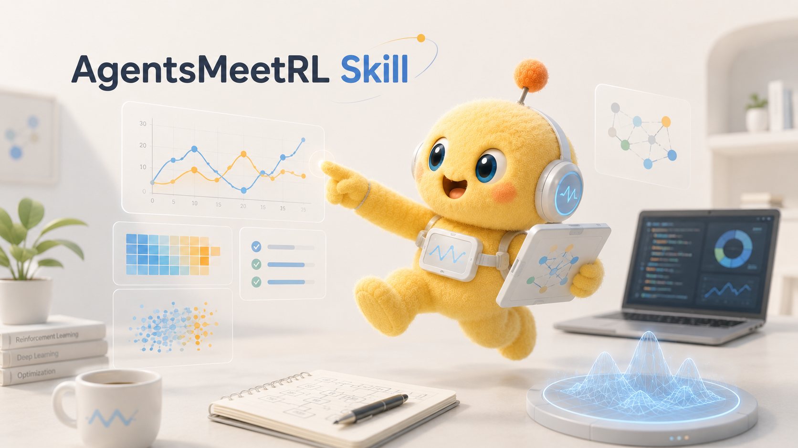

<div align="center">
  
</div>

<div align="center">

[](https://oosmetrics.com/repo/thinkwee/AgentsMeetRL)


<br>


<br>


<br>


</div>

<div align="center">

[](https://thinkwee.top/amr/)

</div>

# When LLM Agents Meet Reinforcement Learning

**AgentsMeetRL** is an awesome list that summarizes **open-source repositories** for training LLM Agents using reinforcement learning:
 - 🤖 The criteria for identifying an agent project are that it must have at least one of the following: multi-turn interactions or tool use (so TIR projects, Tool-Integrated Reasoning, are considered in this repo).
 - ⚠️ This project is based on code analysis from open-source repositories using LLM coding agents, which may contain unfaithful cases. Although manually reviewed, there may still be omissions. If you find any errors, please don't hesitate to let us know immediately through issues or PRs - we warmly welcome them!
 - 🚀 We particularly focus on the reinforcement learning frameworks, RL algorithms, rewards, and environments that projects depend on, for everyone's reference on how these excellent open-source projects make their technical choices. See [Click to view technical details] under each table.
 - 📅 Last updated: 2026-07-23
 - 🤗 Feel free to submit your own projects anytime - we welcome contributions!
 - 📚 If you find this repository helpful for your research, please cite it via the **"Cite this repository"** button on the right sidebar.

Taxonomy:
 - **Base Framework**: General-purpose RL training frameworks for LLM agents (e.g., veRL, OpenRLHF, trl)
 - **General/MultiTask**: Agent systems trained/evaluated across multiple tasks or environments
 - **Search & RAG**: Search-augmented reasoning agents that use retrieval tools to enhance LLM reasoning
 - **Web & GUI**: Agents that interact with web browsers, mobile/desktop GUIs, or operating systems
 - **Tool-Use**: Agents trained to invoke external tools (APIs, code executors, MCP, etc.)
 - **Code & SWE**: Software engineering and code generation agents
 - **Reasoning**: Reasoning agents with tool-integrated or multi-turn reasoning (math, QA, visual)
 - **Multi-Agent RL**: Multi-agent collaboration, negotiation, or credit assignment via RL
 - **Memory**: Agents that learn to manage, retrieve, or evolve memory
 - **Embodied**: Agents operating in embodied/physical simulation environments
 - **Domain-Specific**: RL agents for specialized domains (medical, OS tuning, etc.)
 - **Reward & Training**: Process/outcome reward models and training methodologies for agents
 - **Safety**: RL for agent safety alignment, adversarial red-teaming, and jailbreak defense/attack
 - **VLM Agent**: Vision-language model agents trained with RL for multimodal interaction
 - **Self-Evolution**: Agents that self-evolve via RL feedback loops (⚠️ definition still evolving in the community)
 - **Environment**: Benchmarks, gyms, and sandbox environments for agent training/evaluation

Some Enumeration:
 - Enumeration for Reward Type:
   - External Verifier: e.g., a compiler or math solver
   - Rule-Based: e.g., a LaTeX parser with exact match scoring
   - Model-Based: e.g., a trained verifier LLM or reward LLM
   - Custom

---

## Updates
- 📢 **2026-07 Update**: Added 13 new repositories from late-Jun–Jul 2026 across 8 categories (Self-Evolution +3 [SEED/OPID/UCOB, the on-policy-distillation-for-agentic-RL line], VLM Agent +2 [VTS/VSeek, long-video search agents], Tool-Use +2 [Tool-RL-Box; plus catch-up of AWorld-RL], Environment +2 [SETA terminal envs, OpenAgent tool-generalization sandbox], Web & GUI +1 [SCALE-CUA], Embodied +1 [REAL], Memory +1 [Supersede], Domain-Specific +1 [FaithMed]). Every entry was verified by opening the repo and confirming real RL-training (or environment) code — papers whose code is not yet released (EvoCUA-1.5, DeepSearch-World, CompactionRL, GUICrafter, VideoSearcher, Xiaomi-GUI-0) were deliberately left out.
- 📢 **2026-06 Update**: Added 43 new repositories across 11 categories (VLM Agent +8, Search & RAG +7, Environment +6, Reward & Training +4, Base Framework/Tool-Use/Self-Evolution/Embodied +3 each, Web & GUI/Code & SWE/Domain-Specific +2 each). New since the last update: Harness-1, FastContext, OpenWebRL, Polar, AgentJet, HarnessX, APPO, SPADER, DeepRubric, Embodied-R1.5, SIRI; plus catch-up of earlier-2026 misses (Vision-DeepResearch, ARM-Thinker, PyVision-RL, Gen-Searcher, DataMind, Tool-R0, Agent World Model, VisGym, Gym-Anything, ChemCraft, OpAgent, etc.).
- 📢 **2026-05 Update**: Added 17 new repositories from Apr–May 2026 across 11 categories (notably General/MultiTask +4 [SkillZero/T²PO/SDAR/StraTA, mostly ZJU-REAL & related agentic RL methods], VLM Agent +3 [MTA-Agent/ParaVT/OpenSearch-VL, multimodal deep search & video tool use], Web & GUI +2 [ClawGUI/ToolCUA]). Moved CoEvolve to "Under Review" (code not yet released).
- 📢 **2026-04 Update**: Added 67 new repositories covering Apr 2025 – Apr 2026 across nearly every category (notably VLM Agent +9, Search & RAG +10, Web & GUI +7, Tool-Use +7). Also reclassified SkyRL (→ General) and SPIRAL (→ Multi-Agent), and updated the VAGEN entry to its NeurIPS'25 upstream repo.
- 📢 **2026-03 Update**: Restructured taxonomy from 12 to 16 categories (added Multi-Agent RL, Reward & Training, Safety, VLM Agent, Self-Evolution, Domain-Specific; merged GUI into Web & GUI; retired TextGame/Biomedical). Added ~70 new repositories covering Sep 2025 – Mar 2026, growing the total from ~134 to 205.

## 🤖 Use as a Claude Code Skill

<div align="center">
  
</div>

This list is also packaged as a **[Claude Code](https://claude.com/claude-code) Skill** — [`agents-meet-rl`](skills/agents-meet-rl) — that turns the corpus into an on-demand assistant for **agentic-RL training, evaluation, and experiment design**: reward not moving, KL / entropy / length blow-ups, GRPO / PPO / DAPO knobs, retokenization drift, tool-call parse failures, long-horizon credit assignment, LLM-judge inconsistency, benchmark contamination, and framework / benchmark / algorithm selection — each answer anchored to specific papers and repos from this list. Backed by a machine-readable corpus of **368 projects** (snapshot **2026-07-23**). Once installed, Claude Code auto-invokes it whenever your question matches.

**Install as a plugin (recommended):**

```text
/plugin marketplace add thinkwee/claude-plugins
/plugin install agents-meet-rl@thinkwee
```

**Or install manually:**

```bash
git clone https://github.com/thinkwee/AgentsMeetRL
cp -r AgentsMeetRL/skills/agents-meet-rl ~/.claude/skills/
```

Then just ask, e.g. *"my GRPO search agent's reward is flat but eval keeps dropping"* or *"which RL framework should I pick for a multi-turn tool-use agent?"* — the skill routes your symptom to fixes grounded in this corpus.

## 🔧 Base Framework


| Github Repo | 🌟 Stars | Date | Org | Paper Link |
| :----: | :----: | :----: |  :----: | :----: |
| [AgentJet](https://github.com/modelscope/AgentJet) |  | 2026.6 | ModelScope (Alibaba) | [Paper](https://arxiv.org/abs/2606.04484) |
| [HarnessX](https://github.com/Darwin-Agent/HarnessX) |  | 2026.6 | Darwin-Agent | [Paper](https://arxiv.org/abs/2606.14249) |
| [Polar](https://github.com/NVIDIA-NeMo/ProRL-Agent-Server) |  | 2026.5 | NVIDIA (NeMo) | [Paper](https://arxiv.org/abs/2605.24220) |
| [uni-agent](https://github.com/verl-project/uni-agent) |  | 2026.4 | verl-project | -- |
| [OpenClaw-RL](https://github.com/Gen-Verse/OpenClaw-RL) |  | 2026.3 | Gen-Verse | [Paper](https://arxiv.org/abs/2603.10165) |
| [Claw-R1](https://github.com/AgentR1/Claw-R1) |  | 2026.3 | USTC | -- |
| [Open-AgentRL](https://github.com/Gen-Verse/Open-AgentRL) |  | 2026.2 | Gen-Verse | [Paper](https://arxiv.org/abs/2602.02488) |
| [NeMo-RL](https://github.com/NVIDIA-NeMo/RL) |  | 2026.1 | NVIDIA | -- |
| [RLinf](https://github.com/RLinf/RLinf) |  | 2025.8 | Tsinghua/Infinigence AI/PKU | [Paper](https://arxiv.org/abs/2509.15965) |
| [siiRL](https://github.com/sii-research/siiRL) |  | 2025.7 | Shanghai Innovation Institute | [Paper](https://arxiv.org/abs/2507.13833) |
| [slime](https://github.com/THUDM/slime) |  | 2025.6 | Tsinghua University (THUDM) | [blog](https://lmsys.org/blog/2025-07-09-slime/) |
| [agent-lightning](https://github.com/microsoft/agent-lightning) |  | 2025.6 | Microsoft Research | [Paper](https://arxiv.org/abs/2508.03680) |
| [AReaL](https://github.com/inclusionAI/AReaL) |  | 2025.6 | AntGroup/Tsinghua | [Paper](https://arxiv.org/pdf/2505.24298) |
| [ROLL](https://github.com/alibaba/ROLL) |  | 2025.6 | Alibaba | [Paper](https://arxiv.org/pdf/2506.06122) |
| [MARTI](https://github.com/TsinghuaC3I/MARTI) |  | 2025.5 | Tsinghua | -- |
| [Tunix](https://github.com/google/tunix) |  | 2025.4 | Google | -- |
| [RL2](https://github.com/ChenmienTan/RL2) |  | 2025.4 | Accio | – |
| [verifiers](https://github.com/willccbb/verifiers) |  | 2025.3 | Individual | -- |
| [prime-rl](https://github.com/PrimeIntellect-ai/prime-rl) |  | 2025.2 | Prime Intellect | -- |
| [oat](https://github.com/sail-sg/oat) |  | 2024.11 | NUS/Sea AI | [Paper](https://arxiv.org/pdf/2411.01493) |
| [veRL](https://github.com/volcengine/verl) |  | 2024.10 | ByteDance | [Paper](https://arxiv.org/pdf/2409.19256) |
| [OpenRLHF](https://github.com/OpenRLHF/OpenRLHF) |  | 2023.7 | OpenRLHF | [Paper](https://arxiv.org/abs/2405.11143) |
| [trl](https://github.com/huggingface/trl) |  | 2019.11 | HuggingFace | -- |

<details>
<summary>📋 Click to view technical details</summary>

| Github Repo | RL Algorithm | Single/Multi Agent | Outcome/Process Reward | Single/Multi Turn | Task | Reward Type | Tool usage |
| :----: | :----: | :----: | :----: | :----: | :----: | :----: | :----: |
| [AgentJet](https://github.com/modelscope/AgentJet) | GRPO/PPO (swarm, multi-dim reward) | Both | Both | Multi | Swarm agentic RL (heterogeneous multi-agent, multi-task) | All (Custom/External/Rule) | Yes (tool calls, agent frameworks) |
| [HarnessX](https://github.com/Darwin-Agent/HarnessX) | GRPO/PPO (slime/verl recipes) | Single | Outcome | Multi | Composable agent-harness foundry (ALFWorld/GAIA/WebShop/SWE-bench) | External + Custom | Yes (harness orchestrates tools/memory) |
| [Polar](https://github.com/NVIDIA-NeMo/ProRL-Agent-Server) | GRPO | Both | Outcome | Multi | Agentic RL on any harness (SWE-Bench/SWE-Gym) | External Verifier | Yes (real agent harnesses: shell/Codex/Claude Code) |
| [uni-agent](https://github.com/verl-project/uni-agent) | GRPO/GSPO (partial rollout, fully-async) | Single | Outcome | Multi | SWE-Bench/Search/General Agent (1000+ concurrent) | All | Yes (unified model/tool/env abstractions) |
| [OpenClaw-RL](https://github.com/Gen-Verse/OpenClaw-RL) | GRPO/OPD | Both | Both | Multi | Terminal/GUI/SWE/Tool-call | Model/External | Yes |
| [Claw-R1](https://github.com/AgentR1/Claw-R1) | Generic RL Framework | Multi | Both | Multi | General Agent | All | Yes (Framework-agnostic) |
| [Open-AgentRL](https://github.com/Gen-Verse/Open-AgentRL) | GRPO-TCR | Single | Both | Multi | Reasoning/GUI/Coding | Model (PRM) | Yes (SandboxFusion) |
| [NeMo-RL](https://github.com/NVIDIA-NeMo/RL) | GRPO/DAPO/GDPO/DPO | Single | Outcome | Multi | Math/Reasoning/Code | Rule/External | No |
| [RLinf](https://github.com/RLinf/RLinf) | PPO/GRPO/DAPO/SAC/REINFORCE++/CrossQ/RLPD | Both | Both | Multi | Robotics/Math/Code/QA/VQA | All (Rule/Model/External) | Yes |
| [siiRL](https://github.com/sii-research/siiRL) | PPO/GRPO/CPGD/MARFT | Multi | Both | Multi | LLM/VLM/LLM-MAS PostTraining | Model/Rule | Planned |
| [slime](https://github.com/THUDM/slime) | GRPO/GSPO/REINFORCE++ | Single | Both | Both | Math/Code | External Verifier | Yes |
| [agent-lightning](https://github.com/microsoft/agent-lightning) | PPO/Custom/Automatic Prompt Optimization | Multi | Outcome | Multi | Calculator/SQL | Model/External/Rule | Yes |
| [AReaL](https://github.com/inclusionAI/AReaL) | PPO | Both | Outcome | Both | Math/Code | External | Yes |
| [ROLL](https://github.com/alibaba/ROLL) | PPO/GRPO/Reinforce++/TOPR/RAFT++ | Multi | Both | Multi | Math/QA/Code/Alignment | All | Yes |
| [MARTI](https://github.com/TsinghuaC3I/MARTI) | PPO/GRPO/REINFORCE++/TTRL | Multi | Both | Multi | Math | All | Yes |
| [Tunix](https://github.com/google/tunix) | PPO/GRPO/GSPO-Token/DAPO/Dr.GRPO | Single | Outcome | Multi | Math/Code/Game | Rule/External | Yes |
| [RL2](https://github.com/ChenmienTan/RL2) | Dr. GRPO/PPO/DPO | Single | Both | Both | QA/Dialogue | Rule/Model/External | Yes |
| [verifiers](https://github.com/willccbb/verifiers) | GRPO | Multi | Outcome | Both | Reasoning/Math/Code | All | Code |
| [prime-rl](https://github.com/PrimeIntellect-ai/prime-rl) | GRPO/PPO | Multi | Outcome | Multi | Math/Code/Search | Model/External | Yes |
| [oat](https://github.com/sail-sg/oat) | PPO/GRPO | Single | Outcome | Multi | Math/Alignment | External | No |
| [veRL](https://github.com/volcengine/verl) | PPO/GRPO | Single | Outcome | Both | Math/QA/Reasoning/Search | All | Yes |
| [OpenRLHF](https://github.com/OpenRLHF/OpenRLHF) | PPO/REINFORCE++/GRPO/DPO/IPO/KTO/RLOO | Multi | Both | Both | Dialogue/Chat/Completion | Rule/Model/External | Yes |
| [trl](https://github.com/huggingface/trl) | PPO/GRPO/DPO | Single | Both | Single | QA | Custom | No |

</details>

## 💪 General/MultiTask

| Github Repo | 🌟 Stars | Date | Org | Paper Link | RL Framework |
| :----: | :----: | :----: |  :----: | :----: | :----: |
| [T2PO](https://github.com/WillDreamer/T2PO) |  | 2026.5 | Academic (ICML 2026 Spotlight) | [Paper](https://arxiv.org/abs/2605.02178) | veRL |
| [StraTA](https://github.com/xxyQwQ/StraTA) |  | 2026.5 | Shanghai AI Lab / Oxford / Multi-institution | [Paper](https://arxiv.org/abs/2605.06642) | rLLM |
| [SDAR](https://github.com/ZJU-REAL/SDAR) |  | 2026.5 | Zhejiang University (ZJU-REAL) | [Paper](https://arxiv.org/abs/2605.15155) | veRL (GiGPO-based) |
| [SkillZero](https://github.com/ZJU-REAL/SkillZero) |  | 2026.4 | Zhejiang University (ZJU-REAL) | [Paper](https://arxiv.org/abs/2604.02268) | veRL (GiGPO-based) |
| [MetaClaw](https://github.com/aiming-lab/MetaClaw) |  | 2026.3 | UNC-Chapel Hill (AIMING Lab) | [Paper](https://arxiv.org/abs/2603.17187) | Custom |
| [SkillRL](https://github.com/aiming-lab/SkillRL) |  | 2026.2 | UNC-Chapel Hill (AIMING Lab) | [Paper](https://arxiv.org/abs/2602.08234) | Custom |
| [LLM-in-Sandbox](https://github.com/llm-in-sandbox/llm-in-sandbox) |  | 2026.1 | RUC/MSRA/THU | [Paper](https://huggingface.co/papers/2601.16206) | rllm (w/ veRL) |
| [youtu-agent](https://github.com/TencentCloudADP/youtu-agent) |  | 2025.12 | Tencent Youtu Lab | [Paper](https://arxiv.org/abs/2512.24615) | Custom |
| [DEPO](https://github.com/OpenCausaLab/DEPO) |  | 2025.11 | HKUST/SJTU | [Paper](https://arxiv.org/abs/2511.15392) | LLaMA-Factory |
| [SPEAR](https://github.com/TencentYoutuResearch/SPEAR) |  | 2025.10 | Tencent Youtu Lab | [Paper](https://arxiv.org/abs/2509.22601) | veRL/verl-agent |
| [DeepAgent](https://github.com/RUC-NLPIR/DeepAgent) |  | 2025.10 | RUC/Xiaohongshu | [Paper](https://arxiv.org/abs/2510.21618) | Custom |
| [AgentRL](https://github.com/THUDM/AgentRL) |  | 2025.9 | Tsinghua | [Paper](https://arxiv.org/abs/2510.04206) | veRL |
| [AgentGym-RL](https://github.com/WooooDyy/AgentGym-RL) |  | 2025.9 | Fudan University | [Paper](https://arxiv.org/abs/2509.08755) | veRL |
| [Agent_Foundation_Models](https://github.com/OPPO-PersonalAI/Agent_Foundation_Models) |  | 2025.8 | OPPO Personal AI Lab | [Paper](https://arxiv.org/abs/2508.13167) | veRL |
| [Trinity-RFT](https://github.com/modelscope/Trinity-RFT) |  | 2025.5 | Alibaba | [Paper](https://arxiv.org/pdf/2505.17826) | veRL |
| [SPA-RL-Agent](https://github.com/WangHanLinHenry/SPA-RL-Agent) |  | 2025.5 | PolyU | [Paper](https://arxiv.org/pdf/2505.20732) | TRL |
| [verl-agent](https://github.com/langfengQ/verl-agent) |  | 2025.5 | NTU/Skywork | [Paper](https://arxiv.org/pdf/2505.10978) | veRL |
| [SkyRL](https://github.com/NovaSky-AI/SkyRL) |  | 2025.4 | UC Berkeley / NovaSky-AI | [Paper](https://arxiv.org/abs/2511.16108) | Self (skyrl-train) |
| [VAGEN](https://github.com/mll-lab-nu/VAGEN) |  | 2025.3 | Northwestern University (mll-lab-nu) | [Paper](https://arxiv.org/abs/2510.16907) | veRL |
| [ART](https://github.com/OpenPipe/ART) |  | 2025.3 | OpenPipe | [Paper](https://github.com/OpenPipe/ART#-citation) | TRL |
| [OpenManus-RL](https://github.com/OpenManus/OpenManus-RL) |  | 2025.3 | UIUC/MetaGPT | -- | Custom |

<details>
<summary>📋 Click to view technical details</summary>

| Github Repo | RL Algorithm | Single/Multi Agent | Outcome/Process Reward | Single/Multi Turn | Task | Reward Type | Tool usage |
| :----: | :----: | :----: | :----: | :----: | :----: | :----: | :----: |
| [T2PO](https://github.com/WillDreamer/T2PO) | T²PO (token+turn uncertainty-guided) | Single | Both | Multi | WebShop/ALFWorld/SearchQA/Embody/Game | Rule | Yes (search, web, embodied) |
| [StraTA](https://github.com/xxyQwQ/StraTA) | Hierarchical GRPO + Strategic Trajectory Abstraction | Single | Outcome | Multi | ALFWorld (93.1%)/WebShop (84.2%)/SciWorld (63.5%) | Rule + Model (self-judge) | Yes (interactive long-horizon envs) |
| [SDAR](https://github.com/ZJU-REAL/SDAR) | Self-Distilled Agentic RL (GRPO + gated OPSD) | Single | Outcome | Multi | ALFWorld/WebShop/Search-QA | Rule | Yes (interactive envs) |
| [SkillZero](https://github.com/ZJU-REAL/SkillZero) | In-Context Agentic RL (GRPO + skill-context curriculum withdrawal) | Single | Outcome | Multi | ALFWorld/WebShop/Search-QA | Rule | Yes (interactive envs + skill library) |
| [MetaClaw](https://github.com/aiming-lab/MetaClaw) | GRPO (LoRA) | Single | Process | Multi | General Agentic | Model (PRM) | Yes (Skill-augmented) |
| [SkillRL](https://github.com/aiming-lab/SkillRL) | GRPO | Single | Outcome | Multi | ALFWorld/WebShop/Search | Rule | Yes (Web search, actions) |
| [LLM-in-Sandbox](https://github.com/llm-in-sandbox/llm-in-sandbox) | GRPO++ | Single | Outcome | Multi | Math/Physics/Chemistry/Biomedicine/Long-context/IF/SWE | Rule | Yes (Code Sandbox w/ Terminal, File, Internet) |
| [youtu-agent](https://github.com/TencentCloudADP/youtu-agent) | Training-Free GRPO | Single | Outcome | Multi | Deep Research/Data Analysis/Tool-use | Model/External | Yes (Web search, code, file) |
| [DEPO](https://github.com/OpenCausaLab/DEPO) | KTO + Efficiency Loss | Single | Both | Multi | Agent (BabyAI/WebShop) | Rule | Yes |
| [SPEAR](https://github.com/TencentYoutuResearch/SPEAR) | GRPO/GiGPO + SIL | Single | Both | Multi | Math/Agent | Rule/External | Yes (Search, Sandbox, Browser) |
| [DeepAgent](https://github.com/RUC-NLPIR/DeepAgent) | ToolPO | Single | Outcome | Multi | ToolBench/ALFWorld/WebShop/GAIA/HLE | Model | Yes (16,000+ RapidAPIs) |
| [AgentRL](https://github.com/THUDM/AgentRL) | GRPO/REINFORCE++/RLOO/ReMax/GAE | Single | Outcome | Multi | Agent Tasks | External | Yes |
| [AgentGym-RL](https://github.com/WooooDyy/AgentGym-RL) | PPO/GRPO/RLOO/REINFORCE++ | Single | Outcome | Multi | Web/Search/Game/Embodied/Science | Rule/Model/External | Yes (Web, Search, Env APIs) |
| [Agent_Foundation_Models](https://github.com/OPPO-PersonalAI/Agent_Foundation_Models) | DAPO/PPO | Single | Outcome | Single | QA/Code/Math | Rule/External | Yes |
| [Trinity-RFT](https://github.com/modelscope/Trinity-RFT) | PPO/GRPO | Single | Outcome | Both | Math/TextGame/Web | All | Yes |
| [SPA-RL-Agent](https://github.com/WangHanLinHenry/SPA-RL-Agent) | PPO | Single | Process | Multi | Navigation/Web/TextGame | Model | No |
| [verl-agent](https://github.com/langfengQ/verl-agent) | PPO/GRPO/GiGPO/DAPO/RLOO/REINFORCE++ | Multi | Both | Multi | Phone Use/Math/Code/Web/TextGame | All | Yes |
| [SkyRL](https://github.com/NovaSky-AI/SkyRL) | GRPO/PPO | Single | Both | Multi | Long-horizon Agents (SWE-Bench/Search/Math/SQL) | Rule/External/Custom | Yes |
| [VAGEN](https://github.com/mll-lab-nu/VAGEN) | PPO/GRPO (World Modeling RL) | Single | Both | Multi | Navigation/TextGame/Multimodal | All | Yes |
| [ART](https://github.com/OpenPipe/ART) | GRPO | Multi | Both | Multi | TextGame | All | Yes |
| [OpenManus-RL](https://github.com/OpenManus/OpenManus-RL) | PPO/DPO/GRPO | Multi | Outcome | Multi | TextGame | All | Yes |

</details>

## 🔍 Search & RAG Agent


| Github Repo | 🌟 Stars | Date | Org | Paper Link | RL Framework |
| :----: | :----: | :----: |  :----: | :----: | :----: |
| [Harness-1](https://github.com/pat-jj/harness-1) |  | 2026.6 | UIUC | [Paper](https://arxiv.org/abs/2606.02373) | Custom |
| [SlimSearcher](https://github.com/AQ-MedAI/AntAFu-DeepResearch) |  | 2026.6 | Ant Group / ZJU | [Paper](https://arxiv.org/abs/2606.07074) | Custom (agentic RL) |
| [DeepRubric](https://github.com/ZMingHang/DeepRubric-Code) |  | 2026.6 | Shandong University | [Paper](https://arxiv.org/abs/2606.17029) | verl-tool |
| [SAAS](https://github.com/XMUDeepLIT/SAAS) |  | 2026.5 | Xiamen University | [Paper](https://arxiv.org/abs/2605.29796) | slime |
| [CuSearch](https://github.com/MrToser/CuSearch) |  | 2026.5 | Academic | [Paper](https://arxiv.org/abs/2605.11611) | Custom |
| [ORBIT](https://github.com/castorini/orbit) |  | 2026.4 | University of Waterloo | [Paper](https://arxiv.org/abs/2604.01195) | Custom |
| [LiteResearcher](https://github.com/simplex-ai-inc/LiteResearcher) |  | 2026.4 | Simplex AI / ZJU / PolyU | [Paper](https://arxiv.org/abs/2604.17931) | Custom |
| [DR-Venus](https://github.com/inclusionAI/DR-Venus) |  | 2026.4 | Ant Group (inclusionAI) | [Paper](https://arxiv.org/abs/2604.19859) | veRL (IGPO-based) |
| [MR-Search](https://github.com/tengxiao1/MR-Search) |  | 2026.3 | Academic | [Paper](https://arxiv.org/abs/2603.11327) | Custom |
| [ProRAG](https://github.com/lilinwz/ProRAG) |  | 2026.1 | RUC | [Paper](https://arxiv.org/abs/2601.21912) | Custom |
| [O-Researcher](https://github.com/OPPO-PersonalAI/O-Researcher) |  | 2026.1 | OPPO PersonalAI Lab | [Paper](https://arxiv.org/abs/2601.03743) | Custom |
| [Agentic-RAG-R1](https://github.com/jiangxinke/Agentic-RAG-R1) |  | 2025.12 | PKU | -- | Custom |
| [MemSearcher](https://github.com/icip-cas/MemSearcher) |  | 2025.11 | CAS | [Paper](https://arxiv.org/abs/2511.02805) | Custom |
| [DR Tulu](https://github.com/rlresearch/dr-tulu) |  | 2025.11 | AI2 / UW / CMU / MIT | [Paper](https://arxiv.org/abs/2511.19399) | Open-Instruct |
| [IGPO](https://github.com/GuoqingWang1/IGPO) |  | 2025.10 | Ant Group | [Paper](https://arxiv.org/abs/2510.14967) (ICLR 2026) | veRL |
| [ReSeek](https://github.com/TencentBAC/ReSeek) |  | 2025.10 | Tencent PCG BAC/Tsinghua University | [Paper](https://arxiv.org/abs/2510.00568) | veRL |
| [AutoGraph-R1](https://github.com/HKUST-KnowComp/AutoGraph-R1) |  | 2025.10 | HKUST KnowComp | [Paper](https://arxiv.org/abs/2510.15339) | Custom |
| [WebSeer](https://github.com/99hgz/WebSeer) |  | 2025.10 | Individual | [Paper](https://arxiv.org/abs/2510.18798) | veRL |
| [HiPRAG](https://github.com/qualidea1217/HiPRAG) |  | 2025.10 | Individual | [Paper](https://arxiv.org/abs/2510.07794) | veRL |
| [Tree-GRPO](https://github.com/AMAP-ML/Tree-GRPO) |  | 2025.9 | AMAP | [Paper](https://arxiv.org/abs/2509.21240) | veRL |
| [DeepResearch](https://github.com/Alibaba-NLP/DeepResearch) |  | 2025.9 | Alibaba/Tongyi Lab | [Paper](https://arxiv.org/abs/2510.24701) | Custom |
| [DeepDive](https://github.com/THUDM/DeepDive) |  | 2025.9 | Tsinghua/THUDM | [Paper](https://arxiv.org/abs/2509.10446) | Custom |
| [ASearcher](https://github.com/inclusionAI/ASearcher) |  | 2025.8 | Ant Research RL Lab <br> Tsinghua University & UW | [Paper](https://arxiv.org/abs/2508.07976) | RealHF/AReaL |
| [SSRL](https://github.com/TsinghuaC3I/SSRL) |  | 2025.8 | Tsinghua | [Paper](https://arxiv.org/abs/2508.10874) | Custom |
| [Research-Venus](https://github.com/antgroup/Research-Venus) |  | 2025.8 | Ant Group | [Paper](https://arxiv.org/abs/2508.12800) | Custom |
| [Graph-R1](https://github.com/LHRLAB/Graph-R1) |  | 2025.7 | BUPT/NTU/NUS | [Paper](https://arxiv.org/abs/2507.21892) | veRL |
| [Kimi-Researcher](https://github.com/moonshotai/Kimi-Researcher) |  | 2025.6 | Moonshot AI | [blog](https://moonshotai.github.io/Kimi-Researcher/) | Custom |
| [R-Search](https://github.com/QingFei1/R-Search) |  | 2025.6 | Individual | -- | veRL |
| [R1-Searcher-plus](https://github.com/RUCAIBox/R1-Searcher-plus) |  | 2025.5 | RUC | [Paper](https://arxiv.org/pdf/2505.17005) | Custom |
| [StepSearch](https://github.com/Zillwang/StepSearch) |  | 2025.5 | SenseTime | [Paper](https://arxiv.org/pdf/2505.15107) | veRL |
| [AutoRefine](https://github.com/syr-cn/AutoRefine) |  | 2025.5 | USTC | [Paper](https://www.arxiv.org/pdf/2505.11277) | veRL |
| [ZeroSearch](https://github.com/Alibaba-NLP/ZeroSearch) |  | 2025.5 | Alibaba |[Paper](https://arxiv.org/pdf/2505.04588) | veRL |
| [ReasonRAG](https://github.com/wlzhang2020/ReasonRAG) |  | 2025.5 | CityU HK / Huawei | [Paper](https://arxiv.org/abs/2505.14069) | Custom |
| [VRAG](https://github.com/Alibaba-NLP/VRAG) |  | 2025.5 | USTC / Tongyi Lab, Alibaba | [Paper](https://arxiv.org/abs/2505.22019) | veRL |
| [MaskSearch](https://github.com/Alibaba-NLP/MaskSearch) |  | 2025.5 | Tongyi Lab, Alibaba | [Paper](https://arxiv.org/abs/2505.20285) | DAPO / veRL |
| [R3-RAG](https://github.com/Yuan-Li-FNLP/R3-RAG) |  | 2025.5 | Fudan NLP | [Paper](https://arxiv.org/abs/2505.23794) | OpenRLHF |
| [O2-Searcher](https://github.com/KnowledgeXLab/O2-Searcher) |  | 2025.5 | KnowledgeXLab | [Paper](https://arxiv.org/abs/2505.16582) | veRL |
| [s3](https://github.com/pat-jj/s3) |  | 2025.5 | UIUC | [Paper](https://arxiv.org/abs/2505.14146) | veRL |
| [knowledge-r1](https://github.com/hzy312/knowledge-r1) |  | 2025.5 | CAS / UCAS | [Paper](https://arxiv.org/abs/2505.07596) | veRL |
| [WebThinker](https://github.com/RUC-NLPIR/WebThinker) |  | 2025.4 | RUC | [Paper](https://arxiv.org/pdf/2504.21776) | Custom |
| [DeepResearcher](https://github.com/GAIR-NLP/DeepResearcher) |  | 2025.4 | SJTU | [Paper](https://arxiv.org/pdf/2504.03160) | veRL |
| [Search-R1](https://github.com/PeterGriffinJin/Search-R1) |  | 2025.3 | UIUC/Google | [paper1](https://arxiv.org/pdf/2503.09516), [paper2](https://arxiv.org/pdf/2505.15117) | veRL |
| [R1-Searcher](https://github.com/RUCAIBox/R1-Searcher) |  | 2025.3 | RUC | [Paper](https://arxiv.org/pdf/2503.05592) | OpenRLHF |
| [C-3PO](https://github.com/Chen-GX/C-3PO) |  | 2025.2 | Alibaba | [Paper](https://arxiv.org/pdf/2502.06205) | OpenRLHF |
| [DeepRetrieval](https://github.com/pat-jj/DeepRetrieval) |  | 2025.2 | UIUC | [Paper](https://arxiv.org/abs/2503.00223) | veRL |

<details>
<summary>📋 Click to view technical details</summary>

| Github Repo | RL Algorithm | Single/Multi Agent | Outcome/Process Reward | Single/Multi Turn | Task | Reward Type | Tool usage |
| :----: | :----: | :----: | :----: | :----: | :----: | :----: | :----: |
| [Harness-1](https://github.com/pat-jj/harness-1) | GRPO | Single | Outcome | Multi | Long-horizon search (web/finance/patents) w/ state-externalizing harness | External + Rule | Yes (search/retrieval/rerank) |
| [SlimSearcher](https://github.com/AQ-MedAI/AntAFu-DeepResearch) | GRPO + Adaptive Reward Gating | Single | Outcome | Multi | Efficiency-aware deep research (GAIA/BrowseComp/xBench) | Custom + Rule | Yes (web search, browse) |
| [DeepRubric](https://github.com/ZMingHang/DeepRubric-Code) | GRPO + rubric rewards | Single | Process | Multi | Deep research report synthesis (evidence-tree rubric) | Model + Rule (rubric) | Yes (search/browse/scholar) |
| [SAAS](https://github.com/XMUDeepLIT/SAAS) | RL w/ boundary-aware reward (2-stage curriculum) | Single | Outcome | Multi | Self-aware agentic search (over-search mitigation, 7 QA sets) | Rule-Based | Yes (search) |
| [CuSearch](https://github.com/MrToser/CuSearch) | GRPO + Search-Depth curriculum rollout | Single | Outcome | Multi | Agentic RAG multi-hop QA | Rule-Based (EM) | Yes (retrieval/search) |
| [ORBIT](https://github.com/castorini/orbit) | GRPO | Single | Outcome | Multi | Verifiable data-gen + RL for web search (Qwen3-4B) | External + Rule | Yes (web search) |
| [LiteResearcher](https://github.com/simplex-ai-inc/LiteResearcher) | Scalable Agentic RL (curriculum w/ lite virtual world) | Single | Outcome | Multi | Deep Research (GAIA 71.3% / Xbench-DS 78.0%, 4B SOTA) | Rule/External | Yes (local search/browse env, Milvus+PostgreSQL) |
| [DR-Venus](https://github.com/inclusionAI/DR-Venus) | GRPO + IGPO (info-gain turn-level) w/ agentic SFT | Single | Both | Multi | Edge-scale Deep Research (4B) | Intrinsic (info-gain) + Rule (format) | Yes (Search/Browse) |
| [MR-Search](https://github.com/tengxiao1/MR-Search) | In-context Meta-RL (multi-episode credit) | Single | Outcome | Multi | Agentic search w/ self-reflection | Rule-Based | Yes (search) |
| [ProRAG](https://github.com/lilinwz/ProRAG) | GRPO + DGA (dual-granularity advantage) | Single | Both | Multi | Multi-hop RAG | Model (PRM via MCTS) | Yes (Retrieval) |
| [O-Researcher](https://github.com/OPPO-PersonalAI/O-Researcher) | GRPO + RLAIF | Multi | Process | Multi | Deep Research (Zhihu-KOL/WideSearch/ELI5) | Model (LLM-as-Judge) | Yes (Search/Crawl) |
| [Agentic-RAG-R1](https://github.com/jiangxinke/Agentic-RAG-R1) | GRPO | Single | Outcome | Multi | Knowledge-intensive QA | Rule/Model | Yes (Wiki/Doc search) |
| [MemSearcher](https://github.com/icip-cas/MemSearcher) | Multi-context GRPO | Single | Outcome | Multi | Search/QA + Memory | Rule/Model | Yes (Web search + Memory) |
| [DR Tulu](https://github.com/rlresearch/dr-tulu) | GRPO + evolving rubrics | Single | Outcome | Multi | Long-form Deep Research | Model (rubrics) | Yes (Search/MCP) |
| [IGPO](https://github.com/GuoqingWang1/IGPO) | GRPO + IGPO (Information Gain turn-level reward) | Single | Both | Multi | Multi-turn Search Agent (BrowseComp/-ZH) | Intrinsic (belief Δ) + Outcome | Yes (Search) |
| [ReSeek](https://github.com/TencentBAC/ReSeek) | GRPO/PPO | Single | Both | Multi | QA/Search | Rule | Search/JUDGE |
| [AutoGraph-R1](https://github.com/HKUST-KnowComp/AutoGraph-R1) | GRPO (via VeRL) | Single | Outcome | Multi | KG Construction for QA | Rule | Yes (Graph retrieval) |
| [WebSeer](https://github.com/99hgz/WebSeer) | GRPO-style | Single | Outcome | Multi | Web Search QA (w/ self-reflection) | Rule/Model | Yes (Search) |
| [HiPRAG](https://github.com/qualidea1217/HiPRAG) | PPO | Single | Process | Multi | Efficient Agentic RAG | Model/Rule | Yes (Retrieval) |
| [Tree-GRPO](https://github.com/AMAP-ML/Tree-GRPO) | GRPO/Tree-GRPO | Single | Outcome | Multi | Search | Rule | Search |
| [DeepResearch](https://github.com/Alibaba-NLP/DeepResearch) | RL-based | Single | Outcome | Multi | Deep Research | Model | Yes (Search, Browse) |
| [DeepDive](https://github.com/THUDM/DeepDive) | GRPO | Single | Outcome | Multi | KG-augmented Search | Rule | Yes (KG + Search) |
| [ASearcher](https://github.com/inclusionAI/ASearcher) | PPO/GRPO + Decoupled PPO | Single | Outcome | Multi | Math/Code/SearchQA | External/Rule | Yes |
| [SSRL](https://github.com/TsinghuaC3I/SSRL) | GRPO | Single | Outcome | Multi | Self-Search | Rule | Yes (Self-search) |
| [Research-Venus](https://github.com/antgroup/Research-Venus) | GRPO | Single | Both | Multi | Deep Research | Model (atomic thought) | Yes (Search) |
| [Graph-R1](https://github.com/LHRLAB/Graph-R1) | GRPO/REINFORCE++/PPO | Single | Outcome | Multi | KGQA | Rule (EM/F1) | Yes (Graph retrieval) |
| [Kimi-Researcher](https://github.com/moonshotai/Kimi-Researcher) | REINFORCE | Single | Outcome | Multi | Research | Outcome | Search, Browse, Coding |
| [R-Search](https://github.com/QingFei1/R-Search) | PPO/GRPO | Single | Both | Multi | QA/Search | All | Yes |
| [R1-Searcher-plus](https://github.com/RUCAIBox/R1-Searcher-plus) | Custom | Single | Outcome | Multi | Search | Model | Search |
| [StepSearch](https://github.com/Zillwang/StepSearch) | PPO | Single | Process | Multi | QA | Model | Search |
| [AutoRefine](https://github.com/syr-cn/AutoRefine) | PPO/GRPO | Multi | Both | Multi | RAG QA | Rule | Search |
| [ZeroSearch](https://github.com/Alibaba-NLP/ZeroSearch) | PPO/GRPO/REINFORCE | Single | Outcome | Multi | QA/Search | Rule | Yes |
| [ReasonRAG](https://github.com/wlzhang2020/ReasonRAG) | DPO + MCTS-based PRM | Single | Process | Multi | Multi-hop QA | Model (PRM) | Yes (Wikipedia search) |
| [VRAG](https://github.com/Alibaba-NLP/VRAG) | GRPO | Single | Both | Multi | Visually-rich RAG | Rule/Model | Yes (Visual retrieval) |
| [MaskSearch](https://github.com/Alibaba-NLP/MaskSearch) | DAPO | Single | Outcome | Multi | RAMP Pretraining + QA | Rule/Model | Yes (Search) |
| [R3-RAG](https://github.com/Yuan-Li-FNLP/R3-RAG) | PPO | Single | Both | Multi | Multi-hop QA | Rule | Yes (Retrieval) |
| [O2-Searcher](https://github.com/KnowledgeXLab/O2-Searcher) | GRPO | Single | Outcome | Multi | Open-ended QA | Rule/Model | Yes (Search) |
| [s3](https://github.com/pat-jj/s3) | GRPO | Single | Outcome | Multi | RAG / Medical QA | Model (Gain-Beyond-RAG) | Yes (Retrieval) |
| [knowledge-r1](https://github.com/hzy312/knowledge-r1) | GRPO | Single | Outcome | Multi | Knowledge-intensive QA (KB-aware) | Rule | Yes (Retrieval) |
| [WebThinker](https://github.com/RUC-NLPIR/WebThinker) | DPO | Single | Outcome | Multi | Reasoning/QA/Research | Model/External | Web Browsing |
| [DeepResearcher](https://github.com/GAIR-NLP/DeepResearcher) | PPO/GRPO | Multi | Outcome | Multi | Research | All | Yes |
| [Search-R1](https://github.com/PeterGriffinJin/Search-R1) | PPO/GRPO | Single | Outcome | Multi | Search | All | Search |
| [R1-Searcher](https://github.com/RUCAIBox/R1-Searcher) | PPO/DPO | Single | Both | Multi | Search | All | Yes |
| [C-3PO](https://github.com/Chen-GX/C-3PO) | PPO | Multi | Outcome | Multi | Search | Model | Yes |
| [DeepRetrieval](https://github.com/pat-jj/DeepRetrieval) | GRPO | Single | Outcome | Multi | Query Generation/IR | Rule | Yes (Search) |

</details>

## 🌐 Web & GUI Agent


| Github Repo | 🌟 Stars | Date | Org | Paper Link | RL Framework |
| :----: | :----: | :----: |  :----: | :----: | :----: |
| [SCALE-CUA](https://github.com/THUDM/SCALE-CUA) |  | 2026.7 | Tsinghua (THUDM) | [Paper](https://arxiv.org/abs/2607.11185) | Custom (Ray + vLLM + Megatron-LM) |
| [OpenWebRL](https://github.com/OpenWebRL/OpenWebRL) |  | 2026.6 | UIUC / Microsoft Research | [Paper](https://arxiv.org/abs/2606.02031) | slime |
| [ToolCUA](https://github.com/X-PLUG/ToolCUA) |  | 2026.5 | Alibaba Tongyi Lab (X-PLUG) | [Paper](https://arxiv.org/abs/2605.12481) | Custom |
| [ClawGUI](https://github.com/ZJU-REAL/ClawGUI) |  | 2026.4 | Zhejiang University (ZJU-REAL) | [Paper](https://arxiv.org/abs/2604.11784) | Custom (veRL-based) |
| [OpAgent](https://github.com/codefuse-ai/OpAgent) |  | 2026.2 | Codefuse AI (Ant Group) | [Paper](https://arxiv.org/abs/2602.13559) | Agent-R1 (veRL) |
| [GUI-Libra](https://github.com/GUI-Libra/GUI-Libra) |  | 2026.2 | GUI-Libra (MS-affiliated) | [Paper](https://arxiv.org/abs/2602.22190) | Custom |
| [MobileAgent](https://github.com/X-PLUG/MobileAgent) |  | 2025.9 | X-PLUG (TongyiQwen) | [paper](https://arxiv.org/abs/2509.11543) | veRL |
| [UI-TARS](https://github.com/bytedance/UI-TARS) |  | 2025.9 | ByteDance Seed | [Paper](https://arxiv.org/abs/2509.02544) | Custom |
| [MobileRL](https://github.com/THUDM/MobileRL) |  | 2025.9 | Tsinghua / Zhipu AI (THUDM) | [Paper](https://arxiv.org/abs/2509.18119) | Custom |
| [DART-GUI](https://github.com/Computer-use-agents/dart-gui) |  | 2025.9 | Computer-use-agents | [Paper](https://arxiv.org/abs/2509.23866) | veRL |
| [Mano-P](https://github.com/Mininglamp-AI/Mano-P) |  | 2025.9 | Mininglamp AI | [Paper](https://arxiv.org/abs/2509.17336) | Mano-SDK |
| [InfiGUI-G1](https://github.com/InfiXAI/InfiGUI-G1) |  | 2025.8 | InfiX AI | [Paper](https://arxiv.org/abs/2508.05731) | veRL |
| [gui-rcpo](https://github.com/zju-real/gui-rcpo) |  | 2025.8 | Zhejiang University | [Paper](https://arxiv.org/abs/2508.05615) | Custom |
| [UI-AGILE](https://github.com/KDEGroup/UI-AGILE) |  | 2025.7 | Xiamen University | [Paper](https://arxiv.org/abs/2507.22025) | Custom |
| [GUI-G2](https://github.com/ZJU-REAL/GUI-G2) |  | 2025.7 | Zhejiang University (ZJU-REAL) | [Paper](https://arxiv.org/abs/2507.15846) | Custom (VLM-R1) |
| [MagicGUI](https://github.com/MagicAgent-GUI/MagicGUI) |  | 2025.7 | Honor (MagicAgent-GUI) | [Paper](https://arxiv.org/abs/2508.03700) | Custom |
| [Grounding-R1](https://github.com/Yan98/Grounding-R1) |  | 2025.6 | Salesforce | [blog](https://huggingface.co/blog/HelloKKMe/grounding-r1) | trl |
| [AgentCPM-GUI](https://github.com/OpenBMB/AgentCPM-GUI) |  | 2025.6 | OpenBMB/Tsinghua/RUC | [Paper](https://arxiv.org/pdf/2506.01391) | Huggingface |
| [TTI](https://github.com/test-time-interaction/TTI) |  | 2025.6 | CMU | [Paper](https://arxiv.org/abs/2506.07976) | Custom |
| [GTA1](https://github.com/Yan98/GTA1) |  | 2025.6 | Salesforce / ANU | [Paper](https://arxiv.org/abs/2507.05791) | Custom (DeepSpeed) |
| [SE-GUI](https://github.com/YXB-NKU/SE-GUI) |  | 2025.5 | Nankai University/vivo | [Paper](https://arxiv.org/pdf/2505.12370) | trl |
| [ARPO](https://github.com/dvlab-research/ARPO) |  | 2025.5 | CUHK/HKUST | [Paper](https://arxiv.org/pdf/2505.16282) | veRL |
| [GUI-G1](https://github.com/Yuqi-Zhou/GUI-G1) |  | 2025.5 | RUC | [Paper](https://arxiv.org/pdf/2505.15810) | TRL |
| [WebAgent-R1](https://github.com/weizhepei/WebAgent-R1) |  | 2025.5 | Amazon/UVA | [Paper](https://arxiv.org/abs/2505.16421) | Custom |
| [ZeroGUI](https://github.com/OpenGVLab/ZeroGUI) |  | 2025.5 | Shanghai AI Lab | [Paper](https://arxiv.org/abs/2505.23762) | Custom |
| [GUI-R1](https://github.com/ritzz-ai/GUI-R1) |  | 2025.4 | CAS/NUS | [Paper](https://arxiv.org/pdf/2504.10458) | veRL |
| [InfiGUI-R1](https://github.com/Reallm-Labs/InfiGUI-R1) |  | 2025.4 | Zhejiang University | [Paper](https://arxiv.org/abs/2504.14239) | Custom |
| [UI-R1](https://github.com/lll6gg/UI-R1) |  | 2025.3 | vivo/CUHK | [Paper](https://arxiv.org/pdf/2503.21620) | TRL |
| [CollabUIAgents](https://github.com/THUNLP-MT/CollabUIAgents) |  | 2025.2 | Tsinghua/Alibaba/HKUST | [Paper](https://arxiv.org/abs/2502.14496) | Custom |
| [DigiQ](https://github.com/DigiRL-agent/digiq) |  | 2025.2 | UC Berkeley/CMU/Amazon | [Paper](https://arxiv.org/abs/2502.15760) | Custom |
| [GUI-Agent-RL](https://github.com/microsoft/GUI-Agent-RL) |  | 2025.2 | Microsoft | [Paper](https://arxiv.org/abs/2502.18906) | Custom |
| [WebAgent](https://github.com/Alibaba-NLP/WebAgent) |  | 2025.1 | Alibaba | [paper1](https://arxiv.org/pdf/2501.07572), [paper2](https://arxiv.org/pdf/2505.22648) | LLaMA-Factory |

<details>
<summary>📋 Click to view technical details</summary>

| Github Repo | RL Algorithm | Single/Multi Agent | Outcome/Process Reward | Single/Multi Turn | Task | Reward Type | Tool usage |
| :----: | :----: | :----: | :----: | :----: | :----: | :----: | :----: |
| [SCALE-CUA](https://github.com/THUDM/SCALE-CUA) | GRPO (fully async, Frontier Sampling + visual context segmentation) | Single | Outcome | Multi | Computer Use (OSWorld, ScienceBoard; 24K+ synthesized verifiable tasks) | External Verifier (executable judge functions) | Yes (GUI actions in Docker desktop) |
| [OpenWebRL](https://github.com/OpenWebRL/OpenWebRL) | GRPO (online multi-turn) | Single | Both | Multi | Visual web browsing on live sites (WebVoyager/Online-Mind2Web) | Rule + Model (format + LLM-judge) | Yes (Playwright browser) |
| [ToolCUA](https://github.com/X-PLUG/ToolCUA) | Tool-Bootstrapped GUI RFT + Online Agentic RL (Tool-Efficient Path Reward) | Single | Both | Multi | Computer Use (OSWorld-MCP, hybrid GUI+tool) | Rule (path-efficiency) | Yes (GUI actions + structured tool calls) |
| [ClawGUI](https://github.com/ZJU-REAL/ClawGUI) | GiGPO + Process Reward Model | Single | Both | Multi | Mobile GUI (Android/HarmonyOS/iOS, MobileWorld) | Rule + Model (PRM) | Yes (GUI + hybrid CLI-GUI + persistent memory) |
| [OpAgent](https://github.com/codefuse-ai/OpAgent) | Online agentic RL (GRPO/PPO) | Multi | Both | Multi | Web navigation (WebArena 71.6% pass@5) | Rule + Model (RDTree + WebJudge) | Yes (Playwright browser) |
| [GUI-Libra](https://github.com/GUI-Libra/GUI-Libra) | KL-regularized GRPO (Partially Verifiable RL) | Single | Outcome | Multi | GUI (AndroidWorld/WebArena/Online-Mind2Web) | Rule | Yes |
| [MobileAgent](https://github.com/X-PLUG/MobileAgent) | semi-online RL | Single | Both | Multi | MobileGUI/Automation | Rule | Yes |
| [UI-TARS](https://github.com/bytedance/UI-TARS) | Multi-turn RL | Single | Both | Multi | GUI (Cross-platform) | Model | Yes (GUI actions) |
| [MobileRL](https://github.com/THUDM/MobileRL) | AdaGRPO (Difficulty-Adaptive) | Single | Outcome | Multi | Mobile GUI (AndroidWorld/AndroidLab) | Rule | Yes (Android) |
| [DART-GUI](https://github.com/Computer-use-agents/dart-gui) | Decoupled GRPO | Single | Outcome | Multi | GUI (OSWorld) | Rule | Yes |
| [Mano-P](https://github.com/Mininglamp-AI/Mano-P) | Three-stage SFT→Offline RL→Online RL | Single | Both | Multi | GUI (OSWorld) | Rule | Yes |
| [InfiGUI-G1](https://github.com/InfiXAI/InfiGUI-G1) | AEPO | Single | Outcome | Single | GUI/Grounding | Rule | No |
| [gui-rcpo](https://github.com/zju-real/gui-rcpo) | RCPO | Single | Outcome | Single | GUI Grounding | Rule (self-supervised) | No |
| [UI-AGILE](https://github.com/KDEGroup/UI-AGILE) | GRPO | Single | Outcome | Single | GUI Grounding | Rule (continuous) | No |
| [GUI-G2](https://github.com/ZJU-REAL/GUI-G2) | GRPO (Gaussian Reward) | Single | Outcome | Single | GUI Grounding | Rule (continuous) | No |
| [MagicGUI](https://github.com/MagicAgent-GUI/MagicGUI) | Reinforcement Fine-Tuning (RFT) | Single | Outcome | Multi | Mobile GUI | Model/Rule | Yes |
| [Grounding-R1](https://github.com/Yan98/Grounding-R1) | GRPO | Single | Outcome | Multi | GUI Grounding | Model | Yes |
| [AgentCPM-GUI](https://github.com/OpenBMB/AgentCPM-GUI) | GRPO | Single | Outcome | Multi | Mobile GUI | Model | Yes |
| [TTI](https://github.com/test-time-interaction/TTI) | REINFORCE/BC | Single | Outcome | Multi | Web | External | Web Browsing |
| [GTA1](https://github.com/Yan98/GTA1) | GRPO-style (click-success reward) | Single | Outcome | Multi | GUI Grounding (OSWorld/ScreenSpot-Pro) | Rule | Yes |
| [SE-GUI](https://github.com/YXB-NKU/SE-GUI) | GRPO | Single | Both | Single | GUI Grounding | Rule | Yes |
| [ARPO](https://github.com/dvlab-research/ARPO) | GRPO | Single | Outcome | Multi | GUI | External | Computer Use |
| [GUI-G1](https://github.com/Yuqi-Zhou/GUI-G1) | GRPO | Single | Outcome | Single | GUI | Rule/External | No |
| [WebAgent-R1](https://github.com/weizhepei/WebAgent-R1) | M-GRPO | Single | Outcome | Multi | Web Navigation (WebArena-Lite) | Rule (task success) | Yes (Web browsing) |
| [ZeroGUI](https://github.com/OpenGVLab/ZeroGUI) | Online RL | Single | Outcome | Multi | GUI Agent | Rule | Yes (GUI actions) |
| [GUI-R1](https://github.com/ritzz-ai/GUI-R1) | GRPO | Single | Outcome | Multi | GUI | Rule | No |
| [InfiGUI-R1](https://github.com/Reallm-Labs/InfiGUI-R1) | RL + sub-goal guidance | Single | Both | Multi | GUI Reasoning | Rule | Yes |
| [UI-R1](https://github.com/lll6gg/UI-R1) | GRPO | Single | Process | Both | GUI | Rule | Computer/Phone Use |
| [CollabUIAgents](https://github.com/THUNLP-MT/CollabUIAgents) | DPO (credit re-assignment) | Multi | Process | Multi | GUI (Mobile + Web) | Model (LLM) | Yes (GUI interaction) |
| [DigiQ](https://github.com/DigiRL-agent/digiq) | Value-based offline RL | Single | Outcome | Multi | Android Device Control | Model (Q-function) | Yes |
| [GUI-Agent-RL](https://github.com/microsoft/GUI-Agent-RL) | Value-based RL (VEM) | Single | Outcome | Multi | GUI (Web Shopping) | Model | Yes |
| [WebAgent](https://github.com/Alibaba-NLP/WebAgent) | DAPO | Multi | Process | Multi | Web | Model | Yes |

</details>

## 🔨 Tool-Use Agent


| Github Repo | 🌟 Stars | Date | Org | Paper Link | RL Framework |
| :----: | :----: | :----: |  :----: | :----: | :----: |
| [Tool-RL-Box](https://github.com/hypasd-art/Tool-RL-Box) |  | 2026.6 | Harbin Institute of Technology | [Paper](https://arxiv.org/abs/2606.26027) | veRL (w/ verl-tool) |
| [SPADER](https://github.com/KhanCold/spader) |  | 2026.6 | Zhejiang University | [Paper](https://arxiv.org/abs/2606.00593) | veRL |
| [APPO](https://github.com/AMAP-ML/APPO) |  | 2026.6 | Alibaba AMAP (AMAP-ML) | [Paper](https://arxiv.org/abs/2606.12384) | veRL |
| [AgenticQwen](https://github.com/haruhi-sudo/data_synth_and_rl) |  | 2026.4 | Alibaba PAI | [Paper](https://arxiv.org/abs/2604.21590) | veRL (w/ EasyDistill) |
| [Agent-STAR](https://github.com/WxxShirley/Agent-STAR) |  | 2026.3 | CUHK | [Paper](https://arxiv.org/abs/2603.21972) | veRL |
| [ToolOrchestra](https://github.com/NVlabs/ToolOrchestra) |  | 2025.11 | NVIDIA / HKU | [Paper](https://arxiv.org/abs/2511.21689) | Custom (veRL-based) |
| [ToolMaster](https://github.com/NEUIR/ToolMaster) |  | 2025.11 | Northeastern University (NEUIR) | [Paper](https://arxiv.org/abs/2601.12762) | Custom |
| [MATPO](https://github.com/mzf666/MATPO) |  | 2025.10 | MiroMind AI | [Paper](https://arxiv.org/abs/2510.04678) | Custom |
| [AWorld-RL](https://github.com/inclusionAI/AWorld-RL) |  | 2025.10 | Ant Group (inclusionAI) | -- | AWorld + veRL |
| [CodeGym](https://github.com/StigLidu/CodeGym) |  | 2025.9 | Academic | [Paper](https://arxiv.org/abs/2509.17325) | Custom |
| [UserRL](https://github.com/SalesforceAIResearch/UserRL) |  | 2025.9 | Salesforce AI Research | [Paper](https://arxiv.org/abs/2509.19736) | veRL |
| [ToolBrain](https://github.com/ToolBrain/ToolBrain) |  | 2025.9 | ToolBrain (AAMAS 2026) | [Paper](https://arxiv.org/abs/2510.00023) | Custom |
| [Tool-R1](https://github.com/YBYBZhang/Tool-R1) |  | 2025.9 | Individual (YBYBZhang) | [Paper](https://arxiv.org/abs/2509.12867) | Custom |
| [MiroRL](https://github.com/MiroMindAI/MiroRL) |  | 2025.8 | MiroMindAI | [HF Repo](https://huggingface.co/miromind-ai) | veRL |
| [verl-tool](https://github.com/TIGER-AI-Lab/verl-tool) |  | 2025.6 | TIGER-Lab | [X](https://x.com/DongfuJiang/status/1929198238017720379) | veRL |
| [Multi-Turn-RL-Agent](https://github.com/SiliangZeng/Multi-Turn-RL-Agent) |  | 2025.5 | University of Minnesota | [Paper](https://arxiv.org/pdf/2505.11821) | Custom |
| [Tool-N1](https://github.com/NVlabs/Tool-N1) |  | 2025.5 | NVIDIA | [Paper](https://arxiv.org/pdf/2505.00024) | veRL |
| [Tool-Star](https://github.com/dongguanting/Tool-Star) |  | 2025.5 | RUC | [Paper](https://arxiv.org/pdf/2505.16410) | LLaMA-Factory |
| [RL-Factory](https://github.com/Simple-Efficient/RL-Factory) |  | 2025.5 | Simple-Efficient | [model](https://huggingface.co/Simple-Efficient/RLFactory-Qwen3-8B-GRPO) | veRL |
| [calculator_agent_rl](https://github.com/Danau5tin/calculator_agent_rl) |  | 2025.5 | Individual (Danau5tin) | -- | Verifiers |
| [ReTool](https://github.com/ReTool-RL/ReTool) |  | 2025.4 | ByteDance | [Paper](https://arxiv.org/pdf/2504.11536) | veRL |
| [ToolRL](https://github.com/qiancheng0/ToolRL) |  | 2025.4 | UIUC | [Paper](https://arxiv.org/abs/2504.13958) | veRL |
| [AWorld](https://github.com/inclusionAI/AWorld) |  | 2025.3 | Ant Group (inclusionAI) | [Paper](https://arxiv.org/abs/2508.20404) | veRL |
| [Agent-R1](https://github.com/0russwest0/Agent-R1) |  | 2025.3 | USTC | [Paper](https://arxiv.org/abs/2511.14460) | veRL |
| [ReCall](https://github.com/Agent-RL/ReCall) |  | 2025.3 | BaiChuan | [Paper](https://arxiv.org/pdf/2503.19470) | veRL |

<details>
<summary>📋 Click to view technical details</summary>

| Github Repo | RL Algorithm | Single/Multi Agent | Outcome/Process Reward | Single/Multi Turn | Task | Reward Type | Tool usage |
| :----: | :----: | :----: | :----: | :----: | :----: | :----: | :----: |
| [Tool-RL-Box](https://github.com/hypasd-art/Tool-RL-Box) | GRPO + supervisory signals (anti format-collapse) | Single | Process | Multi | Multi-step function calling (FCL / ToolACE, pluggable tool servers) | Model (LLM-judge error taxonomy) + Rule | Yes (function-calling tools) |
| [SPADER](https://github.com/KhanCold/spader) | GRPO + Step-wise Peer Advantage (SPA) | Single | Both | Multi | Long-horizon tool-augmented multi-answer QA (QAMPARI) | Rule-Based (entity-match + diversity) | Yes (search) |
| [APPO](https://github.com/AMAP-ML/APPO) | APPO (procedure-aware branching; extends ARPO/GRPO) | Single | Process | Multi | Multi-turn TIR (reasoning+search+code, 13 benchmarks) | Rule-Based | Yes (search + code) |
| [AgenticQwen](https://github.com/haruhi-sudo/data_synth_and_rl) | Multi-round RL (Reasoning RL + Agentic RL w/ dual data flywheels) | Single | Outcome | Multi | Industrial Tool Use (search, data analysis, tau-bench airline/retail/telecom) | Rule + Model (rubric) | Yes (Python interpreter, web search, mock tools) |
| [Agent-STAR](https://github.com/WxxShirley/Agent-STAR) | GRPO + dense/curriculum reward (STAR recipe) | Single | Both | Multi | Long-horizon tool-using agents (TravelPlanner, ReAct up to 60 turns) | Rule + External | Yes (planning APIs) |
| [ToolOrchestra](https://github.com/NVlabs/ToolOrchestra) | End-to-end RL (outcome+efficiency+preference) | Single | Both | Multi | Tool orchestration / agentic workflows | All | Yes (Search/Code/LLMs) |
| [ToolMaster](https://github.com/NEUIR/ToolMaster) | SFT + GRPO (trial-then-execute) | Single | Outcome | Multi | Tool trialing + execution (ToolHop/TMDB/StableToolBench) | Rule/External | Yes (Simulated tools) |
| [MATPO](https://github.com/mzf666/MATPO) | GRPO (multi-agent) | Multi | Outcome | Multi | Tool-use/Search | Rule | Yes (MCP: Serper, Web scraping) |
| [AWorld-RL](https://github.com/inclusionAI/AWorld-RL) | Collection: RODS / HardGen / FunReason-MT / Environment Tuning / V2P / RAG-R1 | Both | Both | Multi | Multi-turn function calling + GUI grounding + deep search (BFCL etc.) | Rule + Model (progress reward) | Yes (function calls, GUI, search) |
| [CodeGym](https://github.com/StigLidu/CodeGym) | GRPO-family | Single | Outcome | Multi | Synthetic Multi-turn Tool-Use | Rule (verifiable) | Yes (Synthesized tools) |
| [UserRL](https://github.com/SalesforceAIResearch/UserRL) | GRPO (multi-turn credit) | Single | Both | Multi | User-centric (Function/Persuade/Search/Tau Gyms) | Model/External | Yes |
| [ToolBrain](https://github.com/ToolBrain/ToolBrain) | GRPO/DPO | Single | Outcome | Multi | Agentic tool training | Rule/Model | Yes (User-defined tools) |
| [Tool-R1](https://github.com/YBYBZhang/Tool-R1) | Policy optimization (PPO-style) | Single | Outcome | Multi | Agentic Tool Use (GAIA) | Model + External | Yes (Python exec) |
| [MiroRL](https://github.com/MiroMindAI/MiroRL) | GRPO | Single | Both | Multi | Reasoning/Planning/ToolUse | Rule-based | MCP |
| [verl-tool](https://github.com/TIGER-AI-Lab/verl-tool) | PPO/GRPO | Single | Both | Both | Math/Code | Rule/External | Yes |
| [Multi-Turn-RL-Agent](https://github.com/SiliangZeng/Multi-Turn-RL-Agent) | GRPO | Single | Both | Multi | Tool-use/Math | Rule/External | Yes |
| [Tool-N1](https://github.com/NVlabs/Tool-N1) | PPO | Single | Outcome | Multi | Math/Dialogue | All | Yes |
| [Tool-Star](https://github.com/dongguanting/Tool-Star) | PPO/DPO/ORPO/SimPO/KTO | Single | Outcome | Multi | Multi-modal/Tool Use/Dialogue | Model/External | Yes |
| [RL-Factory](https://github.com/Simple-Efficient/RL-Factory) | GRPO | Multi | Both | Multi | Tool-use/NL2SQL | All | MCP |
| [calculator_agent_rl](https://github.com/Danau5tin/calculator_agent_rl) | GRPO | Single | Outcome | Multi | Calculator Tool Use | Model (Claude-judge) | Yes |
| [ReTool](https://github.com/ReTool-RL/ReTool) | PPO | Single | Outcome | Multi | Math | External | Code |
| [ToolRL](https://github.com/qiancheng0/ToolRL) | GRPO/PPO | Single | Outcome | Multi | Tool Learning | Rule/External | Yes |
| [AWorld](https://github.com/inclusionAI/AWorld) | GRPO | Both | Outcome | Multi | Search/Web/Code | External/Rule | Yes |
| [Agent-R1](https://github.com/0russwest0/Agent-R1) | PPO/GRPO | Single | Both | Multi | Tool-use/QA | Model | Yes |
| [ReCall](https://github.com/Agent-RL/ReCall) | PPO/GRPO/RLOO/REINFORCE++/ReMax | Single | Outcome | Multi | Tool-use/Math/QA | All | Yes |

</details>

## 💻 Code & SWE Agent


| Github Repo | 🌟 Stars | Date | Org | Paper Link | RL Framework |
| :----: | :----: | :----: |  :----: | :----: | :----: |
| [FastContext](https://github.com/microsoft/fastcontext) |  | 2026.6 | Microsoft | [Paper](https://arxiv.org/abs/2606.14066) | Custom |
| [SWE-Edit](https://github.com/microsoft/SWE-Edit) |  | 2026.4 | Microsoft Research | [Paper](https://arxiv.org/abs/2604.26102) | Custom |
| [CodeScout](https://github.com/OpenHands/codescout) |  | 2026.3 | OpenHands | [Paper](https://arxiv.org/abs/2603.17829) | SkyRL |
| [CUDA-Agent](https://github.com/BytedTsinghua-SIA/CUDA-Agent) |  | 2026.2 | ByteDance/Tsinghua | [Paper](https://arxiv.org/abs/2602.24286) | Custom |
| [SWE-World](https://github.com/RUCAIBox/SWE-World) |  | 2026.2 | RUC (RUCAIBox) | [Paper](https://arxiv.org/abs/2602.03419) | OpenRLHF + veRL |
| [LLM-in-Sandbox](https://github.com/llm-in-sandbox/llm-in-sandbox) |  | 2026.1 | RUC/MSRA/THU | [Paper](https://huggingface.co/papers/2601.16206) | rllm (w/ veRL) |
| [CUDA-L2](https://github.com/deepreinforce-ai/CUDA-L2) |  | 2026.1 | DeepReinforce AI | [Paper](https://arxiv.org/abs/2512.02551) | Custom |
| [PPP-Agent](https://github.com/sunnweiwei/PPP-Agent) |  | 2025.11 | CMU/OpenHands | [Paper](https://arxiv.org/abs/2511.02208) | veRL |
| [DeepAnalyze](https://github.com/ruc-datalab/DeepAnalyze) |  | 2025.10 | RUC/Tsinghua | [Paper](https://arxiv.org/abs/2510.16872) | Custom |
| [RepoDeepSearch](https://github.com/Mizersy/RepoDeepSearch) |  | 2025.8 | PKU, Bytedance, BIT | [Paper](https://arxiv.org/abs/2508.03012) | veRL |
| [CUDA-L1](https://github.com/deepreinforce-ai/CUDA-L1) |  | 2025.7 | DeepReinforce AI | [Paper](https://arxiv.org/abs/2507.14111) | Custom |
| [SWE-Swiss](https://github.com/zhenyuhe00/SWE-Swiss) |  | 2025.7 | Tsinghua / ByteDance | -- | veRL |
| [MedAgentGym](https://github.com/wshi83/MedAgentGym) |  | 2025.6 | Emory/Georgia Tech | [Paper](https://arxiv.org/pdf/2506.04405) | Hugginface |
| [CURE](https://github.com/Gen-Verse/CURE) |  | 2025.6 | University of Chicago <br> Princeton/ByteDance | [Paper](https://arxiv.org/pdf/2506.03136) | Huggingface |
| [Time-R1](https://github.com/ulab-uiuc/Time-R1) |  | 2025.5 | UIUC | [Paper](https://arxiv.org/pdf/2505.13508) | veRL |
| [ML-Agent](https://github.com/MASWorks/ML-Agent) |  | 2025.5 | MASWorks | [Paper](https://arxiv.org/pdf/2505.23723) | Custom |
| [R1-Code-Interpreter](https://github.com/yongchao98/R1-Code-Interpreter) |  | 2025.5 | MIT | [Paper](https://arxiv.org/abs/2505.21668) | Custom |
| [digitalhuman](https://github.com/Tencent/digitalhuman) |  | 2025.4 | Tencent | [Paper](https://arxiv.org/abs/2507.03112) | veRL |
| [Skywork-OR1](https://github.com/SkyworkAI/Skywork-OR1) |  | 2025.4 | Skywork AI | [Paper](https://arxiv.org/abs/2505.22312) | Custom (veRL fork) |
| [sweet_rl](https://github.com/facebookresearch/sweet_rl) |  | 2025.3 | Meta/UCB | [Paper](https://arxiv.org/pdf/2503.15478) | OpenRLHF |
| [swe-rl](https://github.com/facebookresearch/swe-rl) |  | 2025.2 | Meta/UIUC/CMU | [Paper](https://arxiv.org/abs/2502.18449) | Custom |
| [CTRL](https://github.com/HKUNLP/critic-rl) |  | 2025.2 | HKU/ByteDance | [Paper](https://arxiv.org/abs/2502.03492) | Custom |
| [AceCoder](https://github.com/TIGER-AI-Lab/AceCoder) |  | 2025.2 | Waterloo (TIGER-Lab) | [Paper](https://arxiv.org/abs/2502.01718) | Custom |
| [rllm](https://github.com/agentica-project/rllm) |  | 2025.1 | Berkeley Sky Computing Lab <br> BAIR / Together AI | [Notion Blog](https://pretty-radio-b75.notion.site/rLLM-A-Framework-for-Post-Training-Language-Agents-21b81902c146819db63cd98a54ba5f31) | veRL |
| [open-r1](https://github.com/huggingface/open-r1) |  | 2025.1 | HuggingFace | -- | TRL |

<details>
<summary>📋 Click to view technical details</summary>

| Github Repo | RL Algorithm | Single/Multi Agent | Outcome/Process Reward | Single/Multi Turn | Task | Reward Type | Tool usage |
| :----: | :----: | :----: | :----: | :----: | :----: | :----: | :----: |
| [FastContext](https://github.com/microsoft/fastcontext) | Task-grounded RL | Single | Outcome | Multi | Repo-explorer subagent (context gathering + citations) | Rule-Based | Yes (Read/Glob/Grep, parallel) |
| [SWE-Edit](https://github.com/microsoft/SWE-Edit) | GRPO (adaptive mode selection) | Multi (Viewer + Editor subagents) | Outcome | Multi | SWE-bench Verified (find-replace vs whole-file rewrite) | Rule/External (test-based) | Yes (bash, file ops, viewer subagent) |
| [CodeScout](https://github.com/OpenHands/codescout) | GSPO | Single | Outcome | Multi | Repo-level code search/localization (terminal) | Rule-Based (F1) | Yes (terminal: rg/sed/cat) |
| [CUDA-Agent](https://github.com/BytedTsinghua-SIA/CUDA-Agent) | Agentic RL (staged) | Single | Outcome | Multi | CUDA Kernel Generation | Rule (correctness + performance) | Yes (compile/verify/profile) |
| [SWE-World](https://github.com/RUCAIBox/SWE-World) | RL with learned world model (SWT + SWR) | Single | Both | Multi | Docker-free SWE (SWE-Bench Verified) | Model (surrogate) + Rule | Yes |
| [LLM-in-Sandbox](https://github.com/llm-in-sandbox/llm-in-sandbox) | GRPO++ | Single | Outcome | Multi | Code/SWE + General (Math/Sci/Bio) | Rule | Yes (Code Sandbox w/ Terminal, File, Internet) |
| [CUDA-L2](https://github.com/deepreinforce-ai/CUDA-L2) | Contrastive RL | Single | Outcome | Single | HGEMM / CUDA Matmul | Rule (TFLOPs) | Yes (compile/benchmark) |
| [PPP-Agent](https://github.com/sunnweiwei/PPP-Agent) | PPP-RL | Single | Both | Multi | SWE/Research | Rule+Model | Search, Ask, Browse |
| [DeepAnalyze](https://github.com/ruc-datalab/DeepAnalyze) | Curriculum RL | Single | Outcome | Multi | Data Science | Rule/External | Yes (Code exec) |
| [RepoDeepSearch](https://github.com/Mizersy/RepoDeepSearch) | GRPO | Single | Both | Multi | Search/Repair | Rule/External | Yes |
| [CUDA-L1](https://github.com/deepreinforce-ai/CUDA-L1) | Contrastive RL | Single | Outcome | Single | CUDA Optimization | Rule (performance) | No |
| [SWE-Swiss](https://github.com/zhenyuhe00/SWE-Swiss) | Two-stage RL curriculum | Single | Outcome | Multi | SWE (Localization/Repair/Unit-Test) | Rule (test-based) | Yes |
| [MedAgentGym](https://github.com/wshi83/MedAgentGym) | SFT/DPO/PPO/GRPO | Single | Outcome | Multi | Medical/Code | External | Yes |
| [CURE](https://github.com/Gen-Verse/CURE) | PPO | Single | Outcome | Single | Code | External | No |
| [Time-R1](https://github.com/ulab-uiuc/Time-R1) | PPO/GRPO/DPO | Multi | Outcome | Multi | Temporal | All | Code |
| [ML-Agent](https://github.com/MASWorks/ML-Agent) | Custom | Single | Process | Multi | Code | All | Yes |
| [R1-Code-Interpreter](https://github.com/yongchao98/R1-Code-Interpreter) | GRPO | Single | Outcome | Multi | Code Interpretation | Rule/External | Yes (Code exec) |
| [digitalhuman](https://github.com/Tencent/digitalhuman) | PPO/GRPO/ReMax/RLOO | Multi | Outcome | Multi | Empathy/Math/Code/MultimodalQA | Rule/Model/External | Yes |
| [Skywork-OR1](https://github.com/SkyworkAI/Skywork-OR1) | Large-scale rule-based RL (GRPO variant) | Single | Outcome | Single | Math + Code (AIME/LiveCodeBench) | Rule (verifiable) | No |
| [sweet_rl](https://github.com/facebookresearch/sweet_rl) | DPO | Multi | Process | Multi | Design/Code | Model | Web Browsing |
| [swe-rl](https://github.com/facebookresearch/swe-rl) | RL-based | Single | Outcome | Single | SWE (SWE-bench) | Rule (similarity) | No |
| [CTRL](https://github.com/HKUNLP/critic-rl) | RL (critique-revision) | Single | Process | Multi | Code Refinement | Model | Yes (Code exec) |
| [AceCoder](https://github.com/TIGER-AI-Lab/AceCoder) | GRPO | Single | Outcome | Single | Code Generation | External (test cases) | Yes |
| [rllm](https://github.com/agentica-project/rllm) | PPO/GRPO | Single | Outcome | Multi | Code Edit | External | Yes |
| [open-r1](https://github.com/huggingface/open-r1) | GRPO | Single | Outcome | Single | Math/Code | All | Yes |

</details>

## 🤔 Reasoning Agent


| Github Repo | 🌟 Stars | Date | Org | Paper Link | RL Framework |
| :----: | :----: | :----: |  :----: | :----: | :----: |
| [Agent0](https://github.com/aiming-lab/Agent0) |  | 2025.10 | UNC‑Chapel Hill / Salesforce Research / Stanford University | [Paper](https://arxiv.org/abs/2511.16043) | veRL |
| [KG-R1](https://github.com/Jinyeop3110/KG-R1) |  | 2025.9 | UIUC/Google | [Paper1](https://arxiv.org/pdf/2503.09516), [Paper2](https://arxiv.org/abs/2505.15117) | veRL |
| [AgentFlow](https://github.com/lupantech/AgentFlow) |  | 2025.09 | Stanford University | [arXiv](https://arxiv.org/abs/2510.05592) | veRL |
| [THOR](https://github.com/JingMog/THOR) |  | 2025.9 | USTC / iFLYTEK | [Paper](https://arxiv.org/abs/2509.13761) | veRL |
| [Tool-Light](https://github.com/RUC-NLPIR/Tool-Light) |  | 2025.9 | RUC (RUC-NLPIR) | [Paper](https://arxiv.org/abs/2509.23285) | LLaMA-Factory |
| [ARPO](https://github.com/dongguanting/ARPO) |  | 2025.7 | RUC, Kuaishou | [Paper](https://arxiv.org/abs/2507.19849) | veRL |
| [terminal-bench-rl](https://github.com/Danau5tin/terminal-bench-rl) |  | 2025.7 | Individual (Danau5tin) | N/A | rLLM |
| [AutoTIR](https://github.com/weiyifan1023/AutoTIR) |  | 2025.7 | Beihang University / BAAI | [Paper](https://arxiv.org/abs/2507.21836) | veRL |
| [MOTIF](https://github.com/purbeshmitra/MOTIF) |  | 2025.6 | University of Maryland | [Paper](https://arxiv.org/abs/2507.02851) | trl |
| [cmriat/l0](https://github.com/cmriat/l0) |  | 2025.6 | CMRIAT | [Paper](https://arxiv.org/abs/2506.23667) | veRL |
| [agent-distillation](https://github.com/Nardien/agent-distillation) |  | 2025.5 | KAIST | [Paper](https://arxiv.org/pdf/2505.17612) | Custom |
| [EasyR1](https://github.com/hiyouga/EasyR1) |  | 2025.4 | Individual | [repo1](https://github.com/hiyouga/EasyR1)/[paper2](https://arxiv.org/pdf/2409.19256) | veRL |
| [AutoCoA](https://github.com/ADaM-BJTU/AutoCoA) |  | 2025.3 | BJTU | [Paper](https://arxiv.org/pdf/2503.06580) | veRL |
| [ToRL](https://github.com/GAIR-NLP/ToRL) |  | 2025.3 | SJTU | [Paper](https://arxiv.org/pdf/2503.23383) | veRL |
| [ReMA](https://github.com/ziyuwan/ReMA-public) |  | 2025.3 | SJTU, UCL | [Paper](https://arxiv.org/pdf/2503.09501) | veRL |
| [Agentic-Reasoning](https://github.com/theworldofagents/Agentic-Reasoning) |  | 2025.2 | Oxford | [Paper](https://arxiv.org/pdf/2502.04644) | Custom |
| [SimpleTIR](https://github.com/ltzheng/SimpleTIR) |  | 2025.2 | NTU, Bytedance | [Notion Blog](https://simpletir.notion.site/report) | veRL |
| [openrlhf_async_pipline](https://github.com/yyht/openrlhf_async_pipline) |  | 2024.5 | OpenRLHF | [Paper](https://arxiv.org/pdf/2405.11143) | OpenRLHF |

<details>
<summary>📋 Click to view technical details</summary>

| Github Repo | RL Algorithm | Single/Multi Agent | Outcome/Process Reward | Single/Multi Turn | Task | Reward Type | Tool usage |
| :----: | :----: | :----: | :----: | :----: | :----: | :----: | :----: |
| [Agent0](https://github.com/aiming-lab/Agent0) | ADPO | Multi | Process | Multi | Math/Visual | Model/Verifier | Yes |
| [KG-R1](https://github.com/Jinyeop3110/KG-R1) | GRPO/PPO | Single | Both | Multi | KGQA | Rule/Model | KG Retrieval |
| [AgentFlow](https://github.com/lupantech/AgentFlow) | Flow-GRPO | Single | Outcome | Multi | Search/Math/QA | Model/External | Yes |
| [THOR](https://github.com/JingMog/THOR) | Hierarchical GRPO (trajectory+step) | Single | Both | Multi | Math (MATH500/AIME/Olympiad) | External (SandboxFusion) | Yes (Python) |
| [Tool-Light](https://github.com/RUC-NLPIR/Tool-Light) | Self-Evolved DPO | Single | Outcome | Multi | Tool-Integrated Reasoning | Model (preference) | Yes (FlashRAG/Python) |
| [ARPO](https://github.com/dongguanting/ARPO) | GRPO | Single | Outcome | Multi | Math/Coding | Model/Rule | Yes |
| [terminal-bench-rl](https://github.com/Danau5tin/terminal-bench-rl) | GRPO | Single | Outcome | Multi | Coding/Terminal | Model+External Verifier | Yes |
| [AutoTIR](https://github.com/weiyifan1023/AutoTIR) | PPO | Single | Outcome | Multi | Autonomous Tool Selection (QA/Math/IF) | Rule | Yes (Search/Python) |
| [MOTIF](https://github.com/purbeshmitra/MOTIF) | GRPO | Single | Outcome | Multi | QA | Rule | No |
| [cmriat/l0](https://github.com/cmriat/l0) | PPO | Multi | Process | Multi | QA | All | Yes |
| [agent-distillation](https://github.com/Nardien/agent-distillation) | PPO | Single | Process | Multi | QA/Math | External | Yes |
| [EasyR1](https://github.com/hiyouga/EasyR1) | GRPO | Single | Process | Multi | Vision-Language | Model | Yes |
| [AutoCoA](https://github.com/ADaM-BJTU/AutoCoA) | GRPO | Multi | Outcome | Multi | Reasoning/Math/QA | All | Yes |
| [ToRL](https://github.com/GAIR-NLP/ToRL) | GRPO | Single | Outcome | Single | Math | Rule/External | Yes |
| [ReMA](https://github.com/ziyuwan/ReMA-public) | PPO | Multi | Outcome | Multi | Math | Rule | No |
| [Agentic-Reasoning](https://github.com/theworldofagents/Agentic-Reasoning) | Custom | Single | Process | Multi | QA/Math | External | Web Browsing |
| [SimpleTIR](https://github.com/ltzheng/SimpleTIR) | PPO/GRPO (with extensions) | Single | Outcome | Multi | Math, Coding | All | Yes |
| [openrlhf_async_pipline](https://github.com/yyht/openrlhf_async_pipline) | PPO/REINFORCE++/DPO/RLOO | Single | Outcome | Multi | Dialogue/Reasoning/QA | All | No |

</details>

## 👥 Multi-Agent RL


| Github Repo | 🌟 Stars | Date | Org | Paper Link | RL Framework |
| :----: | :----: | :----: |  :----: | :----: | :----: |
| [Maestro](https://github.com/jinyangwu/Maestro) |  | 2026.5 | Tsinghua / Multi-institution | [Paper](https://arxiv.org/abs/2605.22177) | veRL + verl-tool |
| [DrMAS](https://github.com/langfengQ/DrMAS) |  | 2026.2 | NTU | [Paper](https://arxiv.org/abs/2602.08847) | Custom |
| [MarsRL](https://github.com/liushulinle/MarsRL) |  | 2025.11 | Academic | [Paper](https://arxiv.org/abs/2511.11373) | veRL |
| [PettingLLMs](https://github.com/pettingllms-ai/PettingLLMs) |  | 2025.10 | Intel / UCSD | [Paper](https://arxiv.org/abs/2510.11062) | Custom |
| [MASPRM](https://github.com/milad1378yz/MASPRM) |  | 2025.10 | UBC / Huawei | [Paper](https://arxiv.org/abs/2510.24803) | Custom |
| [MrlX](https://github.com/AQ-MedAI/MrlX) |  | 2025.10 | Ant Group (AQ-MedAI) | [Paper](https://arxiv.org/abs/2511.13288) | Custom (SGLang + Megatron) |
| [CoMAS](https://github.com/xxyQwQ/CoMAS) |  | 2025.10 | Shanghai AI Lab / CUHK / Oxford / NUS | [Paper](https://arxiv.org/abs/2510.08529) | Custom |
| [MAPoRL](https://github.com/chanwoo-park-official/MAPoRL) |  | 2025.8 | Academic | -- | Custom |
| [CoMLRL](https://github.com/OpenMLRL/CoMLRL) |  | 2025.8 | OpenMLRL | [Paper](https://arxiv.org/abs/2508.04652) | TRL |
| [ARIA](https://github.com/rhyang2021/ARIA) |  | 2025.6 | Fudan University | [Paper](https://arxiv.org/abs/2506.00539) | Custom |
| [SPIRAL](https://github.com/spiral-rl/spiral) |  | 2025.6 | NUS / A*STAR / Sea AI Lab | [Paper](https://arxiv.org/abs/2506.24119) | Oat |
| [AMPO](https://github.com/MozerWang/AMPO) |  | 2025.5 | Tongyi Lab, Alibaba | [Paper](https://arxiv.org/abs/2505.02156) | veRL |
| [FlowReasoner](https://github.com/sail-sg/FlowReasoner) |  | 2025.4 | Sea AI Lab / NUS | [Paper](https://arxiv.org/abs/2504.15257) | Custom |
| [MARFT](https://github.com/jwliao-ai/MARFT) |  | 2025.4 | SII / SJTU | [Paper](https://arxiv.org/abs/2504.16129) | Custom |

<details>
<summary>📋 Click to view technical details</summary>

| Github Repo | RL Algorithm | Single/Multi Agent | Outcome/Process Reward | Single/Multi Turn | Task | Reward Type | Tool usage |
| :----: | :----: | :----: | :----: | :----: | :----: | :----: | :----: |
| [Maestro](https://github.com/jinyangwu/Maestro) | Outcome RL (lightweight orchestrator over frozen expert ensembles) | Multi (orchestrator + frozen experts) | Outcome | Multi | 10 multimodal benchmarks (math/chart/HR/domain — 70.1% avg, beats GPT-5 & Gemini-2.5-Pro) | External | Yes (expert models + 2-tier skill library: OCR/detection/visual) |
| [DrMAS](https://github.com/langfengQ/DrMAS) | GRPO (agent-wise) | Multi | Outcome | Multi | Multi-agent LLM Systems | Rule | No |
| [MarsRL](https://github.com/liushulinle/MarsRL) | RLVR (agent-specific rewards) | Multi | Both | Multi | Math Reasoning (AIME/BeyondAIME) | Rule (verifiable) | No |
| [PettingLLMs](https://github.com/pettingllms-ai/PettingLLMs) | AT-GRPO | Multi | Both | Multi | Game/Code/Math/Planning | Rule (verifiable) | No |
| [MASPRM](https://github.com/milad1378yz/MASPRM) | PRM (trained from MCTS rollouts) | Multi | Process | Multi | Reasoning (GSM8K/MATH/MMLU) | Learned PRM | No |
| [MrlX](https://github.com/AQ-MedAI/MrlX) | M-GRPO (hierarchical) | Multi | Outcome | Multi | Deep Research (GAIA/XBench) | Rule + Model | Yes (Search) |
| [CoMAS](https://github.com/xxyQwQ/CoMAS) | RL w/ LLM-Judge intrinsic reward | Multi | Process | Multi | Co-evolving Reasoning | Model | No |
| [MAPoRL](https://github.com/chanwoo-park-official/MAPoRL) | PPO | Multi | Outcome | Multi | Collaborative LLM Tasks | Rule | No |
| [CoMLRL](https://github.com/OpenMLRL/CoMLRL) | MAGRPO / MAREINFORCE / MARLOO | Multi | Outcome | Multi | Writing / Code / Minecraft | Custom | Minimal |
| [ARIA](https://github.com/rhyang2021/ARIA) | REINFORCE | Both | Process | Multi | Negotiation/Bargaining | Other | No |
| [SPIRAL](https://github.com/spiral-rl/spiral) | Role-conditioned Advantage Estimation (RAE) | Multi | Outcome | Multi | Zero-sum Games (TicTacToe/Kuhn/Negotiation) | Rule | No |
| [AMPO](https://github.com/MozerWang/AMPO) | BC/AMPO(GRPO improvement) | Multi | Outcome | Multi | Social Interaction | Model-based | No |
| [FlowReasoner](https://github.com/sail-sg/FlowReasoner) | GRPO | Multi | Outcome | Multi | Multi-agent Workflow Design | Rule | Yes |
| [MARFT](https://github.com/jwliao-ai/MARFT) | MARFT paradigm (action+token level) | Multi | Both | Multi | Research / Math | Rule | Yes |

</details>

## 🧠 Memory


| Github Repo | 🌟 Stars | Date | Org | Paper Link | RL Framework |
| :----: | :----: | :----: |  :----: | :----: | :----: |
| [Supersede](https://github.com/Vrin-cloud/supersede) |  | 2026.6 | Vrin | [Paper](https://arxiv.org/abs/2606.27472) | verifiers + prime-rl |
| [AgeMem](https://github.com/y1y5/AgeMem) |  | 2026.4 | Multi-institution (incl. Alibaba DAMO) | [Paper](https://arxiv.org/abs/2601.01885) | Trinity-RFT |
| [Mem-alpha](https://github.com/wangyu-ustc/Mem-alpha) |  | 2025.9 | UCSD / USTC | [Paper](https://arxiv.org/abs/2509.25911) | veRL |
| [MEM1](https://github.com/MIT-MI/MEM1) |  | 2025.7 | MIT | [Paper](https://arxiv.org/abs/2506.15841) | veRL (based on Search-R1) |
| [M3-Agent](https://github.com/bytedance-seed/m3-agent) |  | 2025.7 | ByteDance Seed / Zhejiang University | [Paper](https://arxiv.org/abs/2508.09736) | Custom |
| [Memento](https://github.com/Agent-on-the-Fly/Memento) |  | 2025.6 | UCL, Huawei | [Paper](https://arxiv.org/abs/2508.16153) | Custom |
| [MemAgent](https://github.com/BytedTsinghua-SIA/MemAgent) |  | 2025.6 | Bytedance, Tsinghua-SIA | [Paper](https://arxiv.org/abs/2507.02259) | veRL |

<details>
<summary>📋 Click to view technical details</summary>

| Github Repo | RL Algorithm | Single/Multi Agent | Outcome/Process Reward | Single/Multi Turn | Task | Reward Type | Tool usage |
| :----: | :----: | :----: | :----: | :----: | :----: | :----: | :----: |
| [Supersede](https://github.com/Vrin-cloud/supersede) | GRPO (+ LoRA) | Single | Outcome | Multi | Memory-update gap: keeping notes current across sessions (LongMemEval knowledge-update) | Rule-Based (answered_current / stale_penalty) | Yes (capped notes memory as action space) |
| [AgeMem](https://github.com/y1y5/AgeMem) | Step-wise GRPO (3-stage progressive RL) | Single | Process | Multi | Unified LTM/STM management (memory ops as tools) | Rule (task accuracy + memory quality) | Yes (store/retrieve/update/summarize/discard memory tools) |
| [Mem-alpha](https://github.com/wangyu-ustc/Mem-alpha) | GRPO | Single | Outcome | Multi | Long-context QA + Memory Construction | Rule (downstream QA) | Yes (memory tools) |
| [MEM1](https://github.com/MIT-MI/MEM1) | PPO/GRPO | Single | Outcome | Multi | WebShop/GSM8K/QA | Rule/Model | Yes |
| [M3-Agent](https://github.com/bytedance-seed/m3-agent) | RL-based | Single | Outcome | Multi | Long-video QA (M3-Bench) | Rule/Model | Yes (multimodal memory graph) |
| [Memento](https://github.com/Agent-on-the-Fly/Memento) | soft Q-Learning | Single | Outcome | Multi | Research/QA/Code/Web | External/Rule | Yes |
| [MemAgent](https://github.com/BytedTsinghua-SIA/MemAgent) | PPO, GRPO, DPO | Multi | Outcome | Multi | Long-context QA | Rule/Model/External | Yes |

</details>

## 🦾 Embodied


| Github Repo | 🌟 Stars | Date | Org | Paper Link | RL Framework |
| :----: | :----: | :----: |  :----: | :----: | :----: |
| [REAL](https://github.com/InternRobotics/REAL) |  | 2026.7 | InternRobotics | [Paper](https://arxiv.org/abs/2607.13653) | Custom (GSPO/GRPO over MCP) |
| [Embodied-R1.5](https://github.com/pickxiguapi/Embodied-R1.5) |  | 2026.6 | Tianjin University | [Paper](https://arxiv.org/abs/2606.11324) | EasyR1 / veRL |
| [AVA-VLA](https://github.com/LeiDQ/AVA-VLA) |  | 2026.6 | UCAS | [Paper](https://arxiv.org/abs/2606.15099) | Custom (PPO) |
| [WorldVLN](https://github.com/EmbodiedCity/WorldVLN.code) |  | 2026.5 | Tsinghua (EmbodiedCity) | [Paper](https://arxiv.org/abs/2605.15964) | Custom |
| [Embodied-R1](https://github.com/pickxiguapi/Embodied-R1) |  | 2025.6 | Tianjing University | [Paper](http://arxiv.org/abs/2508.13998) | veRL |
| [VIKI-R](https://github.com/MARS-EAI/VIKI-R) |  | 2025.6 | MARS-EAI (NeurIPS 2025 D&B) | [Paper](https://arxiv.org/abs/2506.09049) | veRL + LLaMA-Factory |
| [STeCa](https://github.com/WangHanLinHenry/STeCa) |  | 2025.2 | The Hong Kong Polytechnic University | [Paper](https://arxiv.org/abs/2502.14276) | FastChat/TRL |

<details>
<summary>📋 Click to view technical details</summary>

| Github Repo | RL Algorithm | Single/Multi Agent | Outcome/Process Reward | Single/Multi Turn | Task | Reward Type | Tool usage |
| :----: | :----: | :----: | :----: | :----: | :----: | :----: | :----: |
| [REAL](https://github.com/InternRobotics/REAL) | GRPO/GSPO (online RL over an MCP tool interface) | Single | Outcome | Multi | Open-world mobile manipulation in Isaac Sim (REAL-Bench, 241 tasks) | External Verifier (target world-state check) | Yes (8 MCP tools: navigate_to/pick/place/ask/...) |
| [Embodied-R1.5](https://github.com/pickxiguapi/Embodied-R1.5) | RFT (GRPO-family multimodal) | Single | Outcome | Multi | Embodied foundation model w/ Planner-Grounder-Corrector closed-loop | Rule-Based | No (closed-loop PGC) |
| [AVA-VLA](https://github.com/LeiDQ/AVA-VLA) | PPO (latent reasoning as sequential decision) | Single | Both | Multi | VLA manipulation (LIBERO/ALOHA), latent CoT w/ early-exit | External (task success) + Custom | No (closed-loop manipulation) |
| [WorldVLN](https://github.com/EmbodiedCity/WorldVLN.code) | Action-aware GRPO | Single | Both | Multi | Aerial (UAV) vision-language navigation (closed-loop) | Rule + Model | No (closed-loop UAV control) |
| [Embodied-R1](https://github.com/pickxiguapi/Embodied-R1) | GRPO | Single | Outcome | Single | Grounding/Waypoint | Rule | No |
| [VIKI-R](https://github.com/MARS-EAI/VIKI-R) | GRPO (RFT after SFT) | Multi | Outcome | Multi | Embodied Multi-Robot Cooperation (VIKI-Bench) | Rule + Model | No |
| [STeCa](https://github.com/WangHanLinHenry/STeCa) | DPO (RFT) | Single | Both | Multi | Embodied/Household | Rule/MC | Environment Actions |

</details>

## 🏷️ Domain-Specific


| Github Repo | 🌟 Stars | Date | Org | Paper Link | RL Framework | Domain |
| :----: | :----: | :----: |  :----: | :----: | :----: | :----: |
| [FaithMed](https://github.com/cxcscmu/FaithMed) |  | 2026.7 | CMU | [Paper](https://arxiv.org/abs/2607.01440) | veRL + verl-agent | Medical |
| [Gene-Disease-Curation](https://github.com/chaeeunlee-io/GeneDiseaseCurationAgents) |  | 2026.2 | Academic | [Paper](https://arxiv.org/abs/2602.14160) | Custom | Medical |
| [MedSAM-Agent](https://github.com/CUHK-AIM-Group/MedSAM-Agent) |  | 2026.2 | CUHK/Tencent | [Paper](https://arxiv.org/abs/2602.03320) | Custom | Medical |
| [ChemCraft](https://github.com/HowardLi1984/ChemCraft) |  | 2026.1 | Peking University / IDEA | [Paper](https://arxiv.org/abs/2601.17687) | veRL | Chemistry |
| [Doctor-R1](https://github.com/thu-unicorn/Doctor-R1) |  | 2025.12 | Tsinghua (thu-unicorn) | [Paper](https://arxiv.org/abs/2510.04284) | veRL | Medical |
| [Alpha-R1](https://github.com/FinStep-AI/Alpha-R1) |  | 2025.12 | SJTU / FinStep.AI / StepFun | [Paper](https://arxiv.org/abs/2512.23515) | Custom | Financial |
| [OS-R1](https://github.com/LHY-24/OS-R1) |  | 2025.8 | ISCAS | [Paper](https://arxiv.org/abs/2508.12551) | Custom | OS/Systems |
| [MMedAgent-RL](https://github.com/JanerhYang/MMedAgent-RL) |  | 2025.8 | Unknown | [paper](https://arxiv.org/abs/2506.00555) | Unknown | Medical |
| [MedResearcher-R1](https://github.com/AQ-MedAI/MedResearcher-R1) |  | 2025.8 | Ant Group (AQ-MedAI) | [Paper](https://arxiv.org/abs/2508.14880) | Custom | Medical |
| [LegalDelta](https://github.com/NEUIR/LegalDelta) |  | 2025.8 | Northeastern University (NEUIR) | [Paper](https://arxiv.org/abs/2508.12281) | Custom | Legal |
| [DoctorAgent-RL](https://github.com/JarvisUSTC/DoctorAgent-RL) |  | 2025.5 | UCAS/CAS/USTC | [Paper](https://arxiv.org/pdf/2505.19630) | RAGEN | Medical |
| [Biomni](https://github.com/snap-stanford/Biomni) |  | 2025.3 | Stanford University (SNAP) | [Paper](https://www.biorxiv.org/content/10.1101/2025.05.30.656746v1) | Custom | Biomedical |

<details>
<summary>📋 Click to view technical details</summary>

| Github Repo | RL Algorithm | Single/Multi Agent | Outcome/Process Reward | Single/Multi Turn | Task | Reward Type | Tool usage |
| :----: | :----: | :----: | :----: | :----: | :----: | :----: | :----: |
| [FaithMed](https://github.com/cxcscmu/FaithMed) | SFT (LLaMA-Factory) + agentic RL w/ process reward | Single | Both | Multi | Faithful evidence-based medical QA (MedQA/MedMCQA/MedXpertQA/...) | Rule + Model (step-level faithfulness) | Yes (medcorp evidence search) |
| [Gene-Disease-Curation](https://github.com/chaeeunlee-io/GeneDiseaseCurationAgents) | Process-supervised Multi-Agent RL | Multi | Both | Multi | Clinical gene-disease validity curation (ClinGen) | Model (process) + Rule (outcome) | Yes (agent-as-tool, evidence synthesis) |
| [MedSAM-Agent](https://github.com/CUHK-AIM-Group/MedSAM-Agent) | GRPO (via veRL) | Single | Both | Multi | Medical Image Segmentation | Model (clinical fidelity) | Yes (SAM/MedSAM2) |
| [ChemCraft](https://github.com/HowardLi1984/ChemCraft) | SMILES-GRPO | Single | Both | Multi | Chemical LM orchestrating chemistry tools (molecular design/synthesis) | External (dense chemical) + Rule | Yes (chemical agent sandbox) |
| [Doctor-R1](https://github.com/thu-unicorn/Doctor-R1) | Experiential Agentic RL | Multi | Both | Multi | Clinical inquiry & diagnosis | Model + Rule + safety veto | No |
| [Alpha-R1](https://github.com/FinStep-AI/Alpha-R1) | GRPO | Single | Outcome | Multi | Alpha factor screening (with real-time news) | External (portfolio returns) + Model | Yes |
| [OS-R1](https://github.com/LHY-24/OS-R1) | GRPO (via veRL) | Single | Outcome | Multi | Linux Kernel Tuning | Rule | Yes (LightRAG, kernel config) |
| [MMedAgent-RL](https://github.com/JanerhYang/MMedAgent-RL) | Unknown | Multi | Unknown | Unknown | Unknown | Unknown | Unknown |
| [MedResearcher-R1](https://github.com/AQ-MedAI/MedResearcher-R1) | GRPO-based (SFT + Online RL) | Single | Outcome | Multi | Medical Deep Research (MedBrowseComp) | Rule + Model | Yes (Search/KG) |
| [LegalDelta](https://github.com/NEUIR/LegalDelta) | GRPO (CoT-guided info-gain) | Single | Process | Multi | Legal Reasoning | Model + Rule | No |
| [DoctorAgent-RL](https://github.com/JarvisUSTC/DoctorAgent-RL) | GRPO | Multi | Both | Multi | Consultation/Diagnosis | Model/Rule | No |
| [Biomni](https://github.com/snap-stanford/Biomni) | TBD | Single | TBD | Single | scRNAseq/CRISPR/ADMET/Knowledge | TBD | Yes |

</details>

## 🎯 Reward & Training Methodology


| Github Repo | 🌟 Stars | Date | Org | Paper Link | Focus |
| :----: | :----: | :----: |  :----: | :----: | :----: |
| [AgentV-RL](https://github.com/JiazhengZhang/AgentV-RL) |  | 2026.4 | Academic | [Paper](https://arxiv.org/abs/2604.16004) | Agentic Verifier Reward Model |
| [DataMind](https://github.com/zjunlp/DataMind) |  | 2026.4 | Zhejiang University (ZJUNLP) | [Paper](https://arxiv.org/abs/2604.24198) | Process Reward Model (DataPRM) |
| [ARLArena](https://github.com/WillDreamer/ARL-Arena) |  | 2026.2 | UCLA | [Paper](https://arxiv.org/abs/2602.21534) | Stable Agentic RL (SAMPO) |
| [Agent-RRM](https://github.com/kxfan2002/Reagent) |  | 2026.1 | Academic | [Paper](https://arxiv.org/abs/2601.22154) | Reasoning Reward Model for Agents |
| [ToolPRMBench](https://github.com/David-Li0406/ToolPRMBench) |  | 2026.1 | Arizona State University | [Paper](https://arxiv.org/abs/2601.12294) | PRM Benchmark for Tool-Use |
| [RLVR-World](https://github.com/thuml/RLVR-World) |  | 2025.5 | THU ML Group | [Paper](https://arxiv.org/abs/2505.13934) | RLVR for World Models |
| [AgentProg](https://github.com/MobileLLM/AgentProg) |  | 2025.5 | MobileLLM | [Paper](https://arxiv.org/abs/2505.18121) | Progress Reward Model (ProgRM) |
| [AgentPRM](https://github.com/sanjibanc/agent_prm) |  | 2025.2 | Cornell | [Paper](https://arxiv.org/abs/2502.10325) | Process Reward for Agents |
| [Agentic-Reward-Modeling](https://github.com/THU-KEG/Agentic-Reward-Modeling) |  | 2025.2 | THU-KEG | [Paper](https://arxiv.org/abs/2502.19328) | Agentic Reward Agent |
| [AgentRM](https://github.com/thunlp/AgentRM) |  | 2025.2 | THUNLP/Tsinghua | [Paper](https://arxiv.org/abs/2502.18407) | Generalizable Agent RM |

<details>
<summary>📋 Click to view technical details</summary>

| Github Repo | RL Algorithm | Single/Multi Agent | Outcome/Process Reward | Single/Multi Turn | Task | Reward Type | Tool usage |
| :----: | :----: | :----: | :----: | :----: | :----: | :----: | :----: |
| [AgentV-RL](https://github.com/JiazhengZhang/AgentV-RL) | RL (verl) training an agentic verifier | Single | Process | Multi | Tool-augmented deliberative verifier (reward model) | Model-Based | Yes (verifier invokes tools, e.g. code) |
| [DataMind](https://github.com/zjunlp/DataMind) | RL w/ generative PRM (DataPRM) | Single | Process | Multi | Agentic data analysis (Python/SQL; ScienceAgentBench/DABench) | Model (PRM) + External (execution) | Yes (code-based multi-turn) |
| [ARLArena](https://github.com/WillDreamer/ARL-Arena) | SAMPO (Stable Agentic Policy Optimization) | Single | Outcome | Multi | Stable agentic RL across web/embodied/math/game/search | External + Rule | Yes (code/web/search/embodied) |
| [Agent-RRM](https://github.com/kxfan2002/Reagent) | Agentic RL w/ trained reasoning RM | Single | Process | Multi | Reward model for agents (web nav, multi-hop QA) | Model-Based (RRM) | Yes (agentic trajectories) |
| [ToolPRMBench](https://github.com/David-Li0406/ToolPRMBench) | N/A (Benchmark) | Single | Process | Multi | Tool-Use | Rule/Model | Yes |
| [RLVR-World](https://github.com/thuml/RLVR-World) | RLVR | Single | Outcome | Multi | World Modeling (Language/Video) | Model (verifiable) | No |
| [AgentProg](https://github.com/MobileLLM/AgentProg) | Online RL w/ progress reward | Single | Process | Multi | GUI Agent Training | Model (ProgRM) | Yes |
| [AgentPRM](https://github.com/sanjibanc/agent_prm) | PPO/DPO + PRM | Single | Process | Multi | ALFWorld/General | Model (PRM) | Yes |
| [Agentic-Reward-Modeling](https://github.com/THU-KEG/Agentic-Reward-Modeling) | DPO/Best-of-N | Single | Outcome | Single | General Instruction | Model (Reward Agent) | Yes (Verification) |
| [AgentRM](https://github.com/thunlp/AgentRM) | MCTS/RM-guided | Single | Outcome | Multi | 9 Agent Tasks | Model (regression PRM) | Yes |

</details>

## 🛡️ Safety


| Github Repo | 🌟 Stars | Date | Org | Paper Link | RL Framework |
| :----: | :----: | :----: |  :----: | :----: | :----: |
| [ToolSafe](https://github.com/MurrayTom/ToolSafe) |  | 2026.1 | Academic (MurrayTom) | [Paper](https://arxiv.org/abs/2601.10156) | veRL |
| [TROJail](https://github.com/xxiqiao/TROJail) |  | 2025.12 | Academic (ACL 2026) | [Paper](https://arxiv.org/abs/2512.07761) | RAGEN + vLLM |
| [SafeSearch](https://github.com/amazon-science/SafeSearch) |  | 2025.11 | Amazon Science | [Paper](https://arxiv.org/abs/2510.17017) | veRL |
| [Jailbreak-R1](https://github.com/yuki-younai/Jailbreak-R1) |  | 2025.6 | Academic (yuki-younai) | [Paper](https://arxiv.org/abs/2506.00782) | Custom |
| [GuardReasoner-VL](https://github.com/yueliu1999/GuardReasoner-VL) |  | 2025.5 | NUS (yueliu1999) | [Paper](https://arxiv.org/abs/2505.11049) | Custom |
| [xJailbreak](https://github.com/Aegis1863/xJailbreak) |  | 2025.1 | Academic | [Paper](https://arxiv.org/abs/2501.16727) | Custom |
| [Auto-RT](https://github.com/icip-cas/Auto-RT) |  | 2025.1 | ICIP-CAS | [Paper](https://arxiv.org/abs/2501.01830) | Custom |
| [RLbreaker](https://github.com/XuanChen-xc/RLbreaker) |  | 2024.6 | Purdue | [Paper](https://arxiv.org/abs/2406.08705) | Custom |
| [curiosity_redteam](https://github.com/Improbable-AI/curiosity_redteam) |  | 2024.2 | MIT | [Paper](https://arxiv.org/abs/2402.19464) | Custom |

<details>
<summary>📋 Click to view technical details</summary>

| Github Repo | RL Algorithm | Single/Multi Agent | Outcome/Process Reward | Single/Multi Turn | Task | Reward Type | Tool usage |
| :----: | :----: | :----: | :----: | :----: | :----: | :----: | :----: |
| [ToolSafe](https://github.com/MurrayTom/ToolSafe) | Multi-task GRPO | Single | Process | Multi | Tool-Invocation Safety Guardrail | Rule + Model | Yes (tool monitoring) |
| [TROJail](https://github.com/xxiqiao/TROJail) | Multi-turn GRPO variant | Single | Both | Multi | Multi-turn Jailbreak Attack | Model (harmfulness judge) + Rule | Yes (target LLM) |
| [SafeSearch](https://github.com/amazon-science/SafeSearch) | PPO (GAE/GRPO) | Single | Both | Multi | Safe QA/Search | Rule + Model | Search |
| [Jailbreak-R1](https://github.com/yuki-younai/Jailbreak-R1) | GRPO (3-stage: imitation→warm-up→progressive) | Single | Both | Multi | Red-teaming Prompt Generation | Model (judge) | Yes (target LLM) |
| [GuardReasoner-VL](https://github.com/yueliu1999/GuardReasoner-VL) | Online RL w/ rejection sampling | Single | Both | Multi | VLM Safety Guard (multimodal) | Rule + Model | No |
| [xJailbreak](https://github.com/Aegis1863/xJailbreak) | RL | Single | Outcome | Multi | Jailbreaking | Model (embedding) | Yes (iterative) |
| [Auto-RT](https://github.com/icip-cas/Auto-RT) | PPO | Single | Outcome | Multi | Red Teaming | Model | Yes (strategy exploration) |
| [RLbreaker](https://github.com/XuanChen-xc/RLbreaker) | Custom PPO | Single | Outcome | Multi | Jailbreaking | Model | Yes (mutator selection) |
| [curiosity_redteam](https://github.com/Improbable-AI/curiosity_redteam) | RL + Curiosity | Single | Outcome | Multi | Red Teaming | Model | Yes (iterative query) |

</details>

## 👁️ VLM Agent


| Github Repo | 🌟 Stars | Date | Org | Paper Link | RL Framework |
| :----: | :----: | :----: |  :----: | :----: | :----: |
| [VTS](https://github.com/CeeZh/VTS) |  | 2026.7 | UNC Chapel Hill / Sony | [Paper](https://arxiv.org/abs/2607.16189) | ms-swift |
| [VSeek](https://github.com/UTAustin-SwarmLab/VSeek) |  | 2026.7 | UT Austin (SwarmLab) | [Paper](https://arxiv.org/abs/2607.02959) | veRL |
| [HyperEyes](https://github.com/DeepExperience/HyperEyes) |  | 2026.5 | DeepExperience | [Paper](https://arxiv.org/abs/2605.07177) | Custom |
| [ODE](https://github.com/JoeYing1019/ODE) |  | 2026.5 | HKUST / CUHK / PKU | [Paper](https://arxiv.org/abs/2605.10832) | verl + rllm |
| [ParaVT](https://github.com/EvolvingLMMs-Lab/ParaVT) |  | 2026.5 | NTU / HKU / Tsinghua / MiroMind (LMMs-Lab) | [Paper](https://arxiv.org/abs/2605.20342) | AReaL |
| [OpenSearch-VL](https://github.com/shawn0728/OpenSearch-VL) |  | 2026.5 | CUHK / NTU / HKU / Multi-institution | [Paper](https://arxiv.org/abs/2605.05185) | rLLM/veRL/Megatron-LM |
| [MTA-Agent](https://github.com/SalesforceAIResearch/MTA-Agent) |  | 2026.4 | Salesforce AI Research | [Paper](https://arxiv.org/abs/2604.06376) | Custom |
| [Gen-Searcher](https://github.com/tulerfeng/Gen-Searcher) |  | 2026.3 | Academic | [Paper](https://arxiv.org/abs/2603.28767) | rllm + verl |
| [MM-DeepResearch](https://github.com/HJYao00/MM-DeepResearch) |  | 2026.3 | Academic | [Paper](https://arxiv.org/abs/2603.01050) | veRL |
| [PyVision-RL](https://github.com/agents-x-project/PyVision-RL) |  | 2026.2 | agents-x-project | [Paper](https://arxiv.org/abs/2602.20739) | veRL |
| [Vision-DeepResearch](https://github.com/Osilly/Vision-DeepResearch) |  | 2026.1 | Academic (ICML 2026) | [Paper](https://arxiv.org/abs/2601.22060) | rllm + verl |
| [ARM-Thinker](https://github.com/InternLM/ARM-Thinker) |  | 2025.12 | Shanghai AI Lab / InternLM | [Paper](https://arxiv.org/abs/2512.05111) | veRL |
| [CodeDance](https://github.com/CodeDance-VL/CodeDance) |  | 2025.12 | ByteDance | [Paper](https://arxiv.org/abs/2512.17312) | veRL |
| [DeepEyesV2](https://github.com/Visual-Agent/DeepEyesV2) |  | 2025.11 | Xiaohongshu | [Paper](https://arxiv.org/abs/2511.05271) | Custom |
| [Mini-o3](https://github.com/Mini-o3/Mini-o3) |  | 2025.9 | Mini-o3 team | [Paper](https://arxiv.org/abs/2509.07969) | veRL |
| [VisionThink](https://github.com/dvlab-research/VisionThink) |  | 2025.7 | CUHK (dvlab-research) | [Paper](https://arxiv.org/abs/2507.13348) | veRL + EasyR1 |
| [multimodal-search-r1](https://github.com/EvolvingLMMs-Lab/multimodal-search-r1) |  | 2025.6 | ByteDance/NTU | [Paper](https://arxiv.org/abs/2506.20670) | Custom |
| [AutoVLA](https://github.com/ucla-mobility/AutoVLA) |  | 2025.6 | UCLA Mobility Lab | [Paper](https://arxiv.org/abs/2506.13757) | Custom |
| [VDeepEyes](https://github.com/Visual-Agent/DeepEyes) |  | 2025.5 | Xiaohongshu/XJTU | [Paper](https://arxiv.org/pdf/2505.14362) | veRL |
| [CoSo](https://github.com/langfengQ/CoSo) |  | 2025.5 | NTU/Alibaba | [Paper](https://arxiv.org/abs/2505.03792) | Custom |
| [Pixel-Reasoner](https://github.com/TIGER-AI-Lab/Pixel-Reasoner) |  | 2025.5 | University of Waterloo (TIGER-AI-Lab) | [Paper](https://arxiv.org/abs/2505.15966) | OpenRLHF |
| [Visual-ARFT](https://github.com/Liuziyu77/Visual-RFT) |  | 2025.5 | Shanghai AI Lab / SJTU | [Paper](https://arxiv.org/abs/2505.14246) | Custom |
| [VTool-R1](https://github.com/VTOOL-R1/vtool-r1) |  | 2025.5 | UIUC | [Paper](https://arxiv.org/abs/2505.19255) | veRL + EasyR1 |
| [OpenThinkIMG](https://github.com/zhaochen0110/OpenThinkIMG) |  | 2025.5 | Academic (zhaochen0110) | [Paper](https://arxiv.org/abs/2505.08617) | OpenR1 |
| [Chain-of-Focus](https://github.com/xtong-zhang/Chain-of-Focus) |  | 2025.5 | Multi-institution | [Paper](https://arxiv.org/abs/2505.15436) | veRL |
| [GRIT](https://github.com/eric-ai-lab/GRIT) |  | 2025.5 | UC Santa Cruz (eric-ai-lab) | [Paper](https://arxiv.org/abs/2505.15879) | trl |
| [AlphaDrive](https://github.com/hustvl/AlphaDrive) |  | 2025.3 | HUST/Horizon Robotics | [Paper](https://arxiv.org/abs/2503.07608) | Custom |
| [VSC-RL](https://github.com/ai-agents-2030/VSC_RL) |  | 2025.2 | Liverpool/Huawei/Tianjin/UCL | [Paper](https://arxiv.org/abs/2502.07949) | Custom |
| [RL4VLM](https://github.com/RL4VLM/RL4VLM) |  | 2024.5 | UC Berkeley | [Paper](https://arxiv.org/abs/2405.10292) | Custom |

<details>
<summary>📋 Click to view technical details</summary>

| Github Repo | RL Algorithm | Single/Multi Agent | Outcome/Process Reward | Single/Multi Turn | Task | Reward Type | Tool usage |
| :----: | :----: | :----: | :----: | :----: | :----: | :----: | :----: |
| [VTS](https://github.com/CeeZh/VTS) | GRPO (multi-turn tree rollout w/ backtracking) | Single | Both | Multi | Grounded long-video QA (search video as an adaptive temporal tree) | Rule-Based (answer + format + evidence IoU) | Yes (zoom_in/zoom_out/shift/answer) |
| [VSeek](https://github.com/UTAustin-SwarmLab/VSeek) | GRPO | Single | Both | Multi | Long-video QA as multi-turn evidence retrieval (LongVideoBench/LVBench/Video-MME/MLVU) | Rule-Based (neuro-symbolic temporal-logic grounding) | Yes (ViCLIP+FAISS retrieval server) |
| [HyperEyes](https://github.com/DeepExperience/HyperEyes) | Dual-grained efficiency-aware RL | Single | Both | Multi | Parallel multimodal search (unified grounded search) | Custom + Rule | Yes (visual grounding + retrieval) |
| [ODE](https://github.com/JoeYing1019/ODE) | GRPO (async) + SFT cold-start | Single | Both | Multi | Visual-native multimodal deep search (9-tool harness) | External + Rule | Yes (web/image/visual search, code) |
| [ParaVT](https://github.com/EvolvingLMMs-Lab/ParaVT) | PARA-GRPO (Parseability-Anchored, Ratio-gAted) | Multi (main + parallel sub-agents w/ shared weights) | Both (outcome + targeted format) | Single-turn parallel | Long-video understanding (VideoMME/LongVideoBench/LVBench/MLVU/MMVU/Charades-STA) | Rule + Model | Yes (parallel video-window crop tools) |
| [OpenSearch-VL](https://github.com/shawn0728/OpenSearch-VL) | Multi-turn fatal-aware GRPO | Single | Outcome | Multi | Multimodal Deep Search (Qwen3-VL base) | Rule + Model (LLM judge) | Yes (text/image search, OCR, crop, sharpen, SR, perspective) |
| [MTA-Agent](https://github.com/SalesforceAIResearch/MTA-Agent) | DAPO (w/ cached tool interactions) | Single | Outcome | Multi | Multimodal Deep Search (21K MTA-Vision-DeepSearch; 32B beats GPT-5 54.63%) | Rule/External | Yes (web search, web read, Google Lens, image search) |
| [Gen-Searcher](https://github.com/tulerfeng/Gen-Searcher) | GRPO (after SFT) | Single | Both | Multi | Search-augmented image-generation deep research | Model (dual text+image) | Yes (search, image search, browse, image-gen) |
| [MM-DeepResearch](https://github.com/HJYao00/MM-DeepResearch) | Multi-turn agentic GRPO | Single | Both | Multi | Multimodal agentic search baseline | Model (judge) + Rule | Yes (image/text search engines) |
| [PyVision-RL](https://github.com/agents-x-project/PyVision-RL) | GRPO | Single | Both | Multi | Agentic image+video understanding w/ dynamic Python tooling | External + Custom | Yes (Python-as-tool, frame sampling) |
| [Vision-DeepResearch](https://github.com/Osilly/Vision-DeepResearch) | GRPO (after cold-start SFT) | Single | Both | Multi | Multimodal deep-research MLLM (dozens of turns) | External + Rule | Yes (visual+textual search, browse) |
| [ARM-Thinker](https://github.com/InternLM/ARM-Thinker) | GRPO (two-stage) | Single | Both | Multi | Agentic multimodal reward modeling (Think-Act-Verify) | External + Rule | Yes (zoom/crop, doc retrieval, validators) |
| [CodeDance](https://github.com/CodeDance-VL/CodeDance) | GRPO/DAPO (agent-loop) | Single | Both | Multi | Executable visual reasoning (visual search/math/chart via code) | External + Custom | Yes (Python sandbox: crop/draw/plot) |
| [DeepEyesV2](https://github.com/Visual-Agent/DeepEyesV2) | Outcome RL | Single | Outcome | Multi | Multimodal Reasoning | Rule | Yes (Code exec, Web search) |
| [Mini-o3](https://github.com/Mini-o3/Mini-o3) | GRPO | Single | Outcome | Multi | Visual Search (V*/HR-Bench) | Rule | Yes (image crop) |
| [VisionThink](https://github.com/dvlab-research/VisionThink) | GRPO w/ LLM-as-Judge | Single | Outcome | Multi | Efficient VQA | Model (LLM-Judge) | Yes (hi-res request) |
| [multimodal-search-r1](https://github.com/EvolvingLMMs-Lab/multimodal-search-r1) | GRPO | Single | Outcome | Multi | Multimodal Search | Rule | Yes (Search) |
| [AutoVLA](https://github.com/ucla-mobility/AutoVLA) | GRPO (RFT after SFT) | Single | Outcome | Multi | Autonomous Driving (nuScenes/nuPlan/Waymo) | Rule (PDMS) | No |
| [VDeepEyes](https://github.com/Visual-Agent/DeepEyes) | PPO/GRPO | Multi | Process | Multi | VQA | All | Yes |
| [CoSo](https://github.com/langfengQ/CoSo) | Soft RL (counterfactual) | Single | Outcome | Multi | Android/Card/Embodied | Rule | Yes |
| [Pixel-Reasoner](https://github.com/TIGER-AI-Lab/Pixel-Reasoner) | Curiosity-driven GRPO | Single | Both | Multi | Visual Reasoning (V*/TallyQA/Info-VQA) | Rule + Model | Yes (zoom/select-frame) |
| [Visual-ARFT](https://github.com/Liuziyu77/Visual-RFT) | GRPO (agentic RFT) | Single | Outcome | Multi | Multimodal Agentic Tool Use (MAT-Search/Coding) | Rule | Yes (Search/Python) |
| [VTool-R1](https://github.com/VTOOL-R1/vtool-r1) | RFT (GRPO-based) | Single | Outcome | Multi | Chart/Table VQA | Rule | Yes (Python visual tools) |
| [OpenThinkIMG](https://github.com/zhaochen0110/OpenThinkIMG) | V-ToolRL (GRPO) | Single | Outcome | Multi | Chart Reasoning | Rule | Yes (GroundingDINO/SAM/OCR/crop) |
| [Chain-of-Focus](https://github.com/xtong-zhang/Chain-of-Focus) | AGAR (GRPO) | Single | Outcome | Multi | Visual Reasoning (V*) | Rule (outcome+format) | Yes (zoom-in) |
| [GRIT](https://github.com/eric-ai-lab/GRIT) | GRPO-GR (Grounded Reasoning) | Single | Outcome | Single | Visual Reasoning (bbox) | Rule | Yes (bbox) |
| [AlphaDrive](https://github.com/hustvl/AlphaDrive) | GRPO | Single | Outcome | Multi | Autonomous Driving | Rule (4 planning rewards) | No |
| [VSC-RL](https://github.com/ai-agents-2030/VSC_RL) | Variational RL | Single | Outcome | Multi | Mobile Device Control | Rule | Yes |
| [RL4VLM](https://github.com/RL4VLM/RL4VLM) | PPO | Single | Outcome | Multi | GymCards/ALFWorld | Rule | Yes |

</details>

## 🔄 Self-Evolution

> ⚠️ **Note**: The definition of "Self-Evolution" in the context of RL for LLM agents is still evolving and not yet well-established. This category currently collects works whose paper titles explicitly contain "self-evolving" or "self-evolution", where the agent improves itself through RL-driven feedback loops.


| Github Repo | 🌟 Stars | Date | Org | Paper Link | RL Framework |
| :----: | :----: | :----: |  :----: | :----: | :----: |
| [SEED](https://github.com/jinyangwu/SEED) |  | 2026.7 | Academic (jinyangwu) | [Paper](https://arxiv.org/abs/2607.14777) | veRL |
| [OPID](https://github.com/jinyangwu/OPID) |  | 2026.6 | Academic (jinyangwu) | [Paper](https://arxiv.org/abs/2606.26790) | veRL + verl-agent |
| [UCOB](https://github.com/TU2021/UCOB) |  | 2026.6 | Academic (TU2021) | [Paper](https://arxiv.org/abs/2606.29502) | veRL |
| [SIRI](https://github.com/kirito618/SIRI) |  | 2026.6 | Academic | [Paper](https://arxiv.org/abs/2606.02355) | Custom (GiGPO) |
| [world-knowledge](https://github.com/Bklight999/world-knowledge) |  | 2026.4 | HKUST / Tencent | [Paper](https://arxiv.org/abs/2604.18131) | Custom |
| [ARISE](https://github.com/Skylanding/ARISE) |  | 2026.3 | George Washington University | [Paper](https://arxiv.org/abs/2603.16060) | veRL |
| [Tool-R0](https://github.com/emrecanacikgoz/Tool-R0) |  | 2026.2 | UIUC / ETH Zurich | [Paper](https://arxiv.org/abs/2602.21320) | veRL |
| [MemSkill](https://github.com/ViktorAxelsen/MemSkill) |  | 2026.2 | NTU/UIUC/UIC/Tsinghua | [Paper](https://arxiv.org/abs/2602.02474) | Custom |
| [MemRL](https://github.com/MemTensor/MemRL) |  | 2026.1 | SJTU/Xidian/NUS/USTC/MemTensor | [Paper](https://arxiv.org/abs/2601.03192) | Custom |
| [AgentEvolver](https://github.com/modelscope/AgentEvolver) |  | 2025.11 | Alibaba/Tongyi Lab | [Paper](https://arxiv.org/abs/2511.10395) | Custom |
| [EvolveR](https://github.com/Edaizi/EvolveR) |  | 2025.10 | KnowledgeXLab / Shanghai AI Lab | [Paper](https://arxiv.org/abs/2510.16079) | veRL |
| [SEAgent](https://github.com/SunzeY/SEAgent) |  | 2025.8 | Shanghai AI Lab / CUHK | [Paper](https://arxiv.org/abs/2508.04700) | Custom |
| [R-Zero](https://github.com/Chengsong-Huang/R-Zero) |  | 2025.8 | Tencent AI Seattle Lab / WashU / UMD | [Paper](https://arxiv.org/abs/2508.05004) | EasyR1 |
| [Absolute-Zero-Reasoner](https://github.com/LeapLabTHU/Absolute-Zero-Reasoner) |  | 2025.5 | Tsinghua (LeapLabTHU) / BIGAI / PSU | [Paper](https://arxiv.org/abs/2505.03335) | veRL |
| [RAGEN](https://github.com/RAGEN-AI/RAGEN) |  | 2025.1 | RAGEN-AI | [Paper](https://arxiv.org/pdf/2504.20073) | veRL |
| [WebRL](https://github.com/THUDM/WebRL) |  | 2024.11 | Tsinghua/Zhipu AI | [Paper](https://arxiv.org/abs/2411.02337) | Custom |

<details>
<summary>📋 Click to view technical details</summary>

| Github Repo | RL Algorithm | Single/Multi Agent | Outcome/Process Reward | Single/Multi Turn | Task | Reward Type | Tool usage |
| :----: | :----: | :----: | :----: | :----: | :----: | :----: | :----: |
| [SEED](https://github.com/jinyangwu/SEED) | GRPO + self-evolving on-policy distillation (hindsight-skill SFT → OPD during RL) | Single | Outcome | Multi | ALFWorld / WebShop / Search-QA / EZPoints / Sokoban | Rule + External | Yes (interactive env actions, search) |
| [OPID](https://github.com/jinyangwu/OPID) | On-policy skill distillation (hierarchical hindsight skills → token-level dense supervision) | Single | Both | Multi | ALFWorld / WebShop / Search-QA | Rule + External | Yes (interactive env actions, search) |
| [UCOB](https://github.com/TU2021/UCOB) | Credit-aware on-policy bidirectional self-distillation (skill-conditioned vs skill-free branches) | Single | Both | Multi | ALFWorld / WebShop / Search-QA | Rule (return-based) | Yes (interactive env actions, search) |
| [SIRI](https://github.com/kirito618/SIRI) | GiGPO + self-skill mining/distillation | Single | Both | Multi | Self-internalizing intrinsic skills (ALFWorld/WebShop) | External + Custom | Yes (interactive actions) |
| [world-knowledge](https://github.com/Bklight999/world-knowledge) | Outcome-based RL (reward-free self-evolution) | Single | Outcome | Multi | Web Agents (WebVoyager/WebWalker; +20% on Qwen3-30B & Seed-OSS-36B) | Model (intrinsic; world-knowledge gain) | Yes (web pipeline for env-specific knowledge construction) |
| [ARISE](https://github.com/Skylanding/ARISE) | Hierarchical RL (options + intra-option) w/ skill evolution | Single | Both | Multi | Reasoning w/ intrinsic skill library (7 Olympiad benchmarks) | External + Custom (skill-quality) | No (skill reuse over multi-step reasoning) |
| [Tool-R0](https://github.com/emrecanacikgoz/Tool-R0) | Self-play RL (generator+solver co-evolution) | Multi | Both | Multi | Self-evolving tool-learning from zero data | External + Custom | Yes (real tool/function calls) |
| [MemSkill](https://github.com/ViktorAxelsen/MemSkill) | PPO | Single | Process | Multi | QA/ALFWorld | Model (learned skills) | Yes |
| [MemRL](https://github.com/MemTensor/MemRL) | RL-based (Q-value) | Single | Process | Multi | HLE/BigCodeBench/ALFWorld | Model (retrieval) | Yes |
| [AgentEvolver](https://github.com/modelscope/AgentEvolver) | ADCA-GRPO | Single | Outcome | Multi | Social Game/Tool-use | Rule | Yes |
| [EvolveR](https://github.com/Edaizi/EvolveR) | GRPO (closed-loop online+offline) | Single | Outcome | Multi | Multi-hop QA (NQ/HotpotQA) | Rule | Yes (experience retrieval) |
| [SEAgent](https://github.com/SunzeY/SEAgent) | GRPO | Single | Outcome | Multi | Computer Use (OSWorld) | Model | Yes (Screenshot-based) |
| [R-Zero](https://github.com/Chengsong-Huang/R-Zero) | GRPO (Challenger + Solver co-evolution) | Multi | Outcome | Multi | Math/SuperGPQA/MMLU-Pro/BBEH | Rule (majority voting) | No |
| [Absolute-Zero-Reasoner](https://github.com/LeapLabTHU/Absolute-Zero-Reasoner) | TRR++ (Task-Relative REINFORCE++) | Single | Outcome | Single | Code/Math Reasoning (HumanEval/MBPP/LiveCodeBench) | Rule + learnability | Yes (Python exec) |
| [RAGEN](https://github.com/RAGEN-AI/RAGEN) | PPO/GRPO (StarPO) | Single | Both | Multi | TextGame | All | Yes |
| [WebRL](https://github.com/THUDM/WebRL) | Actor-Critic RL + ORM | Single | Outcome | Multi | Web Navigation (WebArena) | Model (ORM) | Yes (Web browsing) |

</details>

## ⛰️ Environment

| Github Repo | 🌟 Stars | Date | Org | Task |
| :----: | :----: | :----: |  :----: | :----: |
| [SETA](https://github.com/camel-ai/seta) |  | 2026.7 | CAMEL-AI.org | Terminal agents (4,500+ verifiable Docker envs, Terminal-Bench format; [Paper](https://arxiv.org/abs/2607.10891)) |
| [OpenAgent](https://github.com/LAMDA-NeSy/OpenAgent) |  | 2026.7 | Nanjing University (LAMDA-NeSy) | Tool-use generalization sandbox (query/schema/observation/domain shifts; [Paper](https://arxiv.org/abs/2607.01084)) |
| [MobileGym](https://github.com/Purewhiter/mobilegym) |  | 2026.5 | Academic | Mobile GUI (Android sim, verifiable, parallel) |
| [AEnvironment](https://github.com/inclusionAI/AEnvironment) |  | 2026.5 | Ant Group (inclusionAI) | Agentic RL Env Platform (MCP, AReaL-integrated, TAU2/SWE/Terminal-Bench) |
| [Gym-Anything](https://github.com/cmu-l3/gym-anything) |  | 2026.4 | CMU L3 Lab | Computer Use (200+ apps) |
| [OpenSandbox](https://github.com/alibaba/OpenSandbox) |  | 2026.3 | Alibaba | Code/GUI/Agent Eval |
| [OpenEnv](https://github.com/meta-pytorch/OpenEnv) |  | 2026.3 | Meta (PyTorch) | Chess/Arcade/Finance |
| [open-trajectory-gym](https://github.com/westonbrown/open-trajectory-gym) |  | 2026.3 | Individual | CTF/Security |
| [Agent-World-Model](https://github.com/Snowflake-Labs/agent-world-model) |  | 2026.2 | Snowflake AI Research | Tool-use (1,000 MCP synthetic envs) |
| [TermiGen](https://github.com/ucsb-mlsec/terminal-bench-env) |  | 2026.2 | UCSB | Terminal/Tool-use (3,500+ envs) |
| [VisGym](https://github.com/visgym/VisGym) |  | 2026.1 | UC Berkeley | Multimodal/VLM (17 envs) |
| [NeMo-Gym](https://github.com/NVIDIA-NeMo/Gym) |  | 2026.1 | NVIDIA | Multi-step/Multi-turn |
| [VISTA-Gym](https://github.com/Lucanyc/VISTA-Gym) |  | 2025.11 | Texas A&M / Emory / KAUST | Tool-integrated visual reasoning (VLM) |
| [LoCoBench-Agent](https://github.com/SalesforceAIResearch/LoCoBench-Agent) |  | 2025.11 | Salesforce AI Research | SWE |
| [Simia-Agent-Training](https://github.com/microsoft/Simia-Agent-Training) |  | 2025.10 | Microsoft | ToolUse/API |
| [PaperArena](https://github.com/Melmaphother/PaperArena) |  | 2025.9 | University of Science and Technology of China | ScientificLiteratureQA |
| [enterprise-deep-research](https://github.com/SalesforceAIResearch/enterprise-deep-research) |  | 2025.9 | Salesforce AI Research | DeepResearch |
| [meta-agents-research-environments](https://github.com/facebookresearch/meta-agents-research-environments) |  | 2025.9 | Meta (FAIR) | Gaia2 / Multi-universe |
| [BrowseComp-Plus](https://github.com/texttron/BrowseComp-Plus) |  | 2025.8 | University of Waterloo | Deep Research Eval |
| [MCP-Bench](https://github.com/Accenture/mcp-bench) |  | 2025.8 | Accenture | MCP Tool-use (28 servers) |
| [MCPVerse](https://github.com/hailsham/mcpverse) |  | 2025.8 | Individual | MCP Tools (550+) |
| [CompassVerifier](https://github.com/open-compass/CompassVerifier) |  | 2025.7 | Shanghai AI Lab | Reasoning |
| [tau2-bench](https://github.com/sierra-research/tau2-bench) |  | 2025.6 | Sierra Research | Tool-Agent-User |
| [Mind2Web-2](https://github.com/OSU-NLP-Group/Mind2Web-2) |  | 2025.6 | Ohio State University | Web |
| [MCP-Universe](https://github.com/SalesforceAIResearch/MCP-Universe) |  | 2025.5 | Salesforce AI Research | MCP Tool-use |
| [gem](https://github.com/axon-rl/gem) |  | 2025.5 | Sea AI Lab | Math/Code/Game/QA |
| [MLE-Dojo](https://github.com/MLE-Dojo/MLE-Dojo) |  | 2025.5 | GIT, Stanford | MLE |
| [R2E-Gym](https://github.com/R2E-Gym/R2E-Gym) |  | 2025.4 | UC Berkeley/ANU | SWE |
| [SWE-smith](https://github.com/SWE-bench/SWE-smith) |  | 2025.4 | Princeton/Stanford/SWE-bench | SWE |
| [atropos](https://github.com/NousResearch/atropos) |  | 2025.4 | Nous Research | Game/Code/Tool |
| [InternBootcamp](https://github.com/InternLM/InternBootcamp) |  | 2025.4 | InternBootcamp | Coding/QA/Game |
| [loong](https://github.com/camel-ai/loong) |  | 2025.3 | CAMEL-AI.org | RLVR |
| [DataSciBench](https://github.com/THUDM/DataSciBench) |  | 2025.2 | Tsinghua | data analysis |
| [reasoning-gym](https://github.com/open-thought/reasoning-gym) |  | 2025.1 | open-thought | Math/Game |
| [llmgym](https://github.com/tensorzero/llmgym) |  | 2025.1 | tensorzero | TextGame/Tool |
| [SWE-Gym](https://github.com/SWE-Gym/SWE-Gym) |  | 2024.12 | UC Berkeley/UIUC/CMU/Apple | SWE |
| [debug-gym](https://github.com/microsoft/debug-gym) |  | 2024.11 | Microsoft Research | Debugging/Game/Code |
| [gym-llm](https://github.com/rsanchezmo/gym-llm) |  | 2024.8 | Rodrigo Sánchez Molina | Control/Game |
| [AgentGym](https://github.com/WooooDyy/AgentGym) |  | 2024.6 | Fudan | Web/Game |
| [tau-bench](https://github.com/sierra-research/tau-bench) |  | 2024.6 | Sierra | Tool |
| [appworld](https://github.com/StonyBrookNLP/appworld) |  | 2024.6 | Stony Brook University | Phone Use |
| [android_world](https://github.com/google-research/android_world) |  | 2024.5 | Google Research | Phone Use |
| [TheAgentCompany](https://github.com/TheAgentCompany/TheAgentCompany) |  | 2024.3 | CMU, Duke | Coding |
| [LlamaGym](https://github.com/KhoomeiK/LlamaGym) |  | 2024.3 | Rohan Pandey | Game|
| [visualwebarena](https://github.com/web-arena-x/visualwebarena)   |  | 2024.1 | CMU | Web |
| [LMRL-Gym](https://github.com/abdulhaim/LMRL-Gym) |  | 2023.12 | UC Berkeley | Game |
| [OSWorld](https://github.com/xlang-ai/OSWorld) |  | 2023.10 | HKU, CMU, Salesforce, Waterloo | Computer Use |
| [webarena](https://github.com/web-arena-x/webarena) |  | 2023.7 | CMU | Web |
| [AgentBench](https://github.com/THUDM/AgentBench) |  | 2023.7 | Tsinghua University | Game/Web/QA/Tool |
| [WebShop](https://github.com/princeton-nlp/WebShop) |  | 2022.7 | Princeton-NLP | Web |
| [ScienceWorld](https://github.com/allenai/ScienceWorld) |  | 2022.3 | AllenAI | TextGame/ScienceQA |
| [factorio-learning-environment](https://github.com/JackHopkins/factorio-learning-environment) |  | 2021.6 | JackHopkins | Game |
| [alfworld](https://github.com/alfworld/alfworld) |  | 2020.10 | Microsoft, CMU, UW | Embodied |
| [jericho](https://github.com/microsoft/jericho) |  | 2018.10 | Microsoft, GIT | TextGame |
| [TextWorld](https://github.com/microsoft/TextWorld) |  | 2018.6 | Microsoft Research | TextGame |

## Under Review/Waiting for Open Source
- [CoEvolve: Training LLM Agents via Agent-Data Mutual Evolution](https://arxiv.org/abs/2604.15840) (ACL 2026, AMAP/Alibaba — repo created but code not yet released)
- [JoyAgents-R1: Joint Evolution Dynamics for Versatile Multi-LLM Agents with Reinforcement Learning](https://arxiv.org/abs/2506.19846)
- [Shop-R1: Rewarding LLMs to Simulate Human Behavior in Online Shopping via Reinforcement Learning](https://arxiv.org/abs/2507.17842)
- [Training Long-Context, Multi-Turn Software Engineering Agents with Reinforcement Learning](https://arxiv.org/abs/2508.03501)
- [Acting Less is Reasoning More! Teaching Model to Act Efficiently](https://arxiv.org/abs/2504.14870)
- [Agentic Reasoning and Tool Integration for LLMs via Reinforcement Learning](https://arxiv.org/abs/2505.01441)
- [ComputerRL: Scaling End-to-End Online Reinforcement Learning for Computer Use Agents](https://arxiv.org/abs/2508.14040)
- [Atom-Searcher: Enhancing Agentic Deep Research via Fine-Grained Atomic Thought Reward](https://github.com/antgroup/Research-Venus)
- [MUA-RL: MULTI-TURN USER-INTERACTING AGENTREINFORCEMENT LEARNING FOR AGENTIC TOOL USE](https://github.com/zzwkk/MUA-RL)
- [Understanding Tool-Integrated Reasoning](https://zhongwenxu.notion.site/Understanding-Tool-Integrated-Reasoning-2551c4e140e3805489fadcc802a1ea83)
- [Memory-R1: Enhancing Large Language Model Agents to Manage and Utilize Memories via Reinforcement Learning](https://arxiv.org/abs/2508.19828)
- [Encouraging Good Processes Without the Need for Good Answers: Reinforcement Learning for LLM Agent Planning](https://arxiv.org/abs/2508.19598)
- [SFR-DeepResearch: Towards Effective Reinforcement Learning for Autonomously Reasoning Single Agents](https://arxiv.org/abs/2509.06283)
- [WebExplorer: Explore and Evolve for Training Long-Horizon Web Agents](https://arxiv.org/abs/2509.06501)
- [EnvX: Agentize Everything with Agentic AI](https://arxiv.org/abs/2509.08088)
- [UI-TARS-2 Technical Report: Advancing GUI Agent with Multi-Turn Reinforcement Learning](https://arxiv.org/abs/2509.02544)
- [UI-Venus Technical Report: Building High-performance UI Agents with RFT](https://arxiv.org/abs/2508.10833)
- [Agent2 : An Agent-Generates-Agent Framework for Reinforcement Learning Automation](https://arxiv.org/abs/2509.13368)
- [Adversarial Reinforcement Learning for Large Language Model Agent Safety](https://arxiv.org/abs/2510.05442)
- [Learning to Refine: An Agentic RL Approach for Iterative SPARQL Query Construction](https://www.arxiv.org/abs/2511.11770)
- [InfoFlow: Reinforcing Search Agent Via Reward Density Optimization](https://arxiv.org/abs/2510.26575)

## Star History

[](https://www.star-history.com/#thinkwee/agentsMeetRL&Date)

---

<div align="center">
  <p>Made with ❤️ by the AgentsMeetRL community</p>
</div>
